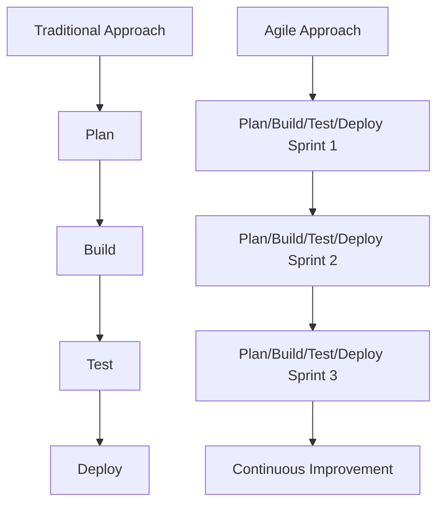
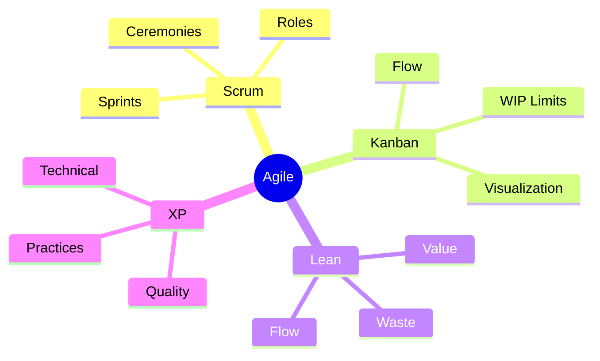

import Tabs from "@theme/Tabs";
import TabItem from "@theme/TabItem";

Agile methodologies have revolutionized modern project management and software development. In this comprehensive guide, we'll explore the various agile approaches, their core principles, and how they can drive successful project delivery.

<!-- truncate -->

:::tip Quick Navigation
Use this guide to understand:

- 🎯 Core Agile principles and values
- 🔄 Different Agile methodologies
- 🤝 Common elements across approaches
- 📈 Choosing the right methodology
  :::

## What is Agile?

Agile is an iterative approach to project management and software development that emphasizes flexibility, continuous improvement, and rapid delivery. Unlike traditional waterfall methodologies, Agile enables teams to respond quickly to changing requirements and evolving user needs.

### The Agile Manifesto

:::info Historical Context
The Agile Manifesto was created in 2001 by 17 software developers who met in Snowbird, Utah. They sought to establish lightweight alternatives to documentation-driven software development processes.
:::

<Tabs>
  <TabItem value="values" label="Core Values" default>
The foundation of Agile is built on four key values:

1. **Individuals and interactions** over processes and tools
2. **Working software** over comprehensive documentation
3. **Customer collaboration** over contract negotiation
4. **Responding to change** over following a rigid plan

  </TabItem>
  <TabItem value="principles" label="12 Principles">
    The Agile Manifesto is supported by 12 principles that guide implementation:
    
    1. Customer satisfaction through early and continuous delivery
    2. Welcome changing requirements
    3. Frequent delivery of working software
    4. Business and developers working together
    5. Build projects around motivated individuals
    6. Face-to-face conversation
    7. Working software as progress measure
    8. Sustainable development pace
    9. Technical excellence and good design
    10. Simplicity
    11. Self-organizing teams
    12. Regular reflection and adaptation
  </TabItem>
</Tabs>

### Benefits of Agile

<Tabs>
  <TabItem value="delivery" label="Delivery Benefits" default>
    - **Faster Time to Market**: Regular releases enable early and continuous
    delivery - **Better Quality**: Regular testing and integration improve
    overall quality - **Predictable Costs**: Fixed-length iterations help manage
    budgets
  </TabItem>
  <TabItem value="team" label="Team Benefits">
    - **Enhanced Collaboration**: Cross-functional teams work together closely -
    **Higher Motivation**: Teams have more autonomy and ownership - **Continuous
    Learning**: Regular retrospectives enable improvement
  </TabItem>
  <TabItem value="business" label="Business Benefits">
    - **Higher Customer Satisfaction**: Customer needs are continuously
    integrated - **Increased Flexibility**: Changes can be implemented quickly -
    **Better ROI**: Value delivery starts earlier in the project
  </TabItem>
</Tabs>

## Major Agile Methodologies

### 1. Scrum

<Tabs>
  <TabItem value="overview" label="Overview" default>
    Scrum is a structured framework that helps teams manage complex work through
    iterative progress. Key characteristics include:
      - Fixed-length iterations (sprints)
      - Clear roles and responsibilities
      - Regular ceremonies and events
      - Emphasis on empirical process control
      - Focus on continuous improvement
  </TabItem>
  <TabItem value="when" label="When to Use">
    Best suited for projects that:
      - Have changing requirements
      - Need regular feedback
      - Require incremental delivery
      - Benefit from timeboxed delivery
  </TabItem>
</Tabs>

### 2. Kanban

<Tabs>
  <TabItem value="overview" label="Overview" default>
    Kanban is a visual method for managing work as it moves through a process. Core principles include:
      - Visualize the workflow
      - Limit work in progress (WIP)
      - Manage and optimize flow
      - Make process policies explicit
      - Implement feedback loops
      - Improve collaboratively
  </TabItem>
  <TabItem value="when" label="When to Use">
    Best suited for projects that:
      - Have a stable workflow
      - Need to optimize flow
      - Require visual management
      - Benefit from continuous improvement
  </TabItem>
</Tabs>

### 3. Lean Software Development

<Tabs>
  <TabItem value="overview" label="Overview" default>
    Adapted from lean manufacturing principles, Lean Software Development focuses on maximizing value and minimizing waste. Key principles include:
      - Eliminate waste
      - Build quality in
      - Create knowledge
      - Defer commitment
      - Deliver fast
      - Respect people
      - Optimize the whole
  </TabItem>
  <TabItem value="when" label="When to Use">
    Best suited for projects that:
      - Need to reduce waste
      - Require fast delivery
      - Benefit from continuous improvement
  </TabItem>
</Tabs>

### 4. Extreme Programming (XP)

<Tabs>
  <TabItem value="overview" label="Overview" default>
    XP emphasizes technical excellence and customer satisfaction through specific engineering practices:
      - Test-driven development
      - Pair programming
      - Continuous integration
      - Small releases
      - Simple design
      - Collective code ownership
  </TabItem>
  <TabItem value="when" label="When to Use">
    Best suited for projects that:
      - Require fast delivery
      - Benefit from continuous improvement
      - Need to optimize flow
  </TabItem>
</Tabs>

## Common Elements Across Agile Methodologies

:::note Shared Foundation
While each methodology has its unique approach, they all share fundamental elements that make them "Agile."
:::

### 1. Iterative Development

<Tabs>
  <TabItem value="cycle" label="Development Cycle" default>
    All agile methods embrace:
      - Short development cycles
      - Regular feedback loops
      - Continuous adaptation
      - Incremental improvement
  </TabItem>
  <TabItem value="benefits" label="Benefits">
    This approach provides:
      - Early value delivery
      - Risk reduction
      - Better adaptability
      - Continuous learning
  </TabItem>
</Tabs>

### 2. Customer Focus

Agile methodologies prioritize:

- Direct customer involvement
- Regular stakeholder feedback
- Value-driven development
- Rapid response to change

### 3. Team Empowerment

Successful agile teams require:

- Self-organization
- Cross-functional capabilities
- Collaborative decision-making
- Continuous learning

### 4. Continuous Improvement

All methodologies emphasize:

- Regular retrospectives
- Process adaptation
- Knowledge sharing
- Metrics-driven optimization

## Choosing the Right Methodology

The choice of methodology depends on various factors:

### Project Characteristics

- Project complexity and size
- Requirements stability
- Delivery timeline
- Team distribution

### Team Factors

- Team size and composition
- Technical capabilities
- Domain expertise
- Cultural alignment

### Organizational Context

- Business objectives
- Stakeholder expectations
- Regulatory requirements
- Organizational culture

## Hybrid Approaches

Many organizations adopt hybrid approaches, combining elements from different methodologies:

- **Scrumban**: Combines Scrum's structure with Kanban's flow-based approach
- **Lean-Kanban**: Integrates lean principles with Kanban visualization
- **XP-Scrum**: Merges XP's technical practices with Scrum's management framework

## Getting Started with Agile

Regardless of the chosen methodology, successful agile adoption requires:

1. Understanding core agile principles
2. Selecting appropriate practices for your context
3. Building cross-functional teams
4. Establishing feedback mechanisms
5. Measuring and adapting processes
6. Fostering continuous improvement

## Conclusion

Agile methodologies provide flexible frameworks for delivering value in today's fast-paced environment. Whether you choose Scrum, Kanban, Lean, XP, or a hybrid approach, success depends on understanding and applying the core principles while adapting practices to your specific context.

In the following sections, we'll dive deeper into each methodology, exploring their unique characteristics, best practices, and implementation strategies. This will help you make informed decisions about which approach best suits your team's needs and organizational goals.
