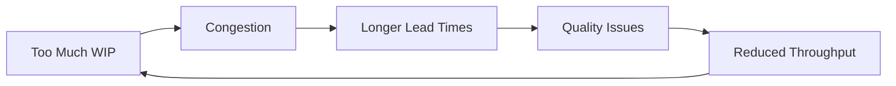
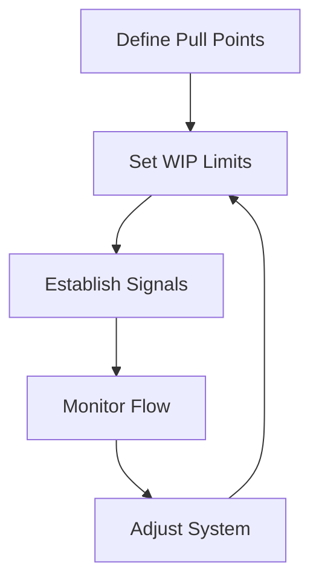
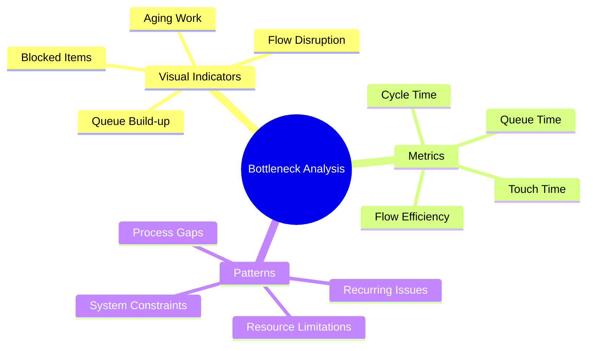
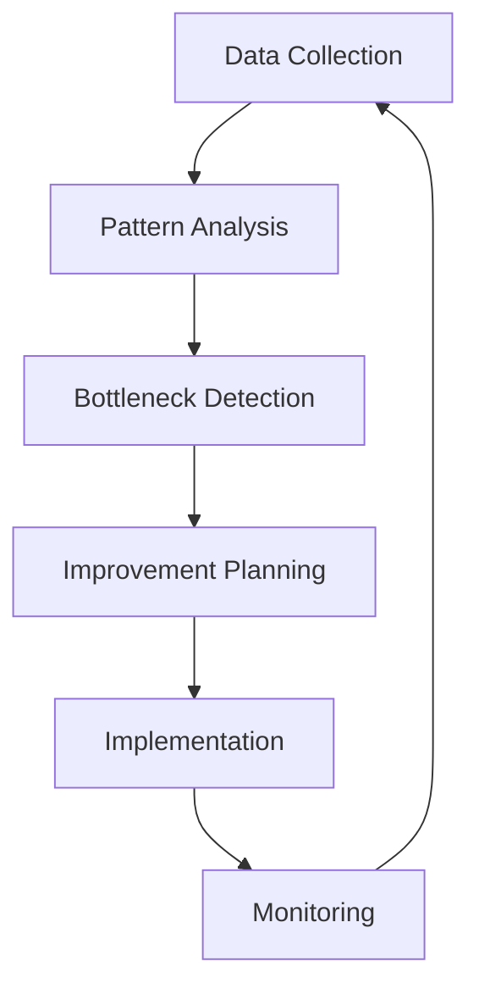

import Tabs from "@theme/Tabs";
import TabItem from "@theme/TabItem";

A comprehensive guide to managing and optimizing flow in Kanban systems, including WIP limits, queue management, and bottleneck identification.

<!-- truncate -->

:::tip Key Flow Concepts
Essential elements of Kanban flow management:

- 🔄 Work in Progress (WIP) Limits
- ⚡ Pull System Implementation
- 📊 Queue Management
- 🔍 Bottleneck Analysis
- 📈 Flow Optimization
  :::

## Understanding WIP Limits

### The Importance of WIP Limits

:::warning Critical Practice
WIP limits are fundamental to maintaining flow and preventing overload in Kanban systems.
:::

### Setting WIP Limits

<Tabs>
  <TabItem value="calculation" label="Calculation Methods" default>
    **Basic Formula**: - Team size + buffer (usually 1-2) - Historical
    completion rate - Capacity analysis - Flow efficiency **Considerations**: -
    Team capabilities - Work complexity - Dependencies - Service levels
  </TabItem>
  <TabItem value="implementation" label="Implementation">
    **Application Levels**: - Individual columns - Workflow stages - Swimlanes -
    Overall system **Adjustment Factors**: - Team feedback - Flow metrics -
    Bottleneck analysis - Service requirements
  </TabItem>
</Tabs>

## Pull System Implementation

### Core Principles

1. **Pull vs. Push**

   - Demand-based work
   - Capacity-driven flow
   - Self-regulating system
   - Natural work balance

2. **Signal Systems**
   - Visual indicators
   - Digital notifications
   - Capacity alerts
   - Blocking mechanisms

### Implementation Strategy

## Queue Management

### Queue Types

<Tabs>
  <TabItem value="input" label="Input Queues" default>
    **Characteristics**: - Prioritized backlog - Ready items - Demand buffer -
    Entry criteria **Management**: - Size limits - Age monitoring - Priority
    updates - Regular refinement
  </TabItem>
  <TabItem value="process" label="Process Queues">
    **Types**: - Handoff queues - Review queues - Testing queues - Deployment
    queues **Controls**: - Queue policies - Time limits - Expedite lanes - Clear
    exit criteria
  </TabItem>
</Tabs>

### Queue Optimization

1. **Size Control**

   - Maximum limits
   - Age thresholds
   - FIFO principles
   - Priority handling

2. **Flow Efficiency**
   - Minimize waiting time
   - Reduce handoffs
   - Clear blockers
   - Manage dependencies

## Bottleneck Identification

### Detection Methods

### Resolution Strategies

<Tabs>
  <TabItem value="immediate" label="Short-term" default>
    **Actions**: - Resource reallocation - Expedite process - Split work items -
    Temporary capacity **Focus**: - Quick relief - Flow restoration - Immediate
    impact - Risk mitigation
  </TabItem>
  <TabItem value="systemic" label="Long-term">
    **Solutions**: - Process redesign - Capacity planning - Automation - Skill
    development **Benefits**: - Sustainable flow - Prevention focus - System
    improvement - Capability enhancement
  </TabItem>
</Tabs>

## Flow Metrics & Analysis

### Key Metrics

1. **Lead Time**

   - Customer request to delivery
   - End-to-end cycle
   - Value stream mapping
   - Trend analysis

2. **Cycle Time**

   - Work start to completion
   - Process efficiency
   - Stage duration
   - Flow predictability

3. **Throughput**
   - Completion rate
   - Delivery frequency
   - Capacity utilization
   - Trend patterns

### Analysis Techniques

## Flow Optimization

### Techniques

<Tabs>
  <TabItem value="process" label="Process Optimization" default>
    **Methods**: - Value stream mapping - Process simplification - Handoff
    reduction - Automation **Focus Areas**: - Non-value steps - Wait times -
    Decision points - Quality gates
  </TabItem>
  <TabItem value="system" label="System Optimization">
    **Approaches**: - Constraint management - Capacity balancing - Queue
    optimization - Flow smoothing **Enablers**: - Clear policies - Team
    alignment - Tool support - Feedback loops
  </TabItem>
</Tabs>

### Best Practices

1. **Continuous Monitoring**

   - Regular metrics review
   - Flow analysis
   - Bottleneck tracking
   - Performance trends

2. **Adaptive Management**
   - Flexible WIP limits
   - Dynamic allocation
   - Policy adjustment
   - System evolution

## Additional Resources

- [Kanban WIP Limits](https://www.atlassian.com/agile/kanban/wip-limits)
- [Flow Efficiency](https://www.digite.com/kanban/kanban-metrics/)
- [Bottleneck Management](https://www.lean.org/lexicon-terms/bottleneck/)
- [Queue Management](https://leankit.com/learn/kanban/lean-flow-metrics/)
