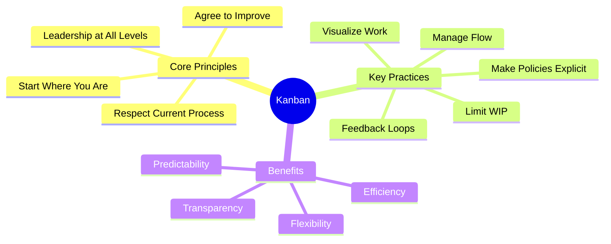
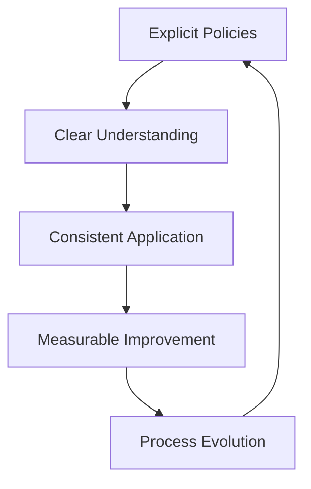

import Tabs from "@theme/Tabs";
import TabItem from "@theme/TabItem";

A comprehensive introduction to Kanban's foundational elements and core principles that enable continuous flow and delivery.

<!-- truncate -->

:::tip Key Concepts
Essential elements of Kanban:

- 📊 Workflow Visualization
- 🔄 Work in Progress (WIP) Limits
- ⚡ Flow Management
- 📈 Continuous Improvement
- 📋 Service Level Expectations
  :::

## What is Kanban?

Kanban is a popular framework for implementing Agile and DevOps software development that emphasizes real-time communication, full transparency of work, and continuous flow. The word "Kanban" comes from Japanese, literally translating to "signboard" or "visual signal," reflecting its core principle of visual management.

### Historical Context

:::info Origins
Kanban's roots trace back to the late 1940s when Toyota optimized its engineering processes based on supermarket inventory management systems. Just as supermarkets stock just enough products to meet consumer demand, Toyota applied this "just-in-time" (JIT) principle to match inventory levels with material consumption on their factory floors.
:::

### Modern Application

<Tabs>
  <TabItem value="principles" label="Core Philosophy" default>
    **Key Elements**:
    - Visual workflow management
    - Pull-based system
    - Continuous flow
    - Real-time communication

    **Benefits**:
    - Enhanced transparency
    - Improved efficiency
    - Reduced waste
    - Better predictability

  </TabItem>
  <TabItem value="software" label="Software Development">
    **Applications**:
    - Agile development
    - DevOps practices
    - Continuous delivery
    - Service management

    **Advantages**:
    - Flexible planning
    - Faster feedback cycles
    - Clear priorities
    - Focused delivery

  </TabItem>
</Tabs>

### Framework Overview

### Key Differences from Other Methodologies

<Tabs>
  <TabItem value="scrum" label="vs. Scrum" default>
    **Process Structure**:
    - Kanban: Continuous flow with no prescribed timeboxes
    - Scrum: Fixed-length sprints (usually 2 weeks)

    **Roles & Responsibilities**:
    - Kanban: Flexible roles, no prescribed positions
    - Scrum: Product Owner, Scrum Master, Development Team

    **Change Philosophy**:
    - Kanban: Changes can happen at any time
    - Scrum: Changes during sprint are discouraged

  </TabItem>
  <TabItem value="traditional" label="vs. Traditional">
    **Work Management**:
    - Kanban: Pull-based, limit WIP
    - Traditional: Push-based, resource utilization focus

    **Planning Approach**:
    - Kanban: Just-in-time, continuous flow
    - Traditional: Comprehensive upfront planning

    **Change Handling**:
    - Kanban: Embraces change, adaptive
    - Traditional: Change control boards, resistance

  </TabItem>
</Tabs>

## Core Principles

### Start With What You Do Now

<Tabs>
  <TabItem value="principle" label="Principle" default>
    **Key Points**:
    - Respect current processes
    - Respect current roles
    - Accept current responsibilities
    - Encourage incremental change

    **Benefits**:
    - Reduced resistance
    - Easier adoption
    - Evolutionary change
    - Maintained stability

  </TabItem>
  <TabItem value="practice" label="Practice">
    **Implementation**:
    - Map current workflow
    - Document existing processes
    - Identify pain points
    - Plan gradual improvements

    **Examples**:
    - Current state mapping
    - Process documentation
    - Role clarification
    - Improvement backlog

  </TabItem>
</Tabs>

### Agree to Pursue Incremental Change

:::info Evolution over Revolution
Kanban promotes evolutionary change that's easier to implement and sustain.
:::

1. **Small Changes**

   - Iterative improvements
   - Measurable steps
   - Feedback-driven
   - Risk mitigation

2. **Continuous Evolution**
   - Regular assessment
   - Adaptation cycles
   - Learning loops
   - Progressive enhancement

### Make Process Policies Explicit

### Leadership at All Levels

:::note Empowerment
Kanban encourages acts of leadership at all levels, from individual contributors to senior management.
:::

1. **Individual Level**

   - Process improvement suggestions
   - Flow optimization
   - Quality initiatives
   - Knowledge sharing

2. **Team Level**

   - Workflow management
   - Capacity planning
   - Collaboration practices
   - Performance monitoring

3. **Management Level**
   - Strategic alignment
   - Resource allocation
   - System optimization
   - Organizational learning

## Getting Started with Kanban

### Essential First Steps

1. **Visualize Your Work**

   - Map current workflow
   - Identify work types
   - Create initial board
   - Track work items

2. **Establish Basic Metrics**

   - Work item counts
   - Basic lead time
   - Simple flow measures
   - Quality indicators

3. **Begin Improvement Cycle**
   - Regular reviews
   - Team feedback
   - Process adjustments
   - Measure results

## Additional Resources

For detailed information about specific aspects of Kanban, please refer to:

- [Visualization Guide](visualization) - Detailed board design and visual management
- [Flow Management](flow-management) - WIP limits and flow optimization
- [Service Classes](service-classes) - Work item types and policies
- [Metrics & Analytics](metrics) - Comprehensive measurement guide
- [Kanban Method](https://www.kanban.university/kanban-guide/)
- [Implementation Guide](https://www.digite.com/kanban/kanban-implementation/)
