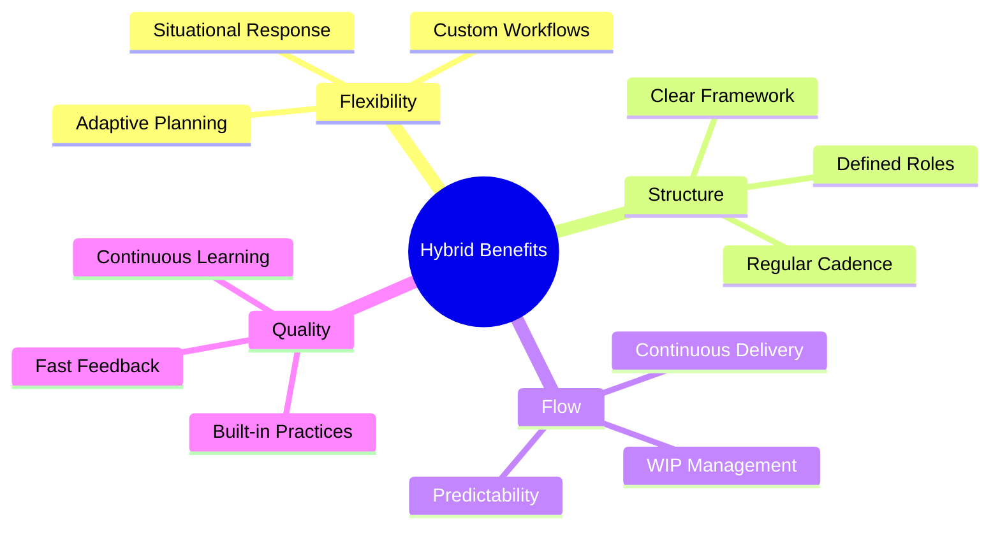
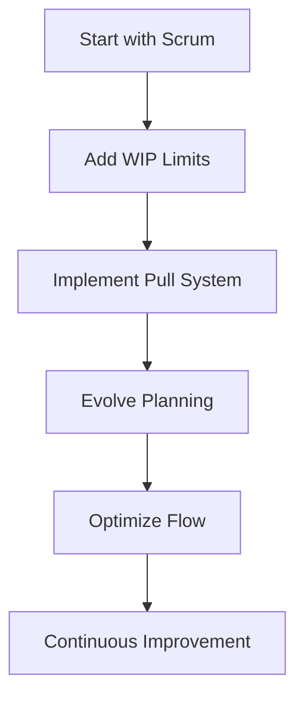
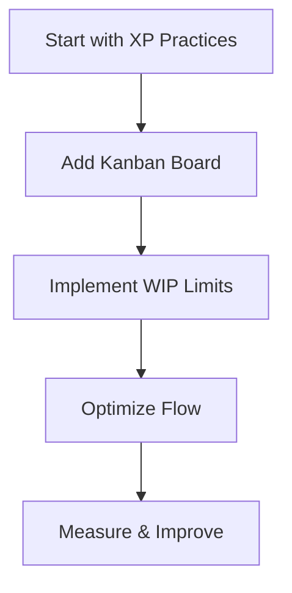

import Tabs from "@theme/Tabs";
import TabItem from "@theme/TabItem";

A comprehensive guide to combining Kanban with other methodologies to create effective hybrid approaches that leverage the strengths of multiple frameworks.

<!-- truncate -->

:::tip Key Hybrid Elements
Essential components for successful hybrid implementations:

- 🔄 Scrumban Integration
- 📊 SAFe Implementation
- 🚀 XP Combination
- 🛠️ Custom Frameworks
- 📈 Migration Strategies
  :::

## Understanding Hybrid Approaches

### Why Hybrid?

### Common Combinations

<Tabs>
  <TabItem value="scrumban" label="Scrumban" default>
    **Core Elements**:
    - Sprint-based planning
    - Pull-based execution
    - WIP limits
    - Continuous flow

    **Benefits**:
    - Structured planning
    - Flexible execution
    - Better flow management
    - Reduced overhead

  </TabItem>
  <TabItem value="safe" label="Kanban in SAFe">
    **Integration Points**:
    - Team Kanban
    - Program Board
    - Portfolio Kanban
    - DevOps pipeline

    **Benefits**:
    - Enterprise alignment
    - Scaled visualization
    - Coordinated delivery
    - Portfolio management

  </TabItem>
</Tabs>

## Scrumban Deep Dive

### Key Characteristics

1. **Planning Approach**

   - Regular planning cadence
   - On-demand replenishment
   - Flexible iterations
   - Just-in-time refinement

2. **Execution Model**

   - Pull system
   - WIP limits
   - Continuous flow
   - Team swarming

3. **Roles & Ceremonies**
   - Simplified roles
   - Focused meetings
   - Flow-based reviews
   - Continuous improvement

### Implementation Pattern

## Kanban in SAFe

### Integration Points

<Tabs>
  <TabItem value="team" label="Team Level" default>
    **Implementation**:
    - Team Kanban board
    - Story flow
    - Daily management
    - Local metrics

    **Practices**:
    - WIP limits
    - Pull system
    - Flow metrics
    - Quick feedback

  </TabItem>
  <TabItem value="program" label="Program Level">
    **Implementation**:
    - Program board
    - Feature flow
    - PI planning
    - Dependencies

    **Practices**:
    - Cross-team coordination
    - Capacity allocation
    - Risk management
    - Progress tracking

  </TabItem>
</Tabs>

### Portfolio Management

1. **Strategic Themes**

   - Value streams
   - Investment themes
   - Portfolio vision
   - Epic management

2. **Flow Management**
   - Portfolio WIP
   - Epic flow
   - Capacity allocation
   - Investment horizons

## Kanban + XP

### Integration Benefits

:::info XP + Kanban
Combining XP technical practices with Kanban flow management creates a powerful delivery system.
:::

1. **Technical Excellence**

   - Test-first development
   - Pair programming
   - Continuous integration
   - Simple design

2. **Flow Optimization**
   - WIP limits
   - Pull system
   - Visual management
   - Flow metrics

### Implementation Approach

## Custom Combinations

### Framework Selection

<Tabs>
  <TabItem value="analysis" label="Analysis Phase" default>
    **Considerations**:
    - Team context
    - Business needs
    - Delivery constraints
    - Cultural factors

    **Tools**:
    - Context analysis
    - Value stream mapping
    - Constraint identification
    - Risk assessment

  </TabItem>
  <TabItem value="design" label="Design Phase">
    **Activities**:
    - Practice selection
    - Process design
    - Role definition
    - Metric selection

    **Outputs**:
    - Hybrid framework
    - Implementation plan
    - Training program
    - Success metrics

  </TabItem>
</Tabs>

## Migration Strategies

### Transition Patterns

1. **Gradual Evolution**

   - Start where you are
   - Add practices incrementally
   - Measure impact
   - Adjust based on feedback

2. **Structured Transition**
   - Define target state
   - Plan transition phases
   - Execute systematically
   - Review and adjust

### Common Pitfalls

:::warning Watch Out For
Avoid these common mistakes when implementing hybrid approaches:
:::

1. **Framework Confusion**

   - Mixed terminology
   - Conflicting practices
   - Role ambiguity
   - Metric misalignment

2. **Implementation Issues**
   - Too much change
   - Insufficient training
   - Poor communication
   - Lack of support

## Best Practices

### Success Factors

1. **Clear Purpose**

   - Define objectives
   - Identify benefits
   - Set expectations
   - Measure success

2. **Strong Foundation**

   - Core principles
   - Basic practices
   - Team alignment
   - Leadership support

3. **Continuous Learning**
   - Regular reviews
   - Feedback loops
   - Adaptation cycles
   - Knowledge sharing

## Additional Resources

- [Scrumban Guide](https://www.agilealliance.org/scrumban/) - Comprehensive Scrumban overview
- [SAFe Implementation](https://www.scaledagileframework.com/kanban/) - Kanban in SAFe
- [XP and Kanban](https://www.extremeprogramming.org/) - XP practices and principles
- [Hybrid Case Studies](https://www.digite.com/kanban/hybrid-approaches/) - Real-world implementations
