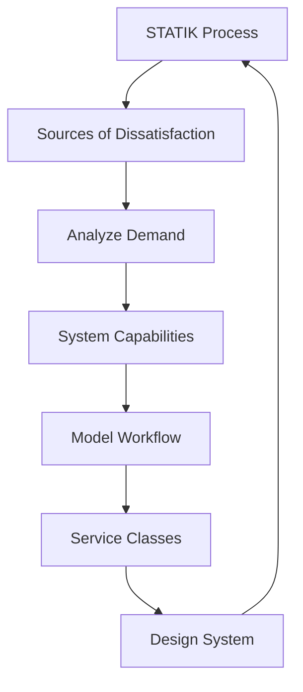
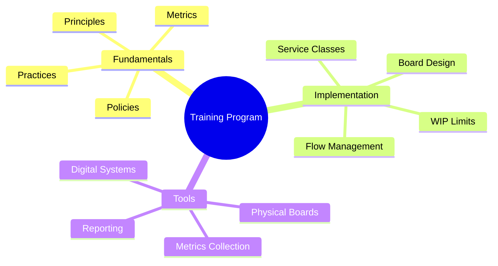
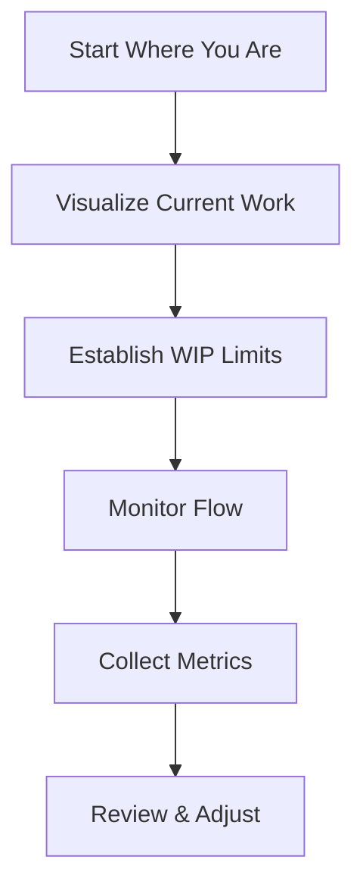
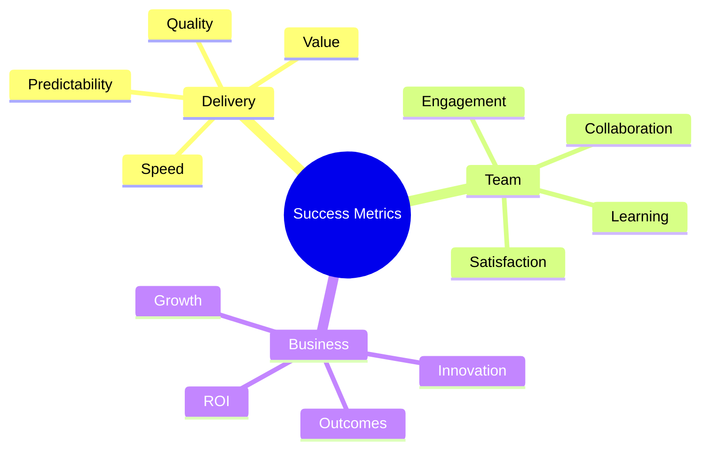

import Tabs from "@theme/Tabs";
import TabItem from "@theme/TabItem";

A comprehensive guide to implementing Kanban in your organization, following the Systems Thinking Approach To Introducing Kanban (STATIK) methodology.

<!-- truncate -->

:::tip Key Implementation Elements
Essential components for successful Kanban adoption:

- 📋 STATIK Framework
- 🎯 Team Adoption
- 🛠️ Tool Selection
- 🚀 Getting Started
- 📈 Success Patterns
  :::

## The STATIK Approach

### Understanding STATIK

### Implementation Steps

<Tabs>
  <TabItem value="dissatisfaction" label="Sources of Dissatisfaction" default>
    **Key Areas**:
    - Customer pain points
    - Team frustrations
    - Process bottlenecks
    - Quality issues

    **Analysis Methods**:
    - Stakeholder interviews
    - Team workshops
    - Customer feedback
    - Performance data

  </TabItem>
  <TabItem value="demand" label="Analyze Demand">
    **Focus Points**:
    - Work types
    - Request patterns
    - Customer needs
    - Channel analysis

    **Tools**:
    - Demand analysis
    - Pattern recognition
    - Volume tracking
    - Variability assessment

  </TabItem>
</Tabs>

## Team Adoption

### Change Management

:::info Evolutionary Change
Kanban promotes evolutionary change rather than revolutionary transformation. Start where you are and pursue incremental improvements.
:::

1. **Current State Analysis**

   - Process mapping
   - Work item types
   - Team structure
   - Existing metrics

2. **Gradual Implementation**
   - Start small
   - Build confidence
   - Gather feedback
   - Adapt approach

### Team Training

## Tool Selection

### Evaluation Criteria

<Tabs>
  <TabItem value="requirements" label="Core Requirements" default>
    **Essential Features**:
    - Board visualization
    - WIP limit controls
    - Flow metrics
    - Custom workflows

    **Integration Needs**:
    - Existing tools
    - Communication platforms
    - Reporting systems
    - Authentication

  </TabItem>
  <TabItem value="considerations" label="Selection Factors">
    **Key Factors**:
    - Team size
    - Process complexity
    - Geographic distribution
    - Budget constraints

    **Evaluation Process**:
    - Feature comparison
    - Trial periods
    - Team feedback
    - ROI analysis

  </TabItem>
</Tabs>

## Getting Started

### Initial Setup

1. **Board Design**

   - Column definition
   - WIP limits
   - Swimlanes
   - Card design

2. **Policy Definition**
   - Entry criteria
   - Exit criteria
   - Class of service rules
   - Escalation procedures

### First Steps

## Common Challenges

### Implementation Issues

<Tabs>
  <TabItem value="resistance" label="Change Resistance" default>
    **Challenges**:
    - Cultural inertia
    - Process attachment
    - Tool resistance
    - Metric concerns

    **Solutions**:
    - Clear communication
    - Gradual changes
    - Early wins
    - Team involvement

  </TabItem>
  <TabItem value="execution" label="Execution Issues">
    **Challenges**:
    - WIP limit violations
    - Inconsistent policies
    - Metric confusion
    - Tool adoption

    **Solutions**:
    - Regular training
    - Policy reviews
    - Metric workshops
    - Tool support

  </TabItem>
</Tabs>

## Success Patterns

### Key Success Factors

:::warning Critical Elements
Focus on these areas for successful implementation.
:::

1. **Leadership Support**

   - Executive sponsorship
   - Resource commitment
   - Visible participation
   - Change advocacy

2. **Team Engagement**

   - Active participation
   - Continuous learning
   - Process ownership
   - Improvement focus

3. **Clear Communication**
   - Regular updates
   - Success sharing
   - Challenge discussion
   - Knowledge transfer

## Case Studies

### Manufacturing Implementation

<Tabs>
  <TabItem value="motor" label="Motor Plant" default>
    **Context**:
    - Electric motor manufacturing plant
    - Multiple casting types (52 unique)
    - International supplier (Mexico)
    - High inventory levels

    **Implementation**:
    - Visual kanban system
    - Standard order quantities
    - Supplier collaboration
    - Expedite procedures

    **Results**:
    - Inventory reduced from 37,328 to 12,976 units
    - Lead time reduced from 18 to 7 days
    - Improved supplier relationships
    - Better stock management

  </TabItem>
  <TabItem value="software" label="Software Development">
    **Context**:
    - 50-person development team
    - Multiple projects
    - Distributed teams
    - Legacy processes

    **Implementation**:
    - Digital boards
    - Service classes
    - Flow metrics
    - Daily standups

    **Results**:
    - 40% lead time reduction
    - Improved predictability
    - Better collaboration
    - Higher satisfaction

  </TabItem>
</Tabs>

### Service Implementation

<Tabs>
  <TabItem value="support" label="Customer Support" default>
    **Context**:
    - Customer support team
    - High ticket volume
    - SLA requirements
    - Multiple channels

    **Implementation**:
    - Tiered service classes
    - WIP limits by type
    - SLA tracking
    - Escalation policies

    **Results**:
    - 30% faster resolution
    - Better SLA compliance
    - Reduced escalations
    - Improved satisfaction

  </TabItem>
  <TabItem value="hr" label="HR Recruitment">
    **Context**:
    - Recruiting process
    - Multiple stages
    - Various stakeholders
    - Time-sensitive hiring

    **Implementation**:
    - Standardized workflow
      - Job offers
      - Candidates
      - Phone screens
      - Interviews
      - Hires

    **Results**:
    - Streamlined hiring process
    - Better candidate experience
    - Reduced time-to-hire
    - Improved hiring quality

  </TabItem>
</Tabs>

### Implementation Lessons

:::info Key Learnings
Common success factors across case studies:

- Start with clear visualization
- Establish standard workflows
- Engage stakeholders early
- Focus on measurable results
  :::

1. **Visual Management**

   - Clear board design
   - Standard indicators
   - Status visibility
   - Progress tracking

2. **Stakeholder Engagement**

   - Early involvement
   - Regular communication
   - Clear expectations
   - Continuous feedback

3. **Process Standardization**
   - Defined workflows
   - Clear policies
   - Standard quantities
   - Regular reviews

### Additional Case Studies

For more detailed case studies and implementation examples, refer to:

- [Motor Plant Case Study](https://flylib.com/books/en/1.52.1/appendix_h_case_study_1_motor_plant_casting_kanban.html) - Detailed manufacturing implementation
- [Kanban University Cases](https://www.kanban.university/kanban-guide/) - Various industry implementations
- [Lean-Kanban Case Studies](https://www.digite.com/kanban/case-studies/) - Digital transformation examples
- [Enterprise Kanban Cases](https://www.atlassian.com/agile/kanban/case-studies) - Large-scale implementations

## Metrics and Measurement

### Implementation Metrics

1. **Process Metrics**

   - Lead time
   - Cycle time
   - WIP trends
   - Flow efficiency

2. **Quality Metrics**
   - Defect rates
   - Rework percentage
   - Customer satisfaction
   - Team satisfaction

### Success Indicators

## Best Practices

### Implementation Guidelines

1. **Start Small**

   - Pilot teams
   - Simple processes
   - Basic metrics
   - Regular reviews

2. **Build Gradually**

   - Incremental changes
   - Feature adoption
   - Policy evolution
   - Metric expansion

3. **Maintain Focus**
   - Clear goals
   - Regular checkpoints
   - Success criteria
   - Adjustment cycles

## Additional Resources

- [Kanban Guide](https://www.kanban.university/kanban-guide/) - Official Kanban guide
- [STATIK Overview](https://www.digite.com/kanban/statik-approach/) - Detailed STATIK methodology
- [Implementation Patterns](https://www.atlassian.com/agile/kanban/implementation) - Practical implementation patterns
- [Case Studies](https://leankit.com/learn/kanban/case-studies/) - Real-world implementation examples
