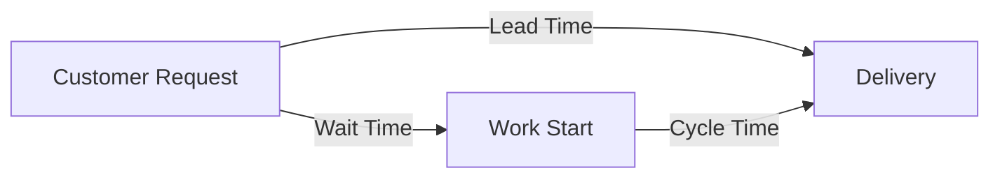
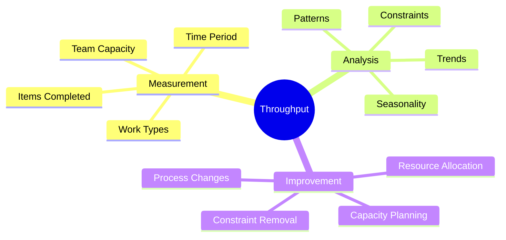
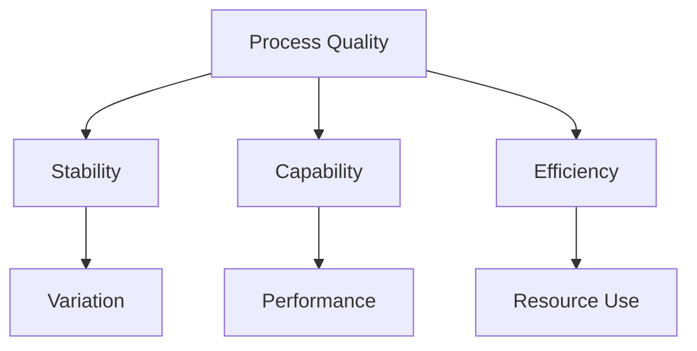
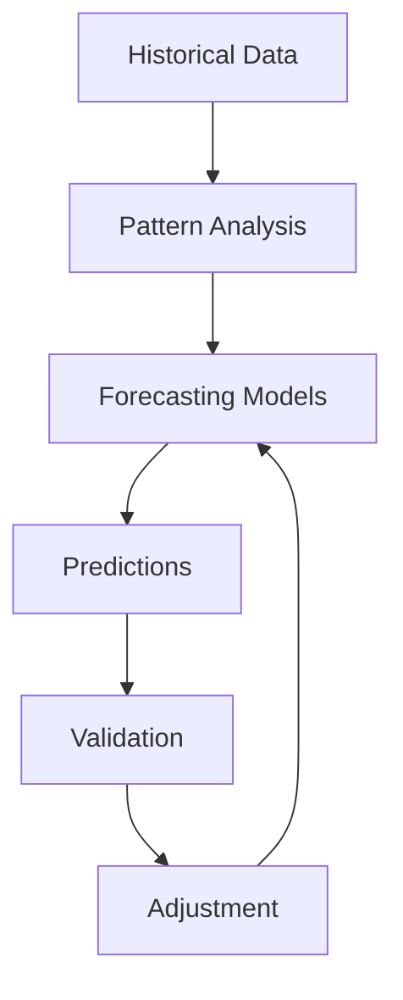
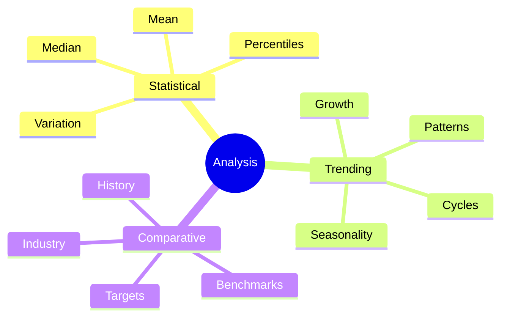

import Tabs from "@theme/Tabs";
import TabItem from "@theme/TabItem";

A comprehensive guide to Kanban metrics and analytics, including flow metrics, performance indicators, and measurement practices.

<!-- truncate -->

:::tip Key Metrics Categories
Essential measurement areas in Kanban:

- ⏱️ Flow Metrics
- 📊 Performance Metrics
- 🎯 Quality Metrics
- 💪 Productivity Metrics
- 📈 Predictability Metrics
  :::

## Flow Metrics

### Lead Time & Cycle Time

<Tabs>
  <TabItem value="lead" label="Lead Time" default>
    **Definition**:
    - Total time from request to delivery
    - Includes all waiting periods
    - Customer perspective
    - End-to-end measurement

    **Measurement**:
    - Start: Request received
    - End: Delivery complete
    - Include all states
    - Track by service class

  </TabItem>
  <TabItem value="cycle" label="Cycle Time">
    **Definition**:
    - Active work time
    - Process efficiency
    - Team perspective
    - Value-add time

    **Measurement**:
    - Start: Work begins
    - End: Work complete
    - Exclude waiting
    - Track by work type

  </TabItem>
</Tabs>

### Flow Efficiency

:::info Flow Efficiency Formula
Flow Efficiency = (Value-Adding Time / Total Lead Time) × 100%
:::

1. **Components**

   - Value-adding time
   - Non-value-adding time
   - Wait time
   - Block time

2. **Improvement Focus**
   - Reduce wait states
   - Minimize handoffs
   - Optimize processes
   - Remove blockers

## Performance Metrics

### Throughput

### Work in Progress (WIP)

<Tabs>
  <TabItem value="tracking" label="WIP Tracking" default>
    **Measurements**:
    - Current WIP
    - WIP limits
    - WIP aging
    - WIP distribution

    **Analysis**:
    - Capacity utilization
    - Flow problems
    - Resource allocation
    - Process efficiency

  </TabItem>
  <TabItem value="optimization" label="WIP Optimization">
    **Strategies**:
    - Limit adjustments
    - Queue management
    - Resource balancing
    - Process improvement

    **Benefits**:
    - Faster delivery
    - Better quality
    - Reduced overhead
    - Improved flow

  </TabItem>
</Tabs>

## Quality Metrics

### Defect Metrics

1. **Defect Rate**

   - Defects per unit
   - Defect categories
   - Severity levels
   - Impact analysis

2. **Quality Indicators**
   - First-time pass rate
   - Rework percentage
   - Technical debt
   - Customer satisfaction

### Process Quality

## Productivity Metrics

### Team Performance

<Tabs>
  <TabItem value="efficiency" label="Efficiency Metrics" default>
    **Measurements**:
    - Completion rate
    - Flow efficiency
    - Resource utilization
    - Time distribution

    **Analysis**:
    - Trend analysis
    - Pattern recognition
    - Improvement areas
    - Team capacity

  </TabItem>
  <TabItem value="effectiveness" label="Effectiveness Metrics">
    **Measurements**:
    - Value delivery
    - Customer satisfaction
    - Innovation rate
    - Learning curve

    **Analysis**:
    - Value assessment
    - Impact evaluation
    - Growth tracking
    - Capability development

  </TabItem>
</Tabs>

### Value Stream Metrics

1. **Value Analysis**

   - Value-add ratio
   - Process efficiency
   - Cost of delay
   - Business impact

2. **Stream Efficiency**
   - Process steps
   - Handoff points
   - Wait states
   - Bottlenecks

## Predictability Metrics

### Forecasting

:::warning Predictability Focus
Reliable forecasting requires consistent measurement and analysis of historical data.
:::

### Variability Analysis

<Tabs>
  <TabItem value="measurement" label="Measurement" default>
    **Metrics**:
    - Standard deviation
    - Percentile analysis
    - Range calculation
    - Trend stability

    **Applications**:
    - SLE setting
    - Risk assessment
    - Planning
    - Improvement

  </TabItem>
  <TabItem value="management" label="Management">
    **Strategies**:
    - Process control
    - Buffer management
    - Risk mitigation
    - Capacity planning

    **Benefits**:
    - Better predictability
    - Reliable delivery
    - Customer trust
    - Team confidence

  </TabItem>
</Tabs>

## Measurement Best Practices

### Data Collection

1. **Principles**

   - Consistency
   - Accuracy
   - Relevance
   - Timeliness

2. **Methods**
   - Automated tracking
   - Manual recording
   - Hybrid approaches
   - Quality checks

### Analysis Techniques

## Visualization & Reporting

### Dashboard Design

<Tabs>
  <TabItem value="elements" label="Key Elements" default>
    **Components**:
    - Flow metrics
    - Quality indicators
    - Trend charts
    - Status indicators

    **Features**:
    - Real-time updates
    - Interactive filters
    - Drill-down capability
    - Custom views

  </TabItem>
  <TabItem value="usage" label="Effective Use">
    **Practices**:
    - Regular reviews
    - Team discussions
    - Decision support
    - Improvement planning

    **Benefits**:
    - Quick insights
    - Clear communication
    - Informed decisions
    - Proactive management

  </TabItem>
</Tabs>

## Additional Resources

- [Kanban Metrics Guide](https://www.digite.com/kanban/kanban-metrics/)
- [Flow Efficiency](https://leankit.com/learn/kanban/lean-flow-metrics/)
- [Predictability Metrics](https://www.kanban.university/kanban-guide/)
- [Performance Analytics](https://www.atlassian.com/agile/kanban/metrics)
