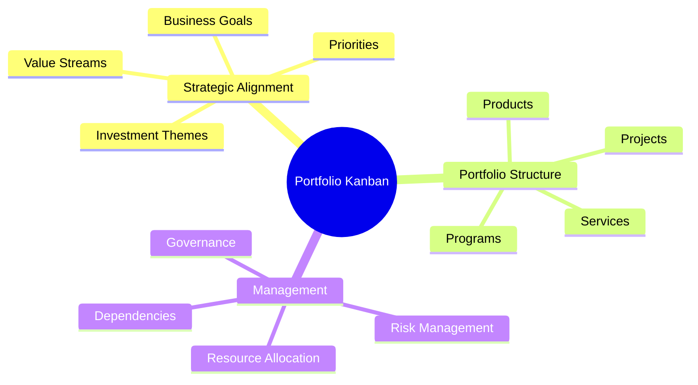
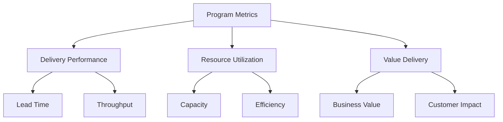
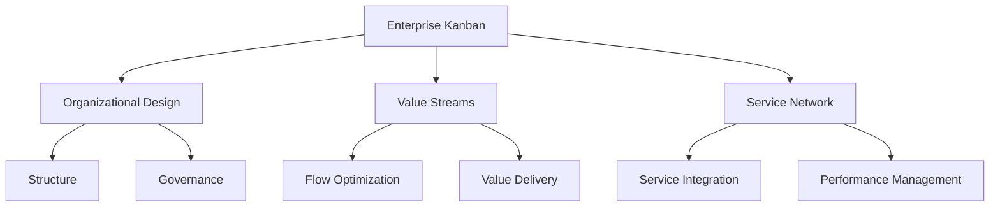
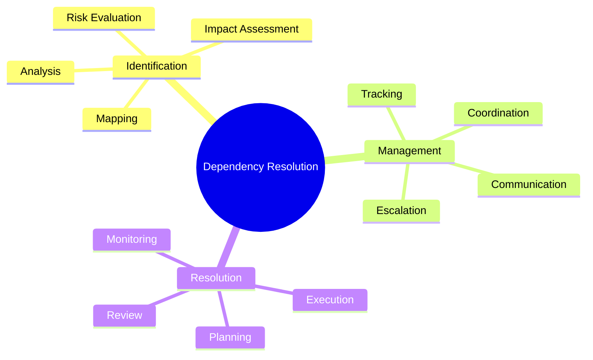

import Tabs from "@theme/Tabs";
import TabItem from "@theme/TabItem";

A comprehensive guide to scaling Kanban practices across multiple teams, departments, and enterprise-wide implementations.

<!-- truncate -->

:::tip Key Scaling Elements
Essential components of scaled Kanban:

- 📊 Portfolio Kanban
- 🏢 Program-level Implementation
- 🔄 Multi-team Coordination
- 🌐 Enterprise-wide Adoption
- 🔗 Dependencies Management
  :::

## Portfolio Kanban

### Purpose and Structure

### Implementation Levels

<Tabs>
  <TabItem value="strategic" label="Strategic Level" default>
    **Components**:
    - Portfolio vision
    - Strategic initiatives
    - Investment decisions
    - Resource allocation

    **Key Practices**:
    - Value stream mapping
    - Portfolio prioritization
    - Capacity planning
    - Risk assessment

  </TabItem>
  <TabItem value="tactical" label="Tactical Level">
    **Components**:
    - Program coordination
    - Resource optimization
    - Dependency management
    - Progress tracking

    **Key Practices**:
    - Cross-team synchronization
    - Resource balancing
    - Bottleneck management
    - Performance monitoring

  </TabItem>
</Tabs>

## Program-level Implementation

### Coordination Structure

:::info Program Management
Effective program management requires clear visualization and coordination across multiple teams and value streams.
:::

1. **Program Board Design**

   - Strategic initiatives
   - Program milestones
   - Team dependencies
   - Resource allocation

2. **Flow Management**
   - Cross-team WIP limits
   - Program-level policies
   - Escalation paths
   - Risk mitigation

### Program Metrics

## Multi-team Coordination

### Team Alignment

<Tabs>
  <TabItem value="structure" label="Organizational Structure" default>
    **Framework**:
    - Team hierarchies
    - Reporting relationships
    - Communication channels
    - Decision authorities

    **Implementation**:
    - Clear roles
    - Defined responsibilities
    - Escalation paths
    - Feedback loops

  </TabItem>
  <TabItem value="practices" label="Coordination Practices">
    **Methods**:
    - Scrum of Scrums
    - Kanban sync meetings
    - Cross-team planning
    - Joint retrospectives

    **Tools**:
    - Digital boards
    - Collaboration platforms
    - Metrics dashboards
    - Communication tools

  </TabItem>
</Tabs>

### Dependencies Management

1. **Identification**

   - Technical dependencies
   - Business dependencies
   - Resource dependencies
   - Timeline dependencies

2. **Visualization**

   - Dependency boards
   - Cross-team maps
   - Impact analysis
   - Risk tracking

3. **Resolution Strategies**
   - Proactive planning
   - Buffer management
   - Resource optimization
   - Communication protocols

## Enterprise Kanban

### Enterprise-wide Implementation

### Governance Framework

<Tabs>
  <TabItem value="structure" label="Governance Structure" default>
    **Components**:
    - Policy framework
    - Decision rights
    - Risk management
    - Compliance

    **Implementation**:
    - Clear guidelines
    - Standard practices
    - Review processes
    - Audit trails

  </TabItem>
  <TabItem value="execution" label="Execution Framework">
    **Elements**:
    - Performance metrics
    - Quality standards
    - Risk thresholds
    - Success criteria

    **Monitoring**:
    - Regular reviews
    - Performance tracking
    - Risk assessment
    - Improvement cycles

  </TabItem>
</Tabs>

## Dependencies Management

### Cross-functional Dependencies

1. **Technical Integration**

   - System dependencies
   - API management
   - Data flow
   - Architecture alignment

2. **Business Process Integration**
   - Process workflows
   - Handoff points
   - Service agreements
   - Value stream mapping

### Resolution Patterns

## Portfolio Metrics

### Key Performance Indicators

<Tabs>
  <TabItem value="delivery" label="Delivery Metrics" default>
    **Measurements**:
    - Portfolio lead time
    - Program throughput
    - Value delivery rate
    - Quality metrics

    **Analysis**:
    - Trend analysis
    - Performance patterns
    - Bottleneck identification
    - Improvement opportunities

  </TabItem>
  <TabItem value="value" label="Value Metrics">
    **Measurements**:
    - Business value
    - Customer satisfaction
    - Market impact
    - Innovation rate

    **Analysis**:
    - ROI assessment
    - Value stream analysis
    - Customer feedback
    - Market response

  </TabItem>
</Tabs>

## Implementation Strategy

### Scaling Approach

1. **Assessment**

   - Current state analysis
   - Readiness evaluation
   - Gap identification
   - Risk assessment

2. **Planning**

   - Implementation roadmap
   - Resource allocation
   - Training needs
   - Communication plan

3. **Execution**
   - Phased rollout
   - Pilot programs
   - Feedback loops
   - Continuous improvement

### Success Factors

:::warning Critical Considerations
Focus on these key areas for successful scaling.
:::

1. **Leadership Support**

   - Executive sponsorship
   - Resource commitment
   - Cultural alignment
   - Change management

2. **Infrastructure**

   - Tool selection
   - Platform scalability
   - Integration capability
   - Performance monitoring

3. **Team Capability**
   - Skill development
   - Knowledge sharing
   - Collaboration practices
   - Continuous learning

## Additional Resources

- [Kanban Maturity Model](https://www.kanban.university/kanban-guide/)
- [Enterprise Kanban Patterns](https://www.digite.com/kanban/enterprise-kanban/)
- [Scaling Agile with Kanban](https://www.atlassian.com/agile/kanban/scaled-kanban)
- [Portfolio Management Guide](https://leankit.com/learn/kanban/portfolio-kanban/)
