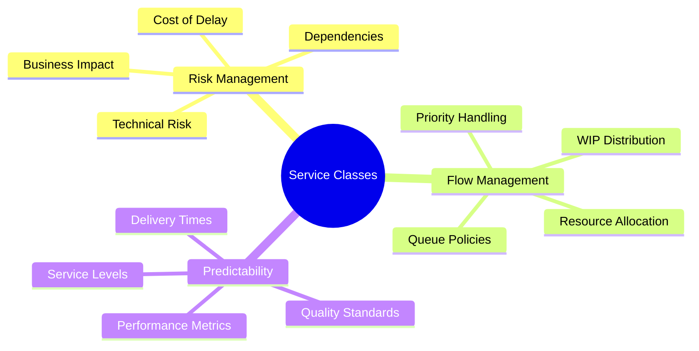
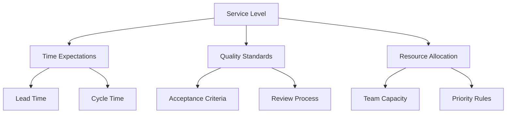
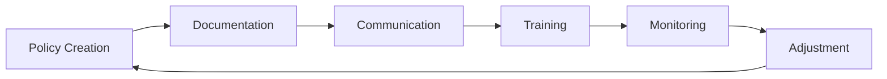
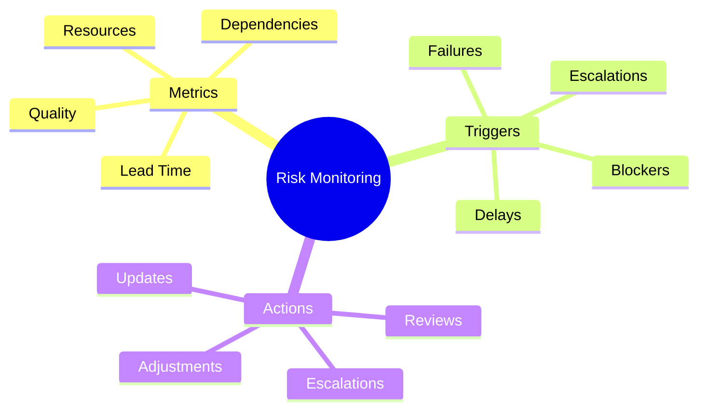

import Tabs from "@theme/Tabs";
import TabItem from "@theme/TabItem";

A comprehensive guide to implementing and managing service classes in Kanban systems, including policies, service level expectations, and risk management strategies.

<!-- truncate -->

:::tip Key Concepts
Essential elements of service class management:

- 🎯 Class of Service Types
- ⚖️ Service Level Expectations
- 📋 Policy Definition
- ⚡ Queue Management
- 🔄 Risk Management
  :::

## Understanding Service Classes

### Purpose and Benefits

### Core Service Class Types

<Tabs>
  <TabItem value="expedite" label="Expedite" default>
    **Characteristics**:
    - Highest priority
    - Breaks WIP limits
    - Immediate attention
    - Special handling

    **Examples**:
    - Production incidents
    - Security vulnerabilities
    - Critical business issues
    - Regulatory compliance

    **Policies**:
    - Stop other work
    - Direct escalation path
    - Senior team involvement
    - Regular status updates

  </TabItem>
  <TabItem value="fixed-date" label="Fixed Date">
    **Characteristics**:
    - Deadline-driven
    - Scheduled delivery
    - Known dependencies
    - Risk management

    **Examples**:
    - Regulatory requirements
    - Contract obligations
    - Market events
    - Scheduled releases

    **Policies**:
    - Early start
    - Buffer management
    - Progress tracking
    - Risk mitigation

  </TabItem>
  <TabItem value="standard" label="Standard">
    **Characteristics**:
    - Normal priority
    - Regular flow
    - Predictable delivery
    - Standard handling

    **Examples**:
    - Feature development
    - Product enhancements
    - Technical improvements
    - Regular maintenance

    **Policies**:
    - FIFO processing
    - Standard WIP limits
    - Normal escalation
    - Regular updates

  </TabItem>
  <TabItem value="intangible" label="Intangible">
    **Characteristics**:
    - Investment nature
    - Flexible timing
    - Long-term value
    - Variable priority

    **Examples**:
    - Technical debt
    - Infrastructure upgrades
    - Research projects
    - Innovation initiatives

    **Policies**:
    - Capacity allocation
    - Batch processing
    - Flexible scheduling
    - Value tracking

  </TabItem>
</Tabs>

## Service Level Expectations (SLE)

### Defining Service Levels

:::info SLE Components
Service Level Expectations define the predictable delivery time for each service class.
:::

### Class-Specific SLEs

<Tabs>
  <TabItem value="expedite" label="Expedite SLEs" default>
    **Time Metrics**:
    - Response time: < 1 hour
    - Resolution time: < 24 hours
    - Status updates: Every 2 hours

    **Quality Requirements**:
    - Immediate testing
    - Senior review
    - Documentation
    - Post-mortem analysis

  </TabItem>
  <TabItem value="fixed" label="Fixed Date SLEs">
    **Time Metrics**:
    - Planning buffer: 20%
    - Review cycles: Weekly
    - Status reports: Bi-weekly
    - Risk assessment: Daily

    **Quality Requirements**:
    - Milestone reviews
    - Stakeholder sign-off
    - Compliance checks
    - Performance testing

  </TabItem>
</Tabs>

## Policy Definition

### Core Policies

1. **Entry Policies**

   - Classification criteria
   - Initial assessment
   - Resource requirements
   - Priority assignment

2. **Processing Policies**

   - WIP limits
   - Queue management
   - Handoff rules
   - Quality gates

3. **Exit Policies**
   - Completion criteria
   - Review requirements
   - Documentation needs
   - Delivery standards

### Policy Implementation

## Queue Management

### Queue Policies

<Tabs>
  <TabItem value="expedite" label="Expedite Queue" default>
    **Management Rules**:
    - Maximum 1-2 items
    - Direct pull access
    - Skip regular queues
    - Priority override

    **Monitoring**:
    - Real-time tracking
    - Escalation triggers
    - Impact assessment
    - Resolution time

  </TabItem>
  <TabItem value="standard" label="Standard Queue">
    **Management Rules**:
    - FIFO processing
    - Size limits
    - Aging policies
    - Replenishment rules

    **Monitoring**:
    - Queue length
    - Wait time
    - Flow metrics
    - Bottlenecks

  </TabItem>
</Tabs>

## Risk Management

### Risk Assessment

:::warning Critical Consideration
Each service class requires specific risk management strategies.
:::

1. **Risk Factors**

   - Business impact
   - Technical complexity
   - Resource constraints
   - External dependencies

2. **Mitigation Strategies**
   - Buffer management
   - Escalation paths
   - Contingency plans
   - Resource allocation

### Risk Monitoring

## Implementation Strategy

### Getting Started

<Tabs>
  <TabItem value="assessment" label="Initial Assessment" default>
    **Activities**:
    - Work type analysis
    - Volume patterns
    - Resource mapping
    - Risk evaluation

    **Outputs**:
    - Service class definitions
    - Initial policies
    - Implementation plan
    - Training needs

  </TabItem>
  <TabItem value="rollout" label="Implementation">
    **Steps**:
    - Policy documentation
    - Team training
    - Monitoring setup
    - Feedback loops

    **Success Factors**:
    - Clear communication
    - Team buy-in
    - Regular reviews
    - Continuous improvement

  </TabItem>
</Tabs>

## Best Practices

### Success Patterns

1. **Clear Definition**

   - Explicit criteria
   - Simple classification
   - Visual indicators
   - Regular review

2. **Effective Management**

   - Policy enforcement
   - Queue discipline
   - Resource alignment
   - Performance tracking

3. **Continuous Improvement**
   - Regular assessment
   - Policy updates
   - Team feedback
   - Metric analysis

## Additional Resources

- [Kanban Service Classes](https://www.digite.com/kanban/kanban-service-classes/)
- [Queue Management](https://leankit.com/learn/kanban/lean-flow-metrics/)
- [Risk Management](https://www.kanban.university/kanban-guide/)
- [Policy Implementation](https://www.atlassian.com/agile/kanban)
