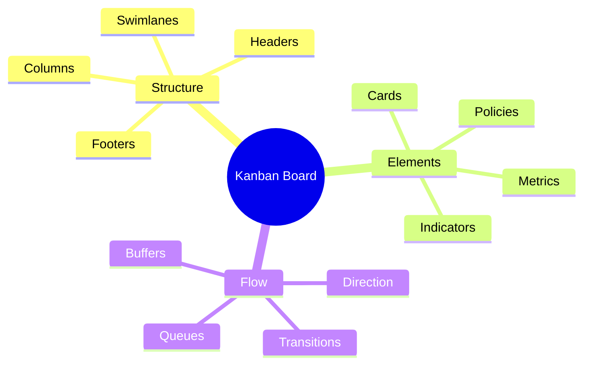
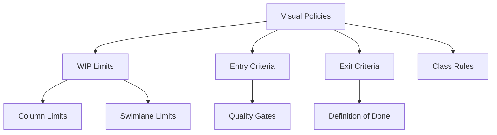
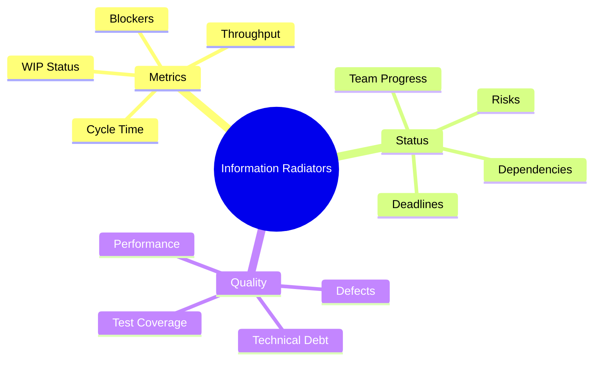

import Tabs from "@theme/Tabs";
import TabItem from "@theme/TabItem";

A comprehensive guide to designing and implementing effective Kanban boards, focusing on visualization techniques and best practices.

<!-- truncate -->

:::tip Key Visualization Elements
Essential components of Kanban visualization:

- 📋 Kanban Boards
- 🔲 Columns & States
- 🏊‍♂️ Swimlanes
- 🎴 Cards & Items
- 📊 Visual Policies
  :::

## Board Design Principles

### Core Components

### Column Types & States

<Tabs>
  <TabItem value="basic" label="Basic Structure" default>
    **Essential Columns**: - Backlog/Input Queue - In Progress States -
    Done/Output **Purpose**: - Clear workflow stages - Status visibility -
    Progress tracking - Handoff points
  </TabItem>
  <TabItem value="advanced" label="Advanced Structure">
    **Specialized Columns**: - Buffer zones - Quality gates - Review stages -
    Waiting states **Benefits**: - Process clarity - Quality control - Risk
    management - Flow optimization
  </TabItem>
</Tabs>

### Swimlane Configuration

1. **Purpose-Based Lanes**

   - Work types
   - Service classes
   - Team assignments
   - Priority levels

2. **Design Considerations**
   - Clear separation
   - Visual distinction
   - Flow consistency
   - Policy alignment

### Visual Policies

:::info Policy Visualization
Visual policies make process rules explicit and visible to all team members.
:::

## Card Design

### Information Architecture

<Tabs>
  <TabItem value="essential" label="Essential Elements" default>
    **Core Information**: - Title/ID - Description - Owner/Assignee - Due Date
    **Visual Indicators**: - Priority markers - Age indicators - Blockers -
    Dependencies
  </TabItem>
  <TabItem value="advanced" label="Advanced Elements">
    **Additional Data**: - Size/Effort - Class of Service - Risk level -
    Business value **Metadata**: - Creation date - Cycle time - Related items -
    Attachments
  </TabItem>
</Tabs>

### Visual Indicators

1. **Status Indicators**

   - Color coding
   - Icons
   - Stickers
   - Flags

2. **Time Tracking**
   - Age markers
   - Due date warnings
   - SLA indicators
   - Timeline markers

## Physical vs. Digital Boards

### Physical Boards

<Tabs>
  <TabItem value="advantages" label="Advantages" default>
    **Benefits**: - High visibility - Tactile interaction - Team engagement -
    Simple updates **Best For**: - Co-located teams - Simple workflows - Quick
    changes - Team ceremonies
  </TabItem>
  <TabItem value="limitations" label="Limitations">
    **Challenges**: - Limited accessibility - Manual updates - No automation -
    Space constraints **Considerations**: - Maintenance effort - Data
    persistence - Remote access - Scalability
  </TabItem>
</Tabs>

### Digital Boards

1. **Key Features**

   - Remote accessibility
   - Automated updates
   - Data persistence
   - Integration capabilities

2. **Tool Selection**
   - Team size
   - Process complexity
   - Integration needs
   - Reporting requirements

## Information Radiators

### Types of Radiators

### Implementation

<Tabs>
  <TabItem value="setup" label="Setup" default>
    **Location**: - High visibility - Team accessibility - Meeting spaces - Work
    areas **Updates**: - Regular frequency - Clear ownership - Team involvement
    - Data accuracy
  </TabItem>
  <TabItem value="content" label="Content">
    **Display**: - Key metrics - Team goals - Blockers - Achievements
    **Format**: - Clear visuals - Simple charts - Color coding - Action items
  </TabItem>
</Tabs>

## Best Practices

### Design Guidelines

1. **Clarity**

   - Clear structure
   - Simple layout
   - Consistent notation
   - Intuitive flow

2. **Accessibility**

   - Easy updates
   - Quick understanding
   - Team involvement
   - Stakeholder clarity

3. **Effectiveness**
   - Right information
   - Timely updates
   - Actionable data
   - Clear policies

### Common Pitfalls

:::warning Watch Out
Avoid these common visualization mistakes.
:::

1. **Design Issues**

   - Overcomplicated layouts
   - Unclear policies
   - Information overload
   - Poor visibility

2. **Process Problems**
   - Inconsistent updates
   - Ignored policies
   - Stale information
   - Missing context

## Additional Resources

- [Kanban Board Design](https://www.atlassian.com/agile/kanban/boards)
- [Card Design Patterns](https://www.digite.com/kanban/kanban-cards/)
- [Information Radiators](https://www.agilealliance.org/glossary/information-radiators/)
- [Visual Management](https://leankit.com/learn/kanban/visual-management-tools/)
