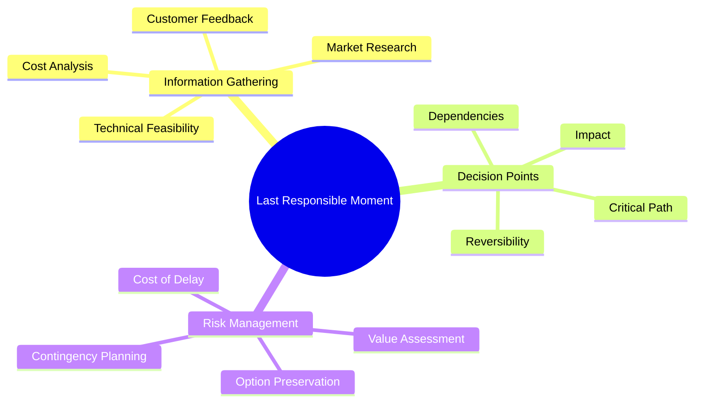
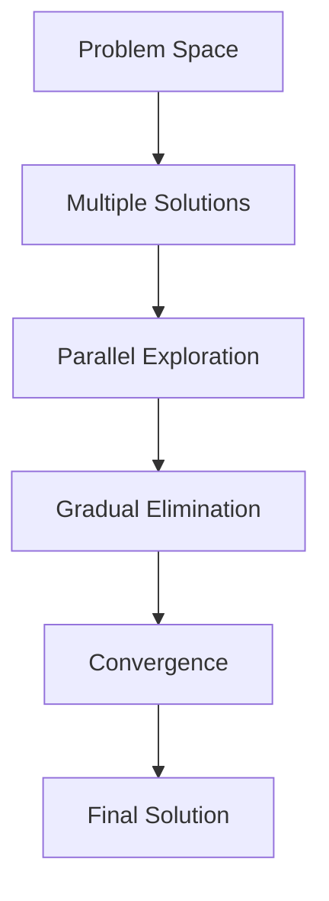
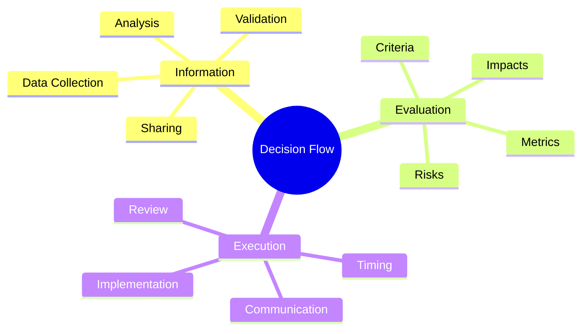
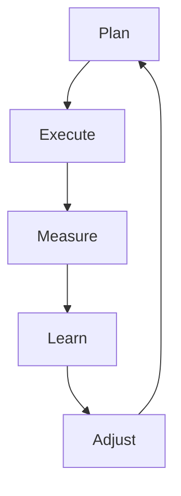

import Tabs from "@theme/Tabs";
import TabItem from "@theme/TabItem";

A comprehensive guide to effective decision making in Lean Software Development, focusing on delaying commitment and maintaining options until the last responsible moment.

<!-- truncate -->

:::tip Key Concepts
Essential elements of Lean decision making:

- ⏰ Last Responsible Moment
- 🔄 Set-Based Development
- 💡 Options Thinking
- 📊 Decision Flow
- 📚 Knowledge Management
- 🔄 Learning Cycles
  :::

## Last Responsible Moment

### Understanding the Concept

:::info Key Principle
The Last Responsible Moment is about making decisions at the point where delaying them further would eliminate an important alternative.
:::



### Implementation Strategy

<Tabs>
  <TabItem value="approach" label="Decision Approach" default>
    **Key Elements**: - Identify decision points - Assess reversibility -
    Evaluate dependencies - Monitor deadlines **Benefits**: - Better information
    - Reduced risk - Increased flexibility - Improved outcomes
  </TabItem>
  <TabItem value="practices" label="Best Practices">
    **Guidelines**: - Keep options open - Gather information continuously -
    Monitor market changes - Maintain flexibility **Challenges**: - Balancing
    delay vs action - Managing uncertainty - Stakeholder expectations - Resource
    allocation
  </TabItem>
</Tabs>

## Set-Based Development

### Core Principles



### Implementation Framework

<Tabs>
  <TabItem value="process" label="Development Process" default>
    **Steps**: - Define solution space - Explore alternatives - Test assumptions
    - Eliminate gradually **Advantages**: - Thorough exploration - Reduced
    rework - Better solutions - Risk mitigation
  </TabItem>
  <TabItem value="tools" label="Tools & Techniques">
    **Methods**: - Prototyping - A/B testing - Proof of concepts - Feasibility
    studies **Support**: - Documentation - Collaboration tools - Testing
    frameworks - Analysis tools
  </TabItem>
</Tabs>

## Options Thinking

### Strategic Approach

:::warning Value Preservation
Maintain valuable options while systematically eliminating less promising alternatives.
:::

1. **Option Identification**

   - Market opportunities
   - Technical solutions
   - Implementation paths
   - Resource allocation

2. **Option Evaluation**
   ```mermaid
   graph TD
       A[Option Analysis] --> B[Cost Assessment]
       B --> C[Value Potential]
       C --> D[Risk Evaluation]
       D --> E[Decision Making]
   ```

### Decision Framework

<Tabs>
  <TabItem value="evaluation" label="Option Evaluation" default>
    **Criteria**: - Business value - Technical feasibility - Resource
    requirements - Risk profile **Analysis**: - Cost-benefit analysis - Risk
    assessment - Impact evaluation - Timeline considerations
  </TabItem>
  <TabItem value="management" label="Option Management">
    **Activities**: - Regular review - Option pruning - New option discovery -
    Decision tracking **Tools**: - Decision matrices - Value stream mapping -
    Risk registers - Timeline tracking
  </TabItem>
</Tabs>

## Decision Flow

### Process Structure



### Flow Management

<Tabs>
  <TabItem value="process" label="Flow Process" default>
    **Stages**: - Information gathering - Option analysis - Stakeholder input -
    Decision making **Controls**: - Quality gates - Review points - Validation
    steps - Feedback loops
  </TabItem>
  <TabItem value="optimization" label="Flow Optimization">
    **Focus Areas**: - Process efficiency - Communication clarity - Decision
    quality - Learning capture **Improvements**: - Streamlined process - Better
    tools - Clear criteria - Quick feedback
  </TabItem>
</Tabs>

## Knowledge Management

### Knowledge Creation

1. **Learning Sources**

   - Project experiences
   - Customer feedback
   - Technical discoveries
   - Market insights

2. **Knowledge Capture**
   ```mermaid
   graph TD
       A[Experience] --> B[Documentation]
       B --> C[Sharing]
       C --> D[Application]
       D --> E[Improvement]
       E --> A
   ```

### Knowledge Sharing

<Tabs>
  <TabItem value="methods" label="Sharing Methods" default>
    **Techniques**: - Documentation - Team meetings - Knowledge bases - Training
    sessions **Tools**: - Wikis - Code comments - Review systems - Learning
    platforms
  </TabItem>
  <TabItem value="culture" label="Learning Culture">
    **Elements**: - Open communication - Regular sharing - Continuous learning -
    Feedback loops **Support**: - Mentoring - Pair programming - Code reviews -
    Tech talks
  </TabItem>
</Tabs>

## Learning Cycles

### Cycle Structure

:::info Continuous Learning
Learning cycles ensure continuous improvement in decision-making capabilities.
:::



### Implementation Framework

<Tabs>
  <TabItem value="cycles" label="Learning Cycles" default>
    **Components**: - Planning phase - Execution phase - Analysis phase -
    Adjustment phase **Benefits**: - Continuous improvement - Better decisions -
    Reduced risks - Knowledge growth
  </TabItem>
  <TabItem value="support" label="Support Systems">
    **Infrastructure**: - Feedback systems - Metrics tracking - Documentation
    tools - Communication platforms **Activities**: - Regular reviews - Team
    retrospectives - Knowledge sharing - Process updates
  </TabItem>
</Tabs>

## Best Practices

### Success Factors

1. **Clear Framework**

   - Defined criteria
   - Transparent process
   - Regular review
   - Measurable outcomes

2. **Team Engagement**

   - Active participation
   - Shared understanding
   - Collective ownership
   - Continuous learning

3. **Continuous Improvement**
   - Regular assessment
   - Process refinement
   - Tool optimization
   - Knowledge sharing

## Additional Resources

- [Lean Enterprise Institute - Decision Making](https://www.lean.org)
- [Set-Based Development Guide](https://leankit.com/learn/lean/set-based-development/)
- [Last Responsible Moment](https://martinfowler.com/bliki/LastResponsibleMoment.html)
- [Knowledge Management in Lean](https://www.planview.com/resources/articles/lkdc-principles-lean-development/)
