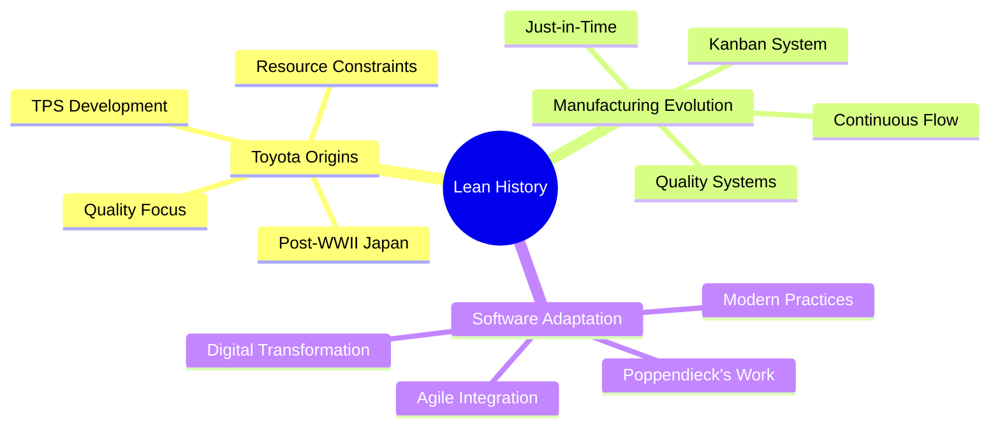
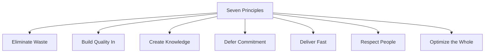
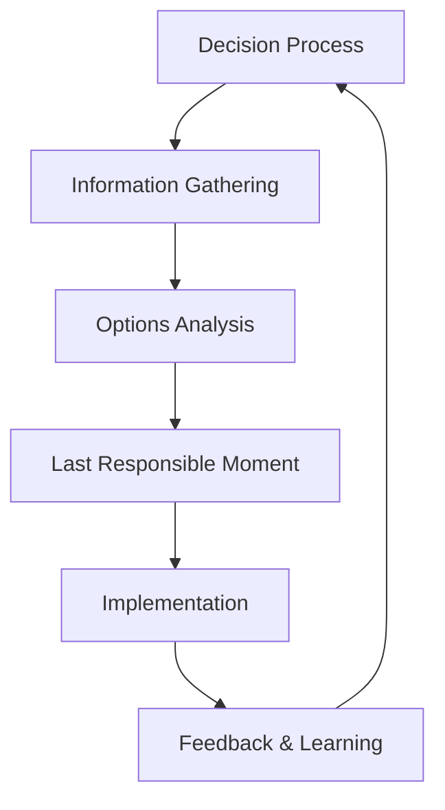
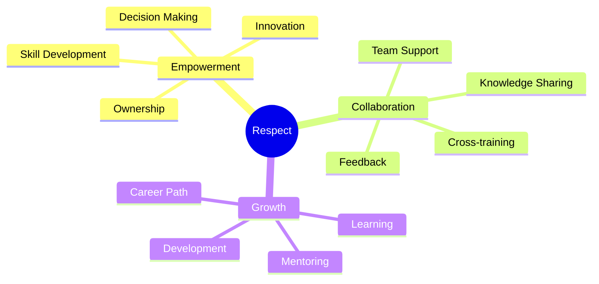

import Tabs from "@theme/Tabs";
import TabItem from "@theme/TabItem";

A comprehensive guide to Lean Software Development, exploring its origins, principles, and modern applications in software development.

<!-- truncate -->

:::tip Key Concepts
Essential elements covered in this guide:

- 📚 Origins and History
- 🎯 Seven Lean Principles
- 🧠 Lean Thinking
- 💎 Value-driven Development
- ♻️ Waste Elimination
  :::

## Origins and History

### Manufacturing Heritage



<Tabs>
  <TabItem value="toyota" label="Toyota Production System" default>
    **Core Elements**:
    - Just-in-Time production
    - Built-in quality (Jidoka)
    - Visual management
    - Continuous improvement (Kaizen)

    **Key Innovations**:
    - Pull systems
    - Value stream focus
    - Waste elimination
    - Worker empowerment

  </TabItem>
  <TabItem value="software" label="Software Evolution">
    **Adaptation Process**:
    - Mary & Tom Poppendieck's principles
    - Integration with Agile values
    - DevOps movement influence
    - Modern digital practices

    **Key Transformations**:
    - Code as inventory concept
    - Technical debt focus
    - Fast feedback cycles
    - Value stream thinking

  </TabItem>
</Tabs>

### Modern Context

:::info Evolution
The journey from manufacturing to software development has led to unique adaptations while maintaining core principles.
:::

1. **Digital Transformation**

   - Continuous delivery
   - Cloud computing
   - DevOps practices
   - Automation focus

2. **Industry Impact**
   - Startup methodologies
   - Enterprise adoption
   - Digital innovation
   - Agile integration

## Seven Lean Principles

### Principle Overview



### Detailed Exploration

<Tabs>
  <TabItem value="eliminate" label="1. Eliminate Waste" default>
    :::info Types of Waste
    In software development, waste is anything that doesn't add value from the customer's perspective.
    :::

    **DOWNTIME Categories**:
    - **Defects**: Bugs, quality issues requiring rework
    - **Overproduction**: Features built before needed
    - **Waiting**: Delays in feedback or approvals
    - **Non-value processing**: Unnecessary documentation
    - **Transportation**: Inefficient handoffs
    - **Inventory**: Partially done work, WIP
    - **Motion**: Task switching, context shifting
    - **Extra Features**: Gold plating, unused functionality

    **Elimination Strategies**:
    - Regular waste identification meetings
    - Value stream mapping
    - Process optimization
    - Automated workflows
    - Clear Definition of Done

  </TabItem>

  <TabItem value="quality" label="2. Build Quality In">
    :::info Quality First
    Focus on preventing defects rather than finding them later.
    :::

    **Key Practices**:
    - Test-Driven Development (TDD)
    - Continuous Integration
    - Automated Testing
    - Code Reviews
    - Pair Programming
    - Design Patterns

    **Implementation Approach**:
    ```mermaid
    graph TD
        A[Quality First] --> B[Prevention]
        A --> C[Automation]
        A --> D[Collaboration]
        B --> E[TDD]
        C --> F[CI/CD]
        D --> G[Pair Programming]
    ```

  </TabItem>

  <TabItem value="knowledge" label="3. Create Knowledge">
    :::info Knowledge Management
    Provide infrastructure to properly document and retain valuable learning.
    :::

    **Documentation Methods**:
    - Wiki systems
    - Code repositories
    - Technical documentation
    - Architecture decisions
    - Team knowledge bases

    **Knowledge Sharing Practices**:
    - Pair programming sessions
    - Code reviews
    - Team workshops
    - Cross-training
    - Documentation sprints

    **Tools and Platforms**:
    - Version control systems
    - Documentation platforms
    - Knowledge bases
    - Collaboration tools
    - Learning management systems

  </TabItem>

  <TabItem value="defer" label="4. Defer Commitment">
    :::warning Last Responsible Moment
    Make irreversible decisions at the last responsible moment, when you have the most information.
    :::

    **Key Concepts**:
    - Options thinking
    - Reversible decisions
    - Information gathering
    - Risk assessment
    - Flexible architecture

    **Implementation Strategies**:
    ```mermaid
    mindmap
      root((Defer Commitment))
        Information
          Gather Data
          Analyze Options
          Assess Impact
        Timing
          Last Responsible Moment
          Reversible Decisions
          Risk Management
        Architecture
          Flexible Design
          Modular Systems
          Adaptable Solutions
    ```

  </TabItem>

  <TabItem value="deliver" label="5. Deliver Fast">
    :::info Speed and Quality
    Fast delivery through waste elimination and efficient processes.
    :::

    **Key Elements**:
    - Small batch sizes
    - Continuous flow
    - Quick feedback cycles
    - MVP approach
    - Iterative development

    **Implementation Focus**:
    - Minimize WIP
    - Automate processes
    - Remove bottlenecks
    - Streamline workflows
    - Continuous deployment

  </TabItem>

  <TabItem value="respect" label="6. Respect People">
    :::info Team Empowerment
    Focus on empowering team members rather than controlling them.
    :::

    **Core Aspects**:
    ```mermaid
    mindmap
      root((Respect))
        Leadership
          Servant Leadership
          Empowerment
          Support
          Growth
        Team
          Self-organization
          Decision-making
          Learning
          Innovation
        Culture
          Trust
          Safety
          Collaboration
          Excellence
    ```

    **Implementation Practices**:
    - Clear communication channels
    - Autonomous teams
    - Continuous learning
    - Recognition systems
    - Growth opportunities

  </TabItem>

  <TabItem value="optimize" label="7. Optimize the Whole">
    :::info Systems Thinking
    Focus on overall system performance rather than local optimizations.
    :::

    **Key Areas**:
    - End-to-end value stream
    - Cross-functional collaboration
    - System architecture
    - Process integration
    - Performance metrics

    **Optimization Strategies**:
    - Value stream mapping
    - System-level metrics
    - Cross-team coordination
    - Constraint management
    - Continuous improvement

    **Measurement Approach**:
    - Lead time
    - Cycle time
    - Value delivery
    - System throughput
    - Quality metrics

  </TabItem>
</Tabs>

## Lean Thinking

### Core Mindset

<Tabs>
  <TabItem value="value" label="Value Focus" default>
    **Key Principles**:
    - Customer-defined value
    - Value stream perspective
    - End-to-end optimization
    - Continuous value delivery

    **Implementation**:
    - Regular customer feedback
    - Value stream mapping
    - Waste elimination
    - Flow optimization

  </TabItem>
  <TabItem value="waste" label="Waste Elimination">
    **Types of Waste (DOWNTIME)**:
    - Defects: Bugs, errors, rework
    - Overproduction: Unused features
    - Waiting: Delays and dependencies
    - Non-utilized talent: Underused skills
    - Transportation: Handoffs and transfers
    - Inventory: Partially done work
    - Motion: Task switching
    - Extra processing: Unnecessary work

    **Elimination Strategies**:
    - Root cause analysis
    - Process simplification
    - Automation
    - Standard practices

  </TabItem>
</Tabs>

### Knowledge Creation

:::info Continuous Learning
Knowledge creation is a fundamental aspect of Lean thinking, emphasizing systematic learning throughout the development cycle.
:::

1. **Documentation Practices**

   - Pair programming sessions
   - Code reviews and feedback
   - Wiki documentation
   - Knowledge sharing sessions

2. **Learning Cycles**

   - Early releases for feedback
   - Daily builds and integration
   - Rapid feedback loops
   - Systematic experimentation

3. **Team Development**
   - Cross-training initiatives
   - Skill development plans
   - Mentoring programs
   - Community of practice

### Decision Making



<Tabs>
  <TabItem value="principles" label="Decision Principles" default>
    **Core Concepts**:
    - Defer commitment
    - Keep options open
    - Fact-based decisions
    - Reversible choices

    **Benefits**:
    - Better information
    - Reduced risk
    - Flexible response
    - Optimal timing

  </TabItem>
  <TabItem value="practices" label="Decision Practices">
    **Implementation**:
    - Set-based development
    - Options thinking
    - Data-driven choices
    - Regular reviews

    **Tools**:
    - Decision matrices
    - Impact analysis
    - Risk assessment
    - Feedback loops

  </TabItem>
</Tabs>

### Flow Optimization

1. **Flow Principles**

   - Small batch sizes
   - Continuous movement
   - Pull-based systems
   - Quick feedback cycles

2. **Implementation Strategies**

   - Value stream mapping
   - Queue management
   - WIP limits
   - Bottleneck removal

3. **Measurement**
   - Lead time tracking
   - Cycle time analysis
   - Flow efficiency
   - Quality metrics

### Respect for People

:::warning Critical Element
Respect for people is a foundational principle that enables all other Lean practices.
:::



### Continuous Improvement

<Tabs>
  <TabItem value="kaizen" label="Kaizen Mindset" default>
    **Elements**:
    - Small improvements
    - Regular reflection
    - Team involvement
    - Measurable progress

    **Implementation**:
    - Daily improvements
    - Team suggestions
    - Quick experiments
    - Success sharing

  </TabItem>
  <TabItem value="process" label="Improvement Process">
    **Steps**:
    - Identify opportunities
    - Plan changes
    - Execute improvements
    - Measure results
    - Standardize success

    **Tools**:
    - Retrospectives
    - Metrics analysis
    - A3 problem solving
    - Visual management

  </TabItem>
</Tabs>

## Value-driven Development

### Value Definition

```

```
