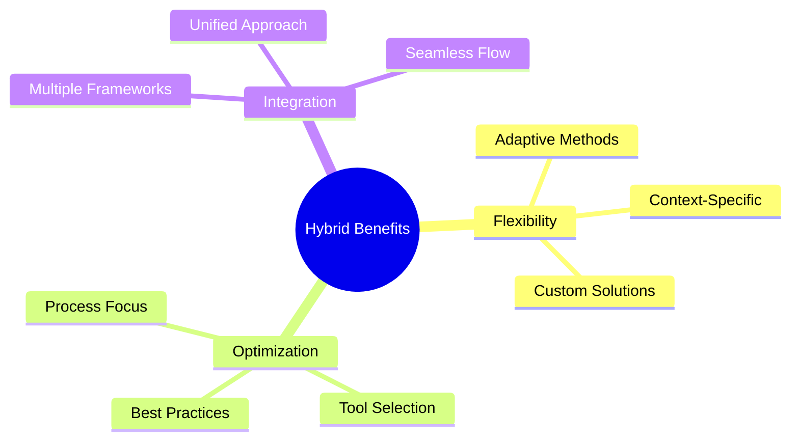

import Tabs from "@theme/Tabs";
import TabItem from "@theme/TabItem";

A comprehensive guide to integrating Lean principles with other methodologies, creating effective hybrid approaches that leverage the strengths of multiple frameworks.

<!-- truncate -->

:::tip Key Concepts
Essential elements of hybrid approaches:

- 🔄 Lean-Agile Integration
- 📊 Lean-Scrum Combination
- ⚡ Lean-Kanban Fusion
- 🚀 DevOps Integration
- 🛠️ Custom Combinations
- 📈 Migration Strategies
  :::

## Understanding Hybrid Approaches

### Why Hybrid?



### Core Principles

<Tabs>
  <TabItem value="foundation" label="Foundation" default>
    **Key Elements**:
    - Value focus
    - Waste elimination
    - Flow optimization
    - Continuous improvement

    **Benefits**:
    - Enhanced adaptability
    - Better outcomes
    - Increased efficiency
    - Team empowerment

  </TabItem>
  <TabItem value="implementation" label="Implementation">
    **Approach**:
    - Selective adoption
    - Gradual integration
    - Regular evaluation
    - Continuous refinement

    **Considerations**:
    - Team context
    - Organization needs
    - Cultural factors
    - Technical requirements

  </TabItem>
</Tabs>

## Lean-Agile Integration

### Core Components

1. **Value Stream Focus**

   - Customer centricity
   - End-to-end flow
   - Value optimization
   - Waste elimination

2. **Agile Practices**
   ```mermaid
   graph TD
       A[Lean Principles] --> B[Iterative Development]
       A --> C[Customer Focus]
       A --> D[Continuous Flow]
       B --> E[Hybrid Implementation]
       C --> E
       D --> E
   ```

### Implementation Strategy

<Tabs>
  <TabItem value="approach" label="Integration Approach" default>
    **Methods**:
    - Value stream mapping
    - Iterative delivery
    - Flow optimization
    - Waste reduction

    **Tools**:
    - Visual management
    - Metrics tracking
    - Feedback loops
    - Improvement cycles

  </TabItem>
  <TabItem value="practices" label="Best Practices">
    **Focus Areas**:
    - Team collaboration
    - Process alignment
    - Tool integration
    - Cultural adaptation

    **Success Factors**:
    - Clear communication
    - Regular feedback
    - Continuous learning
    - Adaptive planning

  </TabItem>
</Tabs>

## Lean-Scrum Combination

### Integration Points

:::info Synergy
Combining Lean principles with Scrum practices creates a powerful framework for delivery optimization.
:::

1. **Framework Integration**

   - Sprint planning
   - Flow management
   - WIP limits
   - Retrospectives

2. **Process Optimization**
   ```mermaid
   mindmap
     root((Lean-Scrum))
       Planning
         Value Focus
         Flow Design
         Capacity Planning
       Execution
         Pull System
         WIP Control
         Daily Flow
       Review
         Value Validation
         Process Check
         Improvements
   ```

### Implementation Framework

<Tabs>
  <TabItem value="structure" label="Framework Structure" default>
    **Elements**:
    - Sprint cadence
    - Flow control
    - Quality focus
    - Value delivery

    **Integration**:
    - Ceremonies alignment
    - Role definition
    - Metric selection
    - Tool adoption

  </TabItem>
  <TabItem value="execution" label="Execution">
    **Activities**:
    - Daily management
    - Flow monitoring
    - Impediment removal
    - Continuous improvement

    **Support**:
    - Team training
    - Tool setup
    - Process guidance
    - Regular review

  </TabItem>
</Tabs>

## Lean-Kanban Fusion

### Core Elements

1. **Visual Management**

   - Board design
   - Flow visualization
   - WIP limits
   - Queue management

2. **Process Control**
   ```mermaid
   graph TD
       A[Lean Principles] --> B[Kanban Board]
       B --> C[Flow Control]
       C --> D[WIP Limits]
       D --> E[Optimization]
       E --> A
   ```

### Implementation Approach

<Tabs>
  <TabItem value="setup" label="Initial Setup" default>
    **Components**:
    - Board configuration
    - Policy definition
    - Metric selection
    - Tool integration

    **Focus**:
    - Flow efficiency
    - Value delivery
    - Quality control
    - Team engagement

  </TabItem>
  <TabItem value="optimization" label="Continuous Improvement">
    **Areas**:
    - Flow analysis
    - Process refinement
    - Tool enhancement
    - Team development

    **Methods**:
    - Regular review
    - Data analysis
    - Feedback loops
    - Adaptation cycles

  </TabItem>
</Tabs>

## DevOps Integration

### Integration Framework

:::warning Alignment
Ensure alignment between Lean principles and DevOps practices for optimal results.
:::

1. **Technical Practices**

   - Continuous Integration
   - Automated Testing
   - Infrastructure as Code
   - Monitoring & Feedback

2. **Cultural Elements**
   ```mermaid
   mindmap
     root((DevOps Culture))
       Collaboration
         Cross-functional
         Shared Goals
         Communication
       Automation
         CI/CD
         Testing
         Deployment
       Measurement
         Metrics
         Feedback
         Learning
   ```

### Implementation Strategy

<Tabs>
  <TabItem value="technical" label="Technical Integration" default>
    **Focus Areas**:
    - Pipeline automation
    - Test automation
    - Infrastructure management
    - Monitoring setup

    **Tools**:
    - CI/CD platforms
    - Testing frameworks
    - Infrastructure tools
    - Monitoring systems

  </TabItem>
  <TabItem value="cultural" label="Cultural Integration">
    **Elements**:
    - Team collaboration
    - Knowledge sharing
    - Continuous learning
    - Feedback culture

    **Support**:
    - Training programs
    - Documentation
    - Communication channels
    - Regular reviews

  </TabItem>
</Tabs>

## Custom Combinations

### Design Principles

1. **Context Analysis**

   - Team capabilities
   - Organization needs
   - Technical requirements
   - Cultural factors

2. **Framework Selection**
   ```mermaid
   graph TD
       A[Context Analysis] --> B[Framework Selection]
       B --> C[Integration Design]
       C --> D[Implementation]
       D --> E[Refinement]
       E --> A
   ```

### Implementation Guide

<Tabs>
  <TabItem value="design" label="Design Phase" default>
    **Activities**:
    - Need assessment
    - Framework evaluation
    - Integration planning
    - Success metrics

    **Outputs**:
    - Custom framework
    - Implementation plan
    - Training program
    - Measurement system

  </TabItem>
  <TabItem value="execution" label="Execution Phase">
    **Steps**:
    - Pilot implementation
    - Team training
    - Process rollout
    - Regular review

    **Support**:
    - Documentation
    - Coaching
    - Tool setup
    - Feedback loops

  </TabItem>
</Tabs>

## Migration Strategies

### Transition Planning

:::info Gradual Change
Focus on incremental improvements and clear communication during transitions.
:::

1. **Assessment**

   - Current state
   - Target state
   - Gap analysis
   - Risk assessment

2. **Implementation Phases**
   ```mermaid
   graph TD
       A[Current State] --> B[Pilot Phase]
       B --> C[Gradual Rollout]
       C --> D[Full Implementation]
       D --> E[Continuous Improvement]
   ```

### Success Factors

<Tabs>
  <TabItem value="critical" label="Critical Elements" default>
    **Key Factors**:
    - Leadership support
    - Team engagement
    - Clear communication
    - Regular feedback

    **Enablers**:
    - Training programs
    - Tool support
    - Process guidance
    - Success metrics

  </TabItem>
  <TabItem value="challenges" label="Common Challenges">
    **Issues**:
    - Resistance to change
    - Process conflicts
    - Tool integration
    - Skill gaps

    **Solutions**:
    - Change management
    - Clear communication
    - Training support
    - Regular review

  </TabItem>
</Tabs>

## Additional Resources

- [Lean Enterprise Institute](https://www.lean.org)
- [Agile Alliance - Hybrid Approaches](https://www.agilealliance.org)
- [DevOps Enterprise Summit](https://events.itrevolution.com)
- [Kanban University](https://www.kanban.university)
