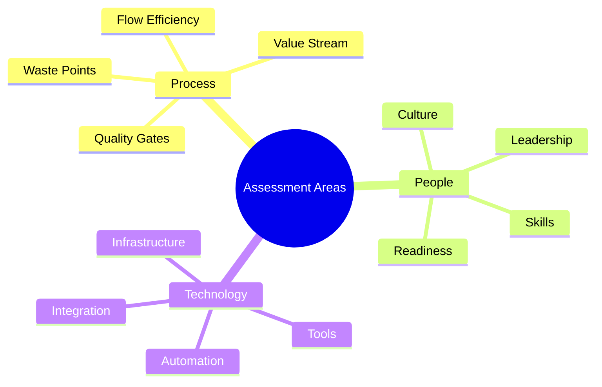

import Tabs from "@theme/Tabs";
import TabItem from "@theme/TabItem";

A comprehensive guide to implementing Lean Software Development in your organization, from initial assessment through full adoption and continuous improvement.

<!-- truncate -->

:::tip Key Implementation Phases
Essential elements for successful Lean adoption:

- 📋 Assessment & Planning
- 🔄 Cultural Transformation
- 🛠️ Tool Selection
- ⚠️ Common Challenges
- ✨ Success Patterns
- 📚 Case Studies
  :::

## Assessment & Planning

### Current State Analysis



### Implementation Strategy

<Tabs>
  <TabItem value="analysis" label="Analysis Phase" default>
    **Key Activities**:
    - Value stream mapping
    - Waste identification
    - Process evaluation
    - Team assessment

    **Deliverables**:
    - Current state map
    - Gap analysis
    - Risk assessment
    - Improvement roadmap

  </TabItem>
  <TabItem value="planning" label="Planning Phase">
    **Focus Areas**:
    - Implementation phases
    - Resource allocation
    - Training needs
    - Success metrics

    **Outputs**:
    - Detailed timeline
    - Resource plan
    - Training schedule
    - Measurement framework

  </TabItem>
</Tabs>

## Cultural Transformation

### Building Lean Culture

:::info Cultural Focus
Cultural transformation is critical for successful Lean adoption, focusing on mindset change and behavioral shifts.
:::

1. **Core Elements**
   ```mermaid
   graph TD
       A[Cultural Change] --> B[Mindset Shift]
       A --> C[Behavior Change]
       A --> D[Leadership Support]
       B --> E[Continuous Improvement]
       C --> F[Collaboration]
       D --> G[Empowerment]
   ```

### Transformation Framework

<Tabs>
  <TabItem value="mindset" label="Mindset Change" default>
    **Key Aspects**:
    - Value focus
    - Waste elimination
    - Flow optimization
    - Quality emphasis

    **Activities**:
    - Training workshops
    - Success stories
    - Visual management
    - Regular reinforcement

  </TabItem>
  <TabItem value="behaviors" label="Behavioral Change">
    **Focus Areas**:
    - Team collaboration
    - Problem-solving
    - Knowledge sharing
    - Continuous learning

    **Support**:
    - Coaching
    - Mentoring
    - Recognition
    - Feedback systems

  </TabItem>
</Tabs>

## Tool Selection

### Tool Categories

1. **Process Tools**

   - Value stream mapping
   - Kanban boards
   - Visual management
   - Metrics dashboards

2. **Development Tools**
   ```mermaid
   mindmap
     root((Tool Categories))
       Process Management
         Workflow
         Metrics
         Documentation
       Development
         Version Control
         CI/CD
         Testing
       Collaboration
         Communication
         Knowledge Sharing
         Team Coordination
   ```

### Selection Framework

<Tabs>
  <TabItem value="criteria" label="Selection Criteria" default>
    **Considerations**:
    - Team needs
    - Process fit
    - Integration capability
    - Scalability

    **Requirements**:
    - Ease of use
    - Support availability
    - Cost effectiveness
    - Training needs

  </TabItem>
  <TabItem value="implementation" label="Tool Implementation">
    **Steps**:
    - Pilot testing
    - User training
    - Integration setup
    - Usage monitoring

    **Success Factors**:
    - User adoption
    - Process alignment
    - Performance impact
    - ROI measurement

  </TabItem>
</Tabs>

## Common Challenges

### Implementation Obstacles

:::warning Watch Out
Understanding and preparing for common challenges increases implementation success.
:::

1. **Key Challenges**

   - Resistance to change
   - Lack of leadership support
   - Inadequate training
   - Tool complexity

2. **Mitigation Strategies**
   ```mermaid
   graph TD
       A[Challenge] --> B[Analysis]
       B --> C[Strategy]
       C --> D[Implementation]
       D --> E[Monitoring]
       E --> F[Adjustment]
   ```

### Resolution Approaches

<Tabs>
  <TabItem value="resistance" label="Change Resistance" default>
    **Signs**:
    - Process adherence issues
    - Tool adoption delays
    - Communication gaps
    - Team conflicts

    **Solutions**:
    - Clear communication
    - Early involvement
    - Quick wins
    - Regular feedback

  </TabItem>
  <TabItem value="support" label="Support Issues">
    **Problems**:
    - Resource constraints
    - Leadership misalignment
    - Training gaps
    - Tool limitations

    **Remedies**:
    - Resource planning
    - Leadership engagement
    - Training programs
    - Tool optimization

  </TabItem>
</Tabs>

## Success Patterns

### Key Success Factors

1. **Critical Elements**

   - Leadership commitment
   - Team engagement
   - Clear communication
   - Measurable progress

2. **Implementation Patterns**
   ```mermaid
   mindmap
     root((Success Patterns))
       Leadership
         Vision
         Support
         Example
       Process
         Clear Goals
         Small Steps
         Quick Wins
       People
         Engagement
         Training
         Recognition
   ```

### Best Practices

<Tabs>
  <TabItem value="practices" label="Implementation Practices" default>
    **Key Areas**:
    - Start small
    - Build momentum
    - Celebrate success
    - Share learning

    **Focus Points**:
    - Value delivery
    - Waste elimination
    - Flow optimization
    - Quality improvement

  </TabItem>
  <TabItem value="measurement" label="Success Metrics">
    **Metrics**:
    - Process efficiency
    - Quality improvements
    - Team satisfaction
    - Business value

    **Analysis**:
    - Regular review
    - Trend tracking
    - Impact assessment
    - ROI calculation

  </TabItem>
</Tabs>

## Case Studies

### Implementation Examples

1. **Industry Cases**

   - Software startups
   - Enterprise transformation
   - Digital agencies
   - Product companies

2. **Success Stories**
   ```mermaid
   graph TD
       A[Initial State] --> B[Challenges]
       B --> C[Solutions]
       C --> D[Results]
       D --> E[Lessons]
   ```

### Learning Points

<Tabs>
  <TabItem value="insights" label="Key Insights" default>
    **Learnings**:
    - Critical factors
    - Common pitfalls
    - Success enablers
    - Best practices

    **Applications**:
    - Strategy adaptation
    - Risk mitigation
    - Process improvement
    - Team development

  </TabItem>
  <TabItem value="recommendations" label="Recommendations">
    **Focus Areas**:
    - Leadership engagement
    - Team empowerment
    - Process alignment
    - Tool adoption

    **Actions**:
    - Clear communication
    - Regular assessment
    - Continuous adjustment
    - Knowledge sharing

  </TabItem>
</Tabs>

## Additional Resources

- [Lean Enterprise Institute - Implementation Guide](https://www.lean.org)
- [Lean Software Development Lifecycle](https://www.pixelcrayons.com/blog/software-development/lean-software-development/)
- [LSD Process Guide](https://www.geeksforgeeks.org/lean-software-development-lsd/)
- [Implementation Best Practices](https://martinfowler.com/articles/lean-inception/)
