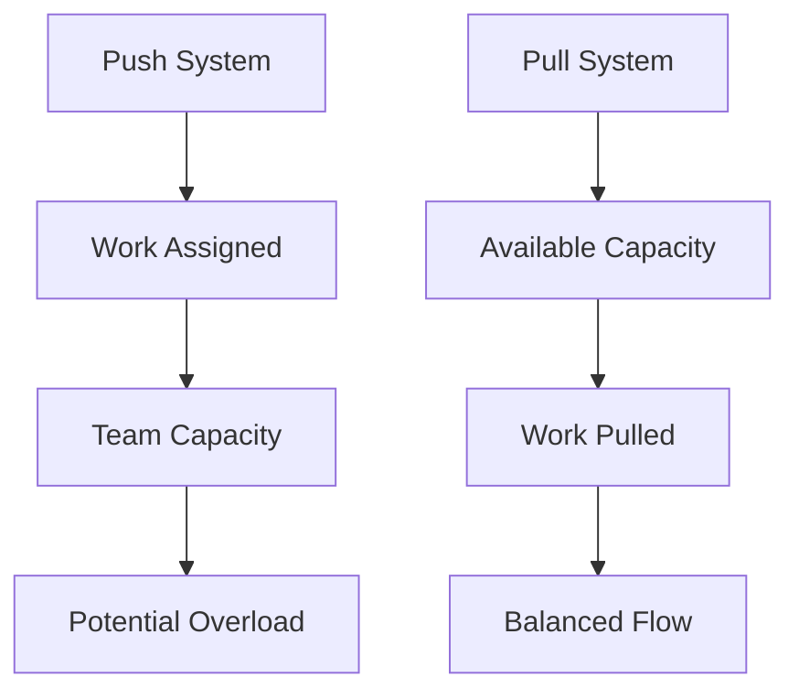
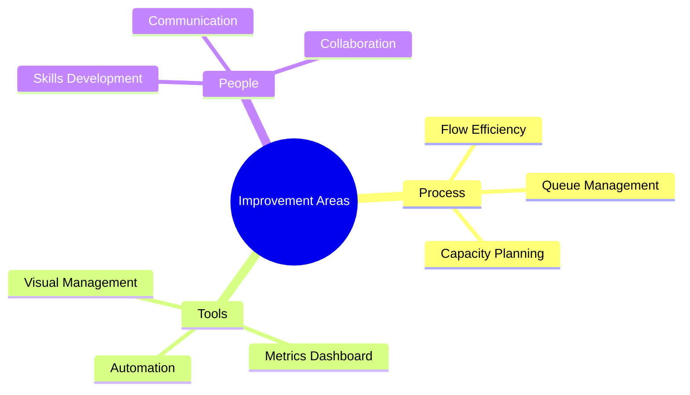

import Tabs from "@theme/Tabs";
import TabItem from "@theme/TabItem";

A comprehensive guide to implementing pull systems in software development, focusing on Just-in-Time delivery, flow efficiency, and capacity management.

<!-- truncate -->

:::tip Key Concepts
Essential elements of pull systems:

- 🔄 Pull vs Push Systems
- ⚡ Just-in-Time Development
- 📊 Work Organization
- 📈 Flow Efficiency
- 💪 Capacity Management
- 🎯 Queue Management
  :::

## Understanding Pull Systems

### Pull vs Push Systems



<Tabs>
  <TabItem value="pull" label="Pull System" default>
    **Characteristics**: - Work pulled based on capacity - Team controls flow -
    Natural work balance - Sustainable pace **Benefits**: - Reduced overload -
    Better quality - Predictable delivery - Team autonomy
  </TabItem>
  <TabItem value="push" label="Push System">
    **Characteristics**: - Work assigned from above - External control -
    Potential bottlenecks - Variable workload **Challenges**: - Resource
    conflicts - Quality issues - Team stress - Unpredictable delivery
  </TabItem>
</Tabs>

## Just-in-Time Development

### Core Principles

:::info JIT Philosophy
Just-in-Time in software means delivering features when they're needed, not before.
:::

1. **Value Focus**

   - Customer needs
   - Market timing
   - Business value
   - Resource optimization

2. **Delivery Timing**
   ```mermaid
   mindmap
     root((JIT Delivery))
       Planning
         Feature Timing
         Market Windows
         Resource Availability
       Execution
         Small Batches
         Quick Feedback
         Fast Integration
       Quality
         Built-in Testing
         Continuous Integration
         Automated Checks
   ```

### Implementation Strategy

<Tabs>
  <TabItem value="planning" label="Planning Approach" default>
    **Key Elements**: - Feature prioritization - Capacity planning - Release
    timing - Value assessment **Tools**: - Kanban boards - Priority queues -
    Value metrics - Flow diagrams
  </TabItem>
  <TabItem value="execution" label="Execution">
    **Practices**: - Small batch sizes - Continuous integration - Automated
    deployment - Quick feedback **Benefits**: - Faster delivery - Reduced waste
    - Better quality - Higher flexibility
  </TabItem>
</Tabs>

## Work Organization

### Structure and Flow

1. **Work Items**

   - User stories
   - Features
   - Bug fixes
   - Technical debt

2. **Organization Methods**
   ```mermaid
   graph TD
       A[Backlog] --> B[Ready Queue]
       B --> C[In Progress]
       C --> D[Review]
       D --> E[Done]
       F[WIP Limits] --> C
   ```

### Work Classification

<Tabs>
  <TabItem value="types" label="Work Types" default>
    **Categories**: - Feature development - Maintenance work - Support tasks -
    Innovation time **Handling**: - Separate queues - Different policies -
    Specific metrics - Dedicated capacity
  </TabItem>
  <TabItem value="policies" label="Work Policies">
    **Guidelines**: - Entry criteria - Exit criteria - WIP limits - Service
    levels **Management**: - Flow rules - Priority handling - Escalation paths -
    Review process
  </TabItem>
</Tabs>

## Flow Efficiency

### Optimizing Flow

:::warning Flow Focus
Efficient flow requires balancing capacity, demand, and work in progress.
:::

1. **Flow Metrics**

   - Lead time
   - Cycle time
   - WIP levels
   - Throughput

2. **Flow Improvements**
   ```mermaid
   graph TD
       A[Current State] --> B[Identify Bottlenecks]
       B --> C[Optimize Process]
       C --> D[Reduce Batch Size]
       D --> E[Measure Results]
       E --> F[Adjust]
       F --> A
   ```

### Flow Management

<Tabs>
  <TabItem value="control" label="Flow Control" default>
    **Mechanisms**: - WIP limits - Pull signals - Queue policies - Batch sizing
    **Tools**: - Kanban boards - Cumulative flow - Cycle time charts -
    Throughput tracking
  </TabItem>
  <TabItem value="optimization" label="Flow Optimization">
    **Strategies**: - Bottleneck removal - Process simplification - Automation -
    Feedback loops **Benefits**: - Faster delivery - Better predictability -
    Higher quality - Team satisfaction
  </TabItem>
</Tabs>

## Capacity Management

### Understanding Capacity

1. **Capacity Components**

   - Team size
   - Skill mix
   - Available time
   - External dependencies

2. **Capacity Planning**
   ```mermaid
   mindmap
     root((Capacity Planning))
       Analysis
         Current Capacity
         Historical Data
         Team Capabilities
       Planning
         Work Allocation
         Buffer Management
         Risk Mitigation
       Optimization
         Resource Balance
         Skill Development
         Process Improvement
   ```

### Capacity Optimization

<Tabs>
  <TabItem value="planning" label="Capacity Planning" default>
    **Methods**: - Demand analysis - Resource allocation - Skills matrix -
    Buffer management **Tools**: - Capacity charts - Team radar - Load balancing
    - Forecasting
  </TabItem>
  <TabItem value="management" label="Active Management">
    **Activities**: - Daily monitoring - Adjustment triggers - Reallocation -
    Escalation paths **Metrics**: - Utilization - Efficiency - Predictability -
    Team health
  </TabItem>
</Tabs>

## Queue Management

### Queue Design

:::info Queue Purpose
Queues help manage work flow and ensure optimal resource utilization.
:::

1. **Queue Types**

   - Backlog queue
   - Ready queue
   - Review queue
   - Deployment queue

2. **Queue Policies**
   ```mermaid
   graph TD
       A[Queue Policy] --> B[Size Limits]
       A --> C[Priority Rules]
       A --> D[Aging Policies]
       A --> E[Exit Criteria]
   ```

### Queue Optimization

<Tabs>
  <TabItem value="management" label="Queue Management" default>
    **Practices**: - Size control - Age monitoring - Priority handling - Flow
    management **Tools**: - Queue metrics - Aging charts - Priority markers -
    Flow indicators
  </TabItem>
  <TabItem value="improvement" label="Queue Improvement">
    **Strategies**: - Reduce queue size - Improve flow - Clear blockages -
    Balance load **Benefits**: - Faster delivery - Less waste - Better
    predictability - Higher satisfaction
  </TabItem>
</Tabs>

## Best Practices

### Implementation Success

1. **Key Factors**

   - Team buy-in
   - Clear policies
   - Visual management
   - Regular review

2. **Common Pitfalls**
   - Overloading teams
   - Ignoring policies
   - Poor visualization
   - Inadequate metrics

### Continuous Improvement



## Additional Resources

- [Kanban University - Pull Systems](https://www.kanban.university)
- [Lean Enterprise Institute](https://www.lean.org)
- [Flow Framework](https://flowframework.org)
- [Toyota Production System Guide](https://global.toyota/en/company/vision-and-philosophy/production-system/)
