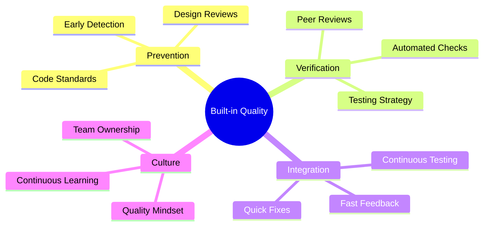
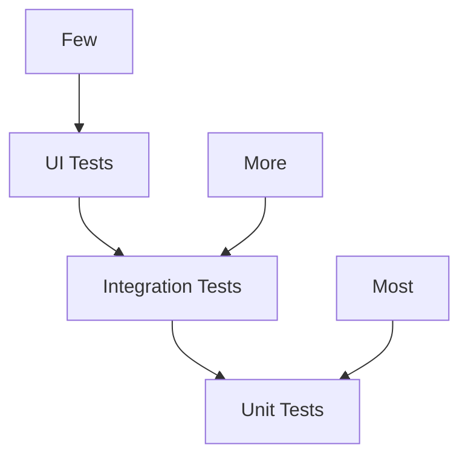

import Tabs from "@theme/Tabs";
import TabItem from "@theme/TabItem";

A comprehensive guide to building and maintaining quality in software development through Lean principles and practices.

<!-- truncate -->

:::tip Key Concepts
Essential elements of quality management:

- 🎯 Built-in Quality
- 🔄 Test-First Development
- ⚡ Automated Testing
- 📊 Quality Metrics
- 🛡️ Defect Prevention
- 🔄 Continuous Integration
  :::

## Built-in Quality

### Core Principles



### Implementation Approach

<Tabs>
  <TabItem value="practices" label="Key Practices" default>
    **Foundation**: - Quality by design - Shift-left testing - Automated checks
    - Continuous feedback **Benefits**: - Reduced defects - Lower costs - Faster
    delivery - Higher reliability
  </TabItem>
  <TabItem value="tools" label="Tools & Techniques">
    **Methods**: - Static analysis - Code reviews - Pair programming - Design
    patterns **Implementation**: - Tool integration - Process automation -
    Quality gates - Metrics tracking
  </TabItem>
</Tabs>

## Test-First Development

### TDD Principles

:::info Test-First Philosophy
Writing tests before implementation ensures better design and clearer requirements understanding.
:::

1. **Core Cycle**
   ```mermaid
   graph TD
       A[Write Test] --> B[Test Fails]
       B --> C[Write Code]
       C --> D[Test Passes]
       D --> E[Refactor]
       E --> A
   ```

### Implementation Strategy

<Tabs>
  <TabItem value="process" label="TDD Process" default>
    **Steps**: - Write failing test - Implement feature - Pass test - Refactor
    code **Benefits**: - Clear requirements - Better design - Regression safety
    - Maintainable code
  </TabItem>
  <TabItem value="practices" label="Best Practices">
    **Guidelines**: - Small increments - Regular refactoring - Clean tests -
    Fast feedback **Challenges**: - Learning curve - Initial slowdown - Test
    maintenance - Legacy code
  </TabItem>
</Tabs>

## Automated Testing

### Testing Pyramid



### Test Automation Strategy

<Tabs>
  <TabItem value="levels" label="Test Levels" default>
    **Unit Tests**: - Component testing - Fast execution - High coverage - Quick
    feedback **Integration Tests**: - Service integration - API testing - Data
    flow - System interaction **UI Tests**: - User workflows - End-to-end
    scenarios - Business processes - User experience
  </TabItem>
  <TabItem value="implementation" label="Implementation">
    **Framework**: - Tool selection - Test architecture - CI/CD integration -
    Reporting **Maintenance**: - Regular updates - Performance tuning - Flaky
    test handling - Coverage monitoring
  </TabItem>
</Tabs>

## Quality Metrics

### Key Measurements

1. **Code Quality**

   - Complexity metrics
   - Coverage metrics
   - Static analysis
   - Technical debt

2. **Process Quality**
   ```mermaid
   mindmap
     root((Quality Metrics))
       Product Metrics
         Defect Density
         Code Coverage
         Technical Debt
         Performance
       Process Metrics
         Lead Time
         Fix Time
         Test Results
         Review Efficiency
   ```

### Metric Analysis

<Tabs>
  <TabItem value="collection" label="Data Collection" default>
    **Sources**: - Build systems - Test results - Code analysis - Production
    monitoring **Tools**: - Quality dashboards - Trend analysis - Alert systems
    - Report generation
  </TabItem>
  <TabItem value="action" label="Action Items">
    **Response**: - Threshold alerts - Improvement plans - Team feedback -
    Process adjustment **Follow-up**: - Track progress - Validate changes -
    Update goals - Share learnings
  </TabItem>
</Tabs>

## Defect Prevention

### Prevention Strategy

:::warning Prevention Focus
Preventing defects is more efficient than finding and fixing them later.
:::

1. **Prevention Methods**

   - Root cause analysis
   - Design reviews
   - Code standards
   - Pair programming

2. **Quality Gates**
   ```mermaid
   graph TD
       A[Code] --> B[Static Analysis]
       B --> C[Peer Review]
       C --> D[Automated Tests]
       D --> E[Integration Tests]
       E --> F[Production]
   ```

### Implementation Framework

<Tabs>
  <TabItem value="practices" label="Prevention Practices" default>
    **Activities**: - Early reviews - Automated checks - Standard enforcement -
    Knowledge sharing **Tools**: - Linting tools - Code analyzers - Review tools
    - Documentation
  </TabItem>
  <TabItem value="culture" label="Quality Culture">
    **Focus Areas**: - Team ownership - Continuous learning - Knowledge sharing
    - Best practices **Support**: - Training - Mentoring - Tools - Resources
  </TabItem>
</Tabs>

## Continuous Integration

### CI Pipeline

1. **Pipeline Components**

   - Source control
   - Build automation
   - Test execution
   - Quality gates

2. **Integration Flow**
   ```mermaid
   graph TD
       A[Code Commit] --> B[Build]
       B --> C[Unit Tests]
       C --> D[Integration Tests]
       D --> E[Quality Analysis]
       E --> F[Deployment]
   ```

### Best Practices

<Tabs>
  <TabItem value="principles" label="CI Principles" default>
    **Core Practices**: - Frequent integration - Automated builds - Fast
    feedback - Quality gates **Benefits**: - Early detection - Consistent
    quality - Rapid delivery - Team confidence
  </TabItem>
  <TabItem value="implementation" label="Implementation">
    **Setup**: - Tool selection - Pipeline design - Automation - Monitoring
    **Maintenance**: - Performance tuning - Resource optimization - Security
    updates - Process improvement
  </TabItem>
</Tabs>

## Additional Resources

- [Lean Enterprise Institute - Quality Management](https://www.lean.org)
- [Test-Driven Development Guide](https://martinfowler.com/bliki/TestDrivenDevelopment.html)
- [Continuous Integration Best Practices](https://martinfowler.com/articles/continuousIntegration.html)
- [Quality Metrics in Agile](https://www.agilealliance.org/agile-metrics/)
