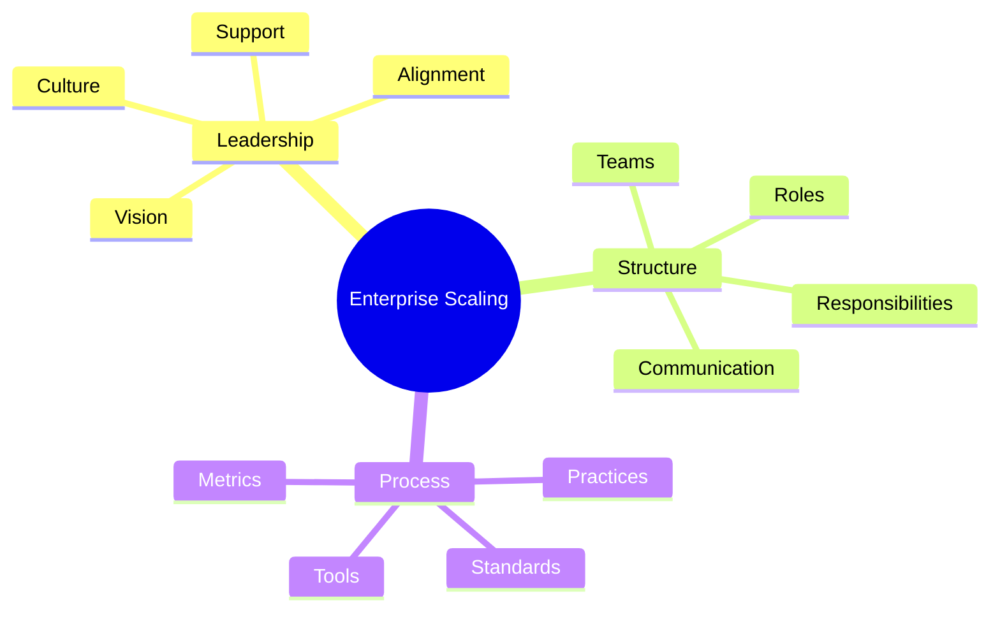
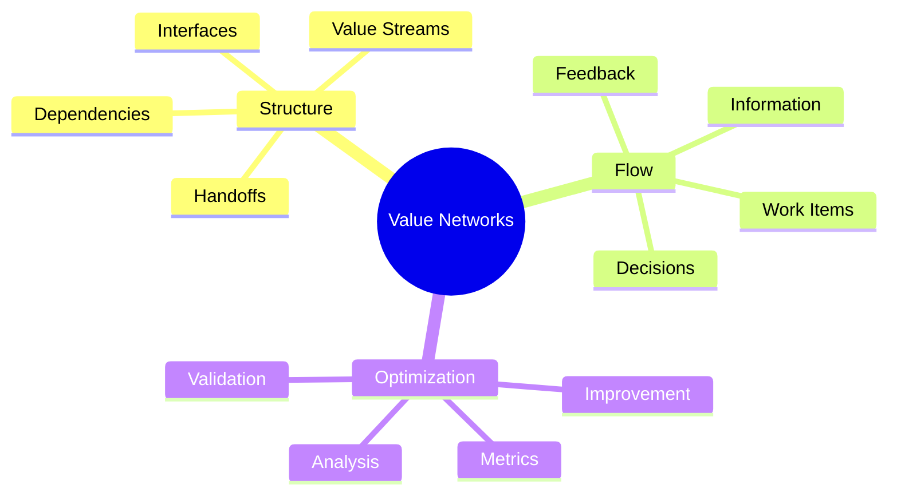

import Tabs from "@theme/Tabs";
import TabItem from "@theme/TabItem";

A comprehensive guide to scaling Lean Software Development across the enterprise, focusing on organizational patterns, coordination mechanisms, and measurement systems.

<!-- truncate -->

:::tip Key Scaling Elements
Essential components for successful enterprise scaling:

- 🏢 Enterprise Adoption
- 📊 Portfolio Management
- 🔄 Multi-team Coordination
- 🌐 Value Stream Networks
- 🏗️ Organizational Design
- 📈 Measurement Systems
  :::

## Enterprise Adoption

### Scaling Strategy



### Implementation Framework

<Tabs>
  <TabItem value="preparation" label="Preparation" default>
    **Key Activities**:
    - Leadership alignment
    - Organizational assessment
    - Capability mapping
    - Resource planning

    **Deliverables**:
    - Readiness assessment
    - Gap analysis
    - Implementation roadmap
    - Risk mitigation plan

  </TabItem>
  <TabItem value="execution" label="Execution">
    **Focus Areas**:
    - Pilot programs
    - Incremental rollout
    - Knowledge transfer
    - Success measurement

    **Outcomes**:
    - Validated approach
    - Early wins
    - Learning capture
    - Scaling momentum

  </TabItem>
</Tabs>

## Portfolio Management

### Portfolio Structure

:::info Portfolio Focus
Effective portfolio management balances strategic alignment with operational efficiency.
:::

1. **Portfolio Elements**

   - Strategic initiatives
   - Value streams
   - Programs
   - Projects

2. **Management Framework**
   ```mermaid
   graph TD
       A[Portfolio Strategy] --> B[Value Streams]
       B --> C[Programs]
       C --> D[Projects]
       D --> E[Teams]
   ```

### Portfolio Optimization

<Tabs>
  <TabItem value="strategy" label="Strategic Alignment" default>
    **Key Areas**:
    - Business objectives
    - Investment priorities
    - Resource allocation
    - Risk management

    **Tools**:
    - Portfolio kanban
    - Value stream mapping
    - Investment tracking
    - Performance metrics

  </TabItem>
  <TabItem value="execution" label="Execution Management">
    **Focus Points**:
    - Dependency management
    - Resource optimization
    - Flow efficiency
    - Value delivery

    **Practices**:
    - Portfolio reviews
    - Capacity planning
    - Risk assessment
    - Performance tracking

  </TabItem>
</Tabs>

## Multi-team Coordination

### Coordination Mechanisms

1. **Synchronization Patterns**

   - Scrum of Scrums
   - Communities of Practice
   - Chapter meetings
   - Guild sessions

2. **Communication Flows**
   ```mermaid
   graph TD
       A[Strategic Level] --> B[Portfolio Level]
       B --> C[Program Level]
       C --> D[Team Level]
       E[Horizontal Coordination] --> F[Cross-team Collaboration]
   ```

### Team Structures

<Tabs>
  <TabItem value="models" label="Team Models" default>
    **Patterns**:
    - Feature teams
    - Component teams
    - Platform teams
    - Service teams

    **Selection Criteria**:
    - Product architecture
    - Technical complexity
    - Business domains
    - Team capabilities

  </TabItem>
  <TabItem value="practices" label="Coordination Practices">
    **Methods**:
    - Daily sync meetings
    - Joint planning
    - Shared retrospectives
    - Cross-team reviews

    **Tools**:
    - Visual management boards
    - Dependency matrices
    - Risk registers
    - Progress dashboards

  </TabItem>
</Tabs>

## Value Stream Networks

### Network Design

:::warning Optimization Focus
Value stream networks must be designed for flow optimization and value delivery.
:::



### Network Management

<Tabs>
  <TabItem value="design" label="Network Design" default>
    **Elements**:
    - Stream identification
    - Interface definition
    - Flow mapping
    - Metrics selection

    **Tools**:
    - Value stream maps
    - Network diagrams
    - Flow metrics
    - Performance indicators

  </TabItem>
  <TabItem value="optimization" label="Network Optimization">
    **Focus Areas**:
    - Flow efficiency
    - Handoff reduction
    - Feedback loops
    - Value acceleration

    **Practices**:
    - Regular assessment
    - Flow analysis
    - Improvement cycles
    - Performance tracking

  </TabItem>
</Tabs>

## Organizational Design

### Design Principles

1. **Core Elements**

   - Team autonomy
   - Clear boundaries
   - Minimal dependencies
   - Value orientation

2. **Structure Patterns**
   ```mermaid
   graph TD
       A[Value Streams] --> B[Product Teams]
       B --> C[Feature Teams]
       D[Platform] --> E[Enabling Teams]
       E --> F[Service Teams]
   ```

### Implementation Strategy

<Tabs>
  <TabItem value="structure" label="Organizational Structure" default>
    **Components**:
    - Team topology
    - Interaction models
    - Decision rights
    - Support systems

    **Design Factors**:
    - Business domains
    - Technical architecture
    - Team capabilities
    - Value delivery

  </TabItem>
  <TabItem value="evolution" label="Organizational Evolution">
    **Stages**:
    - Current assessment
    - Target design
    - Transition planning
    - Implementation

    **Support**:
    - Change management
    - Communication plan
    - Training program
    - Success metrics

  </TabItem>
</Tabs>

## Measurement Systems

### Metrics Framework

:::info Measurement Focus
Effective measurement systems balance leading and lagging indicators across multiple dimensions.
:::

1. **Key Metrics**

   - Flow efficiency
   - Value delivery
   - Quality metrics
   - Business outcomes

2. **Measurement Hierarchy**
   ```mermaid
   mindmap
     root((Metrics))
       Strategic
         Business Value
         Market Impact
         Customer Success
       Operational
         Flow Efficiency
         Quality
         Productivity
       Team
         Velocity
         Quality
         Satisfaction
   ```

### Performance Management

<Tabs>
  <TabItem value="metrics" label="Metric Selection" default>
    **Categories**:
    - Value metrics
    - Flow metrics
    - Quality metrics
    - Team metrics

    **Implementation**:
    - Data collection
    - Analysis methods
    - Visualization
    - Action planning

  </TabItem>
  <TabItem value="improvement" label="Continuous Improvement">
    **Focus Areas**:
    - Performance trends
    - Bottleneck analysis
    - Improvement opportunities
    - Success patterns

    **Actions**:
    - Regular reviews
    - Adjustment cycles
    - Learning capture
    - Best practices

  </TabItem>
</Tabs>

## Additional Resources

- [Lean Enterprise Institute - Scaling Guide](https://www.lean.org)
- [Enterprise Value Stream Mapping](https://www.pixelcrayons.com/blog/software-development/lean-software-development/)
- [Scaling Lean Practices](https://www.geeksforgeeks.org/lean-software-development-lsd/)
- [Organizational Design Patterns](https://martinfowler.com/articles/scaling-lean-agile.html)
