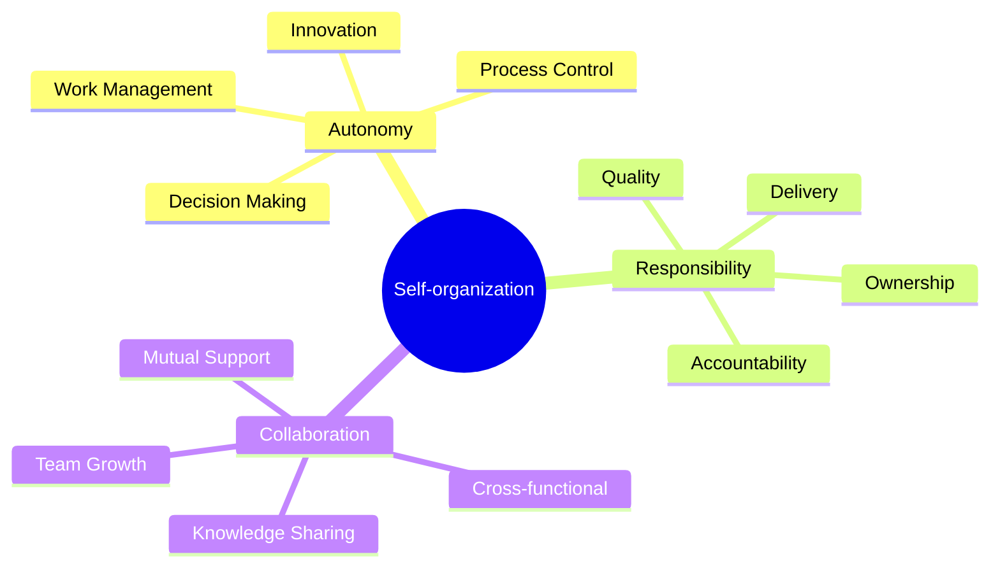
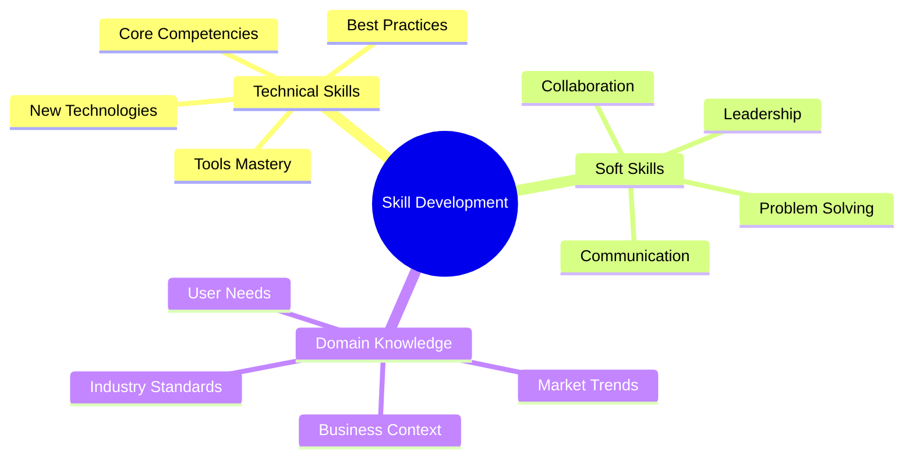

import Tabs from "@theme/Tabs";
import TabItem from "@theme/TabItem";

A comprehensive guide to building and empowering high-performing teams in Lean Software Development, focusing on self-organization, leadership, and continuous learning.

<!-- truncate -->

:::tip Key Concepts
Essential elements of team empowerment:

- 👥 Self-organizing Teams
- 🎯 Leadership Styles
- 📚 Knowledge Creation
- 💡 Skill Development
- 🔄 Continuous Learning
- ⚡ Team Optimization
  :::

## Self-organizing Teams

### Core Principles



### Implementation Framework

<Tabs>
  <TabItem value="structure" label="Team Structure" default>
    **Key Elements**:
    - Cross-functional skills
    - Clear boundaries
    - Shared goals
    - Collective ownership

    **Benefits**:
    - Faster decisions
    - Better solutions
    - Higher motivation
    - Increased innovation

  </TabItem>
  <TabItem value="practices" label="Best Practices">
    **Guidelines**:
    - Define clear goals
    - Establish boundaries
    - Support decisions
    - Enable learning

    **Support**:
    - Regular feedback
    - Resource access
    - Tool provision
    - Skill development

  </TabItem>
</Tabs>

## Leadership Styles

### Servant Leadership

:::info Leadership Focus
Leaders serve the team by removing obstacles and enabling success rather than directing actions.
:::

1. **Core Responsibilities**
   ```mermaid
   graph TD
       A[Servant Leader] --> B[Remove Obstacles]
       A --> C[Enable Growth]
       A --> D[Provide Vision]
       A --> E[Support Team]
       B --> F[Team Success]
       C --> F
       D --> F
       E --> F
   ```

### Leadership Framework

<Tabs>
  <TabItem value="styles" label="Leadership Approaches" default>
    **Methods**:
    - Coaching and mentoring
    - Facilitation
    - Empowerment
    - Vision setting

    **Impact**:
    - Team growth
    - Higher engagement
    - Better outcomes
    - Stronger culture

  </TabItem>
  <TabItem value="implementation" label="Implementation">
    **Activities**:
    - Regular 1:1s
    - Team coaching
    - Growth planning
    - Success celebration

    **Tools**:
    - Feedback systems
    - Development plans
    - Progress tracking
    - Recognition programs

  </TabItem>
</Tabs>

## Knowledge Creation

### Learning Environment

1. **Knowledge Sources**

   - Team experiences
   - Technical skills
   - Process insights
   - Customer feedback

2. **Sharing Mechanisms**
   ```mermaid
   graph TD
       A[Knowledge Creation] --> B[Documentation]
       B --> C[Sharing Sessions]
       C --> D[Practice]
       D --> E[Feedback]
       E --> A
   ```

### Knowledge Management

<Tabs>
  <TabItem value="capture" label="Knowledge Capture" default>
    **Methods**:
    - Documentation
    - Code reviews
    - Tech talks
    - Pair programming

    **Tools**:
    - Wikis
    - Knowledge bases
    - Code comments
    - Team blogs

  </TabItem>
  <TabItem value="sharing" label="Knowledge Sharing">
    **Activities**:
    - Team presentations
    - Mentoring
    - Cross-training
    - Learning sessions

    **Benefits**:
    - Skill growth
    - Better solutions
    - Team resilience
    - Innovation boost

  </TabItem>
</Tabs>

## Skill Development

### Growth Framework

:::warning Continuous Growth
Skill development is an ongoing process, not a one-time event.
:::



### Implementation Strategy

<Tabs>
  <TabItem value="planning" label="Development Planning" default>
    **Components**:
    - Skill assessment
    - Growth paths
    - Learning resources
    - Progress tracking

    **Support**:
    - Training budget
    - Learning time
    - Tool access
    - Mentorship

  </TabItem>
  <TabItem value="execution" label="Execution">
    **Activities**:
    - Regular training
    - Project rotation
    - Skill sharing
    - Practice sessions

    **Measurement**:
    - Skill matrices
    - Progress reviews
    - Team capability
    - Impact assessment

  </TabItem>
</Tabs>

## Continuous Learning

### Learning Culture

1. **Cultural Elements**

   - Growth mindset
   - Safe environment
   - Experimentation
   - Innovation support

2. **Learning Cycles**
   ```mermaid
   graph TD
       A[Learn] --> B[Apply]
       B --> C[Reflect]
       C --> D[Improve]
       D --> A
   ```

### Support Systems

<Tabs>
  <TabItem value="infrastructure" label="Learning Infrastructure" default>
    **Elements**:
    - Learning platforms
    - Knowledge bases
    - Practice environments
    - Feedback systems

    **Tools**:
    - Online courses
    - Documentation
    - Sandbox environments
    - Collaboration tools

  </TabItem>
  <TabItem value="activities" label="Learning Activities">
    **Programs**:
    - Study groups
    - Code dojos
    - Innovation time
    - Learning sprints

    **Outcomes**:
    - New skills
    - Better practices
    - Team growth
    - Innovation

  </TabItem>
</Tabs>

## Team Optimization

### Performance Enhancement

1. **Focus Areas**

   - Process efficiency
   - Collaboration
   - Communication
   - Delivery capability

2. **Optimization Methods**
   ```mermaid
   graph TD
       A[Assessment] --> B[Planning]
       B --> C[Implementation]
       C --> D[Measurement]
       D --> E[Adjustment]
       E --> A
   ```

### Best Practices

<Tabs>
  <TabItem value="practices" label="Team Practices" default>
    **Key Areas**:
    - Regular retrospectives
    - Continuous feedback
    - Process improvement
    - Skill sharing

    **Benefits**:
    - Higher performance
    - Better quality
    - Faster delivery
    - Team satisfaction

  </TabItem>
  <TabItem value="measurement" label="Success Metrics">
    **Metrics**:
    - Team velocity
    - Quality metrics
    - Learning progress
    - Satisfaction scores

    **Analysis**:
    - Trend tracking
    - Improvement impact
    - Team health
    - Growth indicators

  </TabItem>
</Tabs>

## Additional Resources

- [Lean Enterprise Institute - Team Development](https://www.lean.org)
- [Self-organizing Teams Guide](https://www.agilealliance.org/glossary/self-organizing/)
- [Servant Leadership in Practice](https://www.scrum.org/resources/blog/servant-leadership)
- [Continuous Learning Patterns](https://martinfowler.com/articles/continuousLearning.html)
