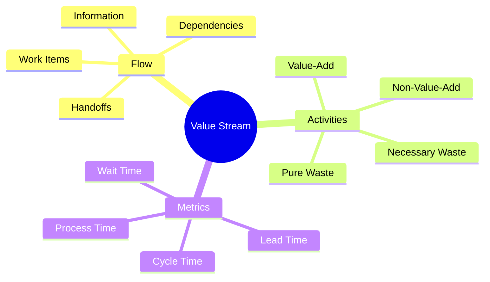
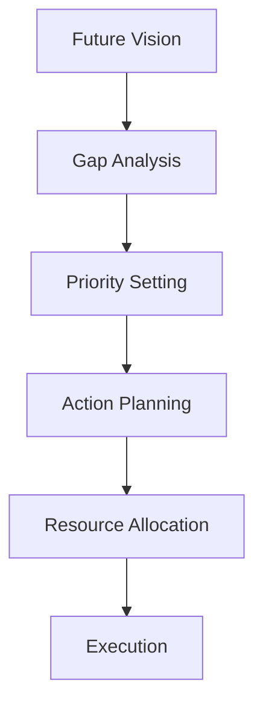
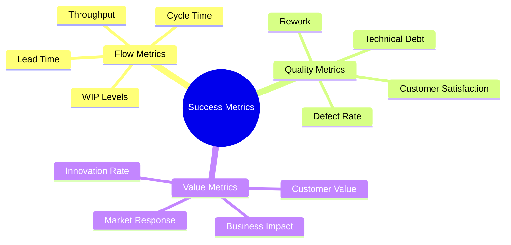

import Tabs from "@theme/Tabs";
import TabItem from "@theme/TabItem";

A comprehensive guide to Value Stream Mapping (VSM) in software development, including concepts, techniques, and practical implementation strategies.

<!-- truncate -->

:::tip Key Concepts
Essential elements of Value Stream Mapping:

- 🗺️ Mapping Techniques
- 📊 Current State Analysis
- 🎯 Future State Design
- 📈 Implementation Planning
- 🔄 Continuous Flow
  :::

## Understanding Value Streams

### Core Concepts



### Two Critical Paths

<Tabs>
  <TabItem value="happy" label="Happy Path" default>
    **Feature Delivery Stream**:
    - New feature development
    - Enhancement requests
    - Planned improvements
    - Regular maintenance

    **Key Metrics**:
    - Lead time for changes
    - Deployment frequency
    - Value delivery rate
    - Quality metrics

  </TabItem>
  <TabItem value="recovery" label="Recovery Path">
    **Break/Fix Stream**:
    - Incident response
    - Production issues
    - Critical bugs
    - Security vulnerabilities

    **Key Metrics**:
    - Change failure rate
    - Mean time to recovery
    - Incident frequency
    - Resolution time

  </TabItem>
</Tabs>

## Mapping Techniques

### Creating Value Stream Maps

1. **Preparation**

   - Gather stakeholders
   - Define scope
   - Set objectives
   - Collect initial data

2. **Basic Elements**

   ```mermaid
   graph LR
       A[Process Step] -->|Wait Time| B[Process Step]
       B -->|Lead Time| C[Process Step]
       C -->|Cycle Time| D[Process Step]
   ```

3. **Information Flow**
   - Work item movement
   - Communication paths
   - Decision points
   - Feedback loops

### Mapping Process

<Tabs>
  <TabItem value="current" label="Current State" default>
    **Steps**:
    - Document actual process
    - Include all activities
    - Note waiting times
    - Identify handoffs

    **Data Collection**:
    - Process times
    - Wait times
    - Quality metrics
    - Resource allocation

  </TabItem>
  <TabItem value="analysis" label="Analysis Phase">
    **Focus Areas**:
    - Bottleneck identification
    - Waste discovery
    - Value assessment
    - Flow efficiency

    **Tools**:
    - Process analysis
    - Metrics review
    - Team feedback
    - Customer input

  </TabItem>
</Tabs>

## Current State Analysis

### Assessment Framework

:::info Analysis Focus
Focus on understanding the current process before suggesting improvements.
:::

1. **Process Documentation**

   - Workflow steps
   - Team responsibilities
   - Tool usage
   - Integration points

2. **Metrics Collection**
   ```mermaid
   graph TD
       A[Data Collection] --> B[Pattern Analysis]
       B --> C[Bottleneck Detection]
       C --> D[Improvement Planning]
       D --> E[Implementation]
       E --> F[Monitoring]
   ```

### Identifying Waste

<Tabs>
  <TabItem value="types" label="Waste Categories" default>
    **Process Waste**:
    - Waiting time
    - Handoff delays
    - Unnecessary steps
    - Duplicate work

    **Technical Waste**:
    - Technical debt
    - Manual processes
    - Legacy systems
    - Outdated tools

  </TabItem>
  <TabItem value="analysis" label="Analysis Methods">
    **Techniques**:
    - Value stream walks
    - Team interviews
    - Data analysis
    - Process observation

    **Tools**:
    - Flow diagrams
    - Metrics dashboards
    - Time studies
    - Quality reports

  </TabItem>
</Tabs>

## Future State Design

### Design Principles

1. **Flow Optimization**

   - Continuous flow
   - Pull systems
   - WIP limits
   - Quick feedback

2. **Waste Elimination**

   - Process simplification
   - Automation opportunities
   - Handoff reduction
   - Quality improvement

3. **Value Enhancement**
   - Customer focus
   - Innovation opportunities
   - Quality built-in
   - Fast delivery

### Implementation Planning



## Implementation Strategy

### Execution Framework

<Tabs>
  <TabItem value="approach" label="Implementation Approach" default>
    **Key Steps**:
    - Start small
    - Build momentum
    - Show results
    - Scale success

    **Success Factors**:
    - Leadership support
    - Team engagement
    - Clear metrics
    - Regular reviews

  </TabItem>
  <TabItem value="tools" label="Tools & Techniques">
    **Essential Tools**:
    - VSM software
    - Metrics dashboards
    - Collaboration platforms
    - Documentation systems

    **Best Practices**:
    - Regular updates
    - Team involvement
    - Data-driven decisions
    - Continuous feedback

  </TabItem>
</Tabs>

## Continuous Flow

### Maintaining Flow

:::warning Flow Focus
Continuous flow is the ultimate goal of value stream optimization.
:::

1. **Flow Principles**

   - Small batch sizes
   - Limited WIP
   - Quick changeovers
   - Balanced workload

2. **Implementation**
   - Pull systems
   - Visual management
   - Standard work
   - Quick feedback

### Measuring Success



## Best Practices

### Success Patterns

1. **Team Engagement**

   - Regular involvement
   - Clear communication
   - Shared ownership
   - Continuous learning

2. **Data-Driven Approach**

   - Metric selection
   - Regular measurement
   - Analysis patterns
   - Improvement tracking

3. **Continuous Improvement**
   - Regular reviews
   - Feedback loops
   - Adaptation cycles
   - Knowledge sharing

## Additional Resources

- [DORA's Value Stream Management Guide](https://dora.dev/guides/value-stream-management/)
- [Atlassian's Value Stream Mapping Guide](https://www.atlassian.com/continuous-delivery/principles/value-stream-mapping)
- [Lean Enterprise Institute](https://www.lean.org)
- [Flow Engineering Resources](https://www.flowframework.org/)
