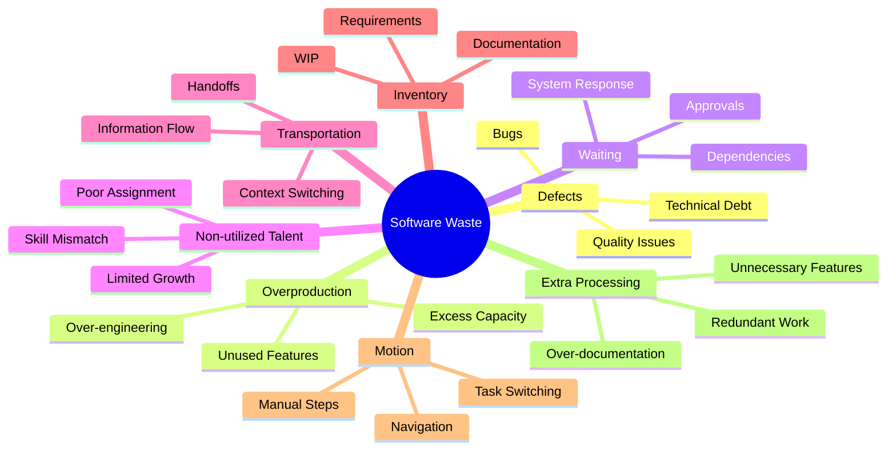
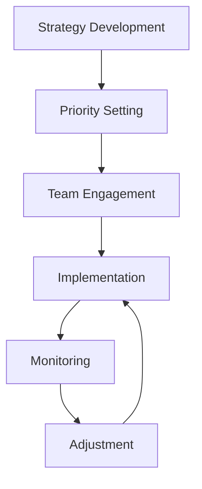
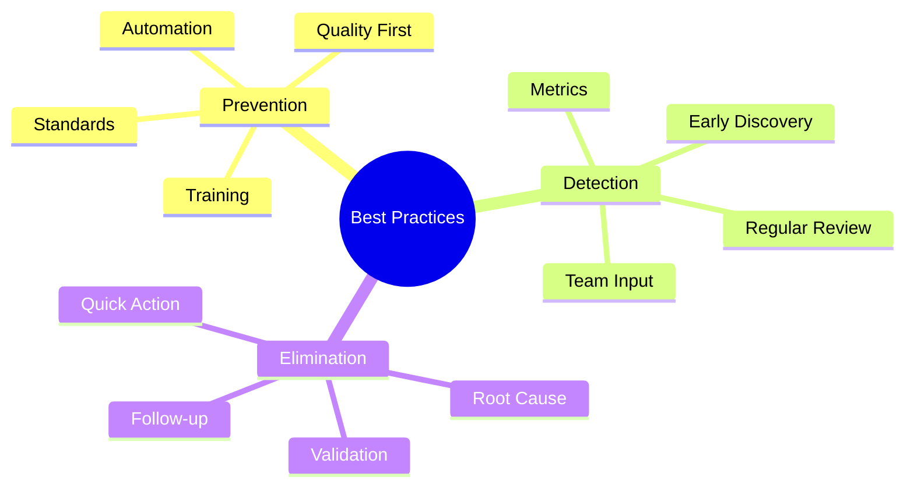

import Tabs from "@theme/Tabs";
import TabItem from "@theme/TabItem";

A comprehensive guide to identifying, analyzing, and eliminating waste in software development processes, following Lean principles and practices.

<!-- truncate -->

:::tip Key Concepts
Essential elements of waste management:

- 🔍 Types of Waste (DOWNTIME)
- 📊 Waste Identification
- 🔄 Root Cause Analysis
- ⚡ Elimination Strategies
- 📈 Measurement & Metrics
- 🔄 Continuous Improvement
  :::

## Understanding Software Waste

### The DOWNTIME Framework



### Detailed Waste Categories

<Tabs>
  <TabItem value="defects" label="Defects" default>
    **Definition**: Any output that requires rework or contains errors
    **Examples**: - Software bugs - Integration issues - Security
    vulnerabilities - Performance problems **Impact**: - Increased lead time -
    Higher costs - Customer dissatisfaction - Team frustration
  </TabItem>
  <TabItem value="overproduction" label="Overproduction">
    **Definition**: Producing more than needed or before it's needed
    **Examples**: - Unused features - Premature optimization - Excess
    documentation - Unnecessary reports **Impact**: - Resource waste -
    Maintenance burden - System complexity - Delayed value delivery
  </TabItem>
  <TabItem value="waiting" label="Waiting">
    **Definition**: Delays in the development process **Examples**: - Dependency
    delays - Approval bottlenecks - System response time - Resource availability
    **Impact**: - Extended lead times - Reduced efficiency - Team idle time -
    Delayed feedback
  </TabItem>
</Tabs>

## Waste Identification

### Identification Techniques

1. **Value Stream Mapping**

   - Process visualization
   - Wait time analysis
   - Handoff points
   - Flow efficiency

2. **Gemba Walks**

   - Direct observation
   - Team interviews
   - Process analysis
   - Pain point discovery

3. **Metrics Analysis**
   ```mermaid
   graph TD
       A[Data Collection] --> B[Pattern Analysis]
       B --> C[Waste Detection]
       C --> D[Impact Assessment]
       D --> E[Priority Setting]
       E --> F[Action Planning]
   ```

### Common Waste Patterns

<Tabs>
  <TabItem value="process" label="Process Waste" default>
    **Patterns**: - Multiple handoffs - Redundant reviews - Manual processes -
    Excessive documentation **Detection**: - Process mapping - Time studies -
    Team feedback - Value analysis
  </TabItem>
  <TabItem value="technical" label="Technical Waste">
    **Patterns**: - Code duplication - Legacy systems - Technical debt - Poor
    automation **Detection**: - Code analysis - Architecture review -
    Performance metrics - Maintenance costs
  </TabItem>
</Tabs>

## Root Cause Analysis

### Analysis Methods

:::info Analysis Focus
Focus on finding systemic causes rather than symptoms.
:::

1. **5 Whys Technique**

   - Iterative questioning
   - Deep cause discovery
   - Pattern identification
   - Solution development

2. **Fishbone Analysis**
   ```mermaid
   graph LR
       A[Problem] --> B[People]
       A --> C[Process]
       A --> D[Technology]
       A --> E[Environment]
       A --> F[Materials]
       A --> G[Methods]
   ```

### Solution Development

<Tabs>
  <TabItem value="approach" label="Analysis Approach" default>
    **Steps**: - Problem definition - Data collection - Cause identification -
    Solution generation **Tools**: - Root cause templates - Analysis workshops -
    Team collaboration - Documentation
  </TabItem>
  <TabItem value="validation" label="Solution Validation">
    **Process**: - Solution testing - Impact assessment - Team feedback -
    Implementation planning **Criteria**: - Effectiveness - Feasibility -
    Sustainability - Value impact
  </TabItem>
</Tabs>

## Elimination Strategies

### Strategic Approach

1. **Prevention Focus**

   - Built-in quality
   - Automated testing
   - Standard practices
   - Clear definitions

2. **Process Optimization**

   - Flow improvement
   - Handoff reduction
   - Automation
   - Simplification

3. **Cultural Change**
   - Team empowerment
   - Continuous learning
   - Knowledge sharing
   - Innovation support

### Implementation Tactics



## Measurement & Metrics

### Key Metrics

<Tabs>
  <TabItem value="efficiency" label="Process Efficiency" default>
    **Metrics**: - Lead time - Cycle time - Wait time - Flow efficiency
    **Analysis**: - Trend tracking - Bottleneck identification - Improvement
    impact - Comparison analysis
  </TabItem>
  <TabItem value="quality" label="Quality Metrics">
    **Metrics**: - Defect rate - Rework percentage - Technical debt - Customer
    satisfaction **Analysis**: - Quality trends - Root causes - Prevention
    effectiveness - Value impact
  </TabItem>
</Tabs>

## Continuous Improvement

### Improvement Cycle

:::warning Continuous Focus
Waste elimination is an ongoing process, not a one-time effort.
:::

1. **Regular Assessment**

   - Process review
   - Metric analysis
   - Team feedback
   - Customer input

2. **Improvement Planning**

   - Priority setting
   - Resource allocation
   - Action planning
   - Team engagement

3. **Implementation**
   - Systematic execution
   - Progress tracking
   - Impact measurement
   - Feedback collection

### Best Practices



## Additional Resources

- [Lean Enterprise Institute - Waste Elimination](https://www.lean.org)
- [Toyota Production System Guide](https://global.toyota/en/company/vision-and-philosophy/production-system/)
- [Agile Alliance - Waste in Software](https://www.agilealliance.org/waste-in-software-development/)
- [DevOps Waste Elimination](https://www.devops.com/identifying-eliminating-waste-devops/)
