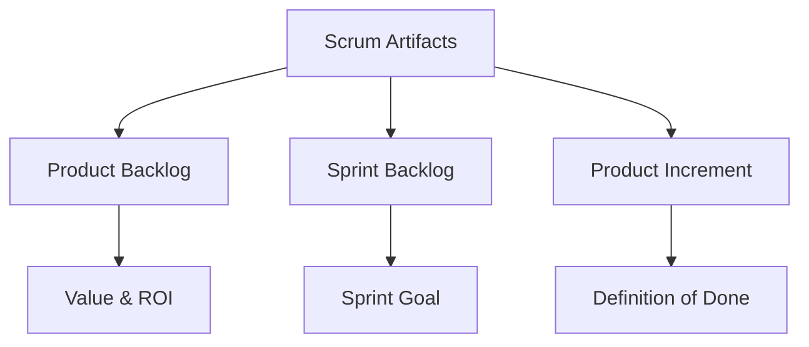
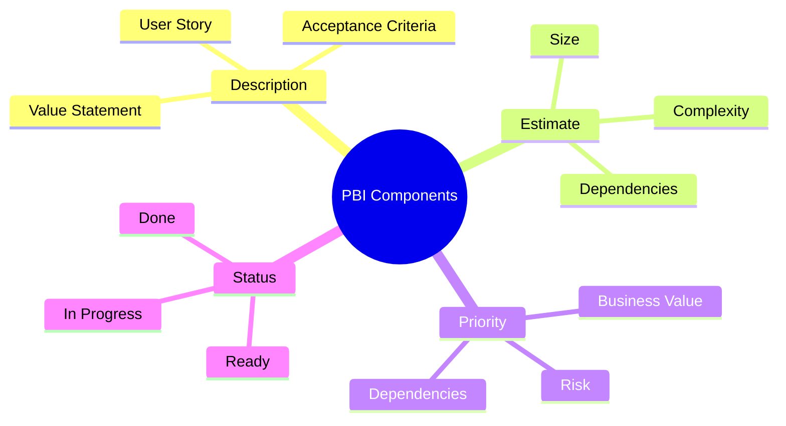
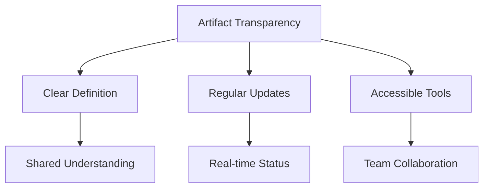

import Tabs from "@theme/Tabs";
import TabItem from "@theme/TabItem";

A comprehensive guide to Scrum artifacts, their purpose, and effective management. These artifacts provide essential transparency and opportunities for inspection and adaptation.

<!-- truncate -->

:::tip Key Artifacts
Scrum defines three essential artifacts:

- 📋 Product Backlog
- 📊 Sprint Backlog
- ✨ Product Increment
  :::

## Core Scrum Artifacts

## Product Backlog

:::info Living Artifact
The Product Backlog is a dynamic, ordered list of everything that might be needed in the product.
:::

### Characteristics

<Tabs>
  <TabItem value="structure" label="Structure" default>
    **Key Elements**: - Ordered by value - Continuously refined - Never complete
    - Dynamic and adaptive **Components**: - Features - Bug fixes - Technical
    work - Knowledge acquisition
  </TabItem>
  <TabItem value="refinement" label="Refinement">
    **Activities**: - Adding detail - Estimating size - Ordering items -
    Breaking down items **Best Practices**: - Regular refinement sessions -
    Collaborative effort - Just-in-time detail - Continuous prioritization
  </TabItem>
</Tabs>

### Product Backlog Items (PBIs)

## Sprint Backlog

:::info Sprint Focus
The Sprint Backlog makes visible all the work that the Development Team identifies as necessary to meet the Sprint Goal.
:::

### Components

<Tabs>
  <TabItem value="elements" label="Key Elements" default>
    **Essential Parts**: - Selected Product Backlog items - Sprint Goal -
    Delivery plan - Implementation tasks **Characteristics**: - Owned by
    Development Team - Highly visible - Real-time updates - Flexible during
    Sprint
  </TabItem>
  <TabItem value="management" label="Management">
    **Daily Updates**: - Task progress - Remaining work - New tasks identified -
    Impediments **Visualization**: - Task board - Burndown chart - Sprint board
    - Work flow diagram
  </TabItem>
</Tabs>

## Product Increment

:::info Definition of Done
Each Increment must meet the Definition of Done, ensuring transparency and quality.
:::

### Characteristics

<Tabs>
  <TabItem value="requirements" label="Requirements" default>
    **Must Be**: - Potentially releasable - Meet Definition of Done - High
    quality - Usable **Represents**: - Working functionality - Value delivery -
    Progress toward goal - Quality standards
  </TabItem>
  <TabItem value="management" label="Management">
    **Activities**: - Quality assurance - Integration - Documentation -
    Validation **Tracking**: - Progress metrics - Quality metrics - Release
    readiness - Value delivered
  </TabItem>
</Tabs>

## Artifact Transparency

### Ensuring Visibility

### Best Practices

1. **Regular Review**

   - Daily updates
   - Sprint reviews
   - Backlog refinement
   - Transparency assessment

2. **Tool Selection**

   - Visual management
   - Real-time updates
   - Collaboration features
   - Metric tracking

3. **Team Practices**
   - Information radiators
   - Daily updates
   - Clear communication
   - Shared ownership

## Metrics and Tracking

### Key Metrics

<Tabs>
  <TabItem value="velocity" label="Velocity" default>
    **Purpose**: - Sprint planning - Capacity planning - Progress tracking -
    Release planning **Measurement**: - Story points completed - Trend analysis
    - Historical data - Predictability
  </TabItem>
  <TabItem value="burndown" label="Burndown Charts">
    **Types**: - Sprint burndown - Release burndown - Epic burndown **Usage**: -
    Progress visualization - Trend identification - Risk assessment - Forecast
    adjustment
  </TabItem>
</Tabs>

## Conclusion

Effective management of Scrum artifacts is crucial for:

- Maintaining transparency
- Enabling inspection
- Supporting adaptation
- Delivering value

:::note Remember
Artifacts are means to an end - delivering value to stakeholders. Keep them lightweight and focused on supporting the team's work.
:::

## Additional Resources

- [Scrum Guide - Artifacts](https://scrumguides.org/scrum-guide.html#scrum-artifacts)
- [Product Backlog Refinement](https://www.scrum.org/resources/blog/product-backlog-refinement-explained-13)
- [Definition of Done](https://www.scrum.org/resources/blog/done-understanding-definition-done)
