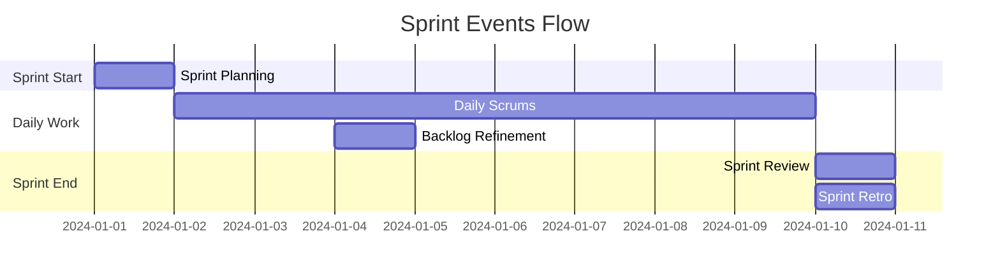
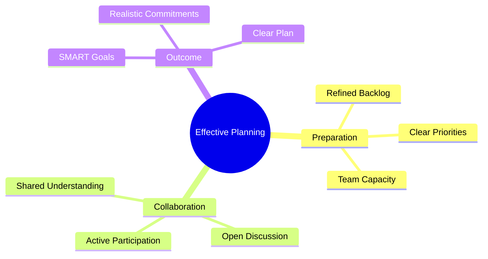
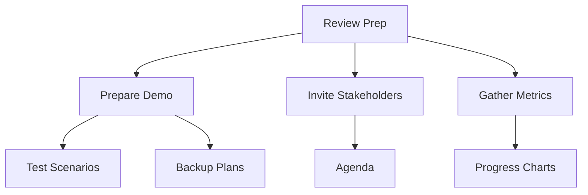
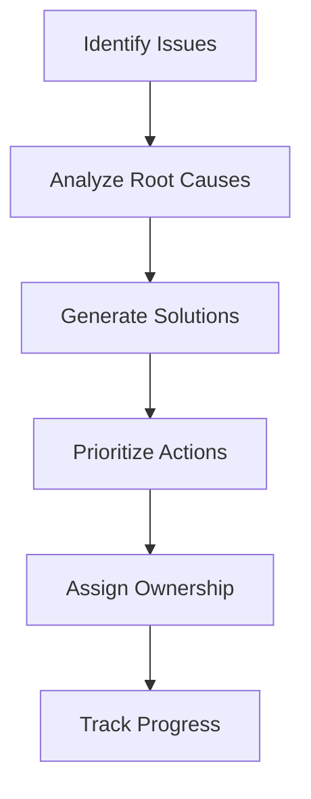

import Tabs from "@theme/Tabs";
import TabItem from "@theme/TabItem";

A comprehensive guide to Scrum events, their purposes, and how to run them effectively. These time-boxed ceremonies provide the framework for inspection and adaptation in Scrum.

<!-- truncate -->

:::tip Key Events
Scrum defines five key events:

- 📅 Sprint Planning
- 📊 Daily Scrum
- 👀 Sprint Review
- 🔄 Sprint Retrospective
- 📋 Backlog Refinement
  :::

## Event Overview

## Sprint Planning

:::info Time-box
Sprint Planning is time-boxed to a maximum of eight hours for a one-month Sprint. For shorter Sprints, the event is usually shorter.
:::

### Planning Structure

<Tabs>
  <TabItem value="what" label="What - Part One" default>
    **Focus**: Sprint Goal and Product Backlog selection **Key Questions**: -
    What can be delivered in the Sprint? - How does it contribute to the Product
    Goal? - Why is this Sprint valuable? **Participants**: - Entire Scrum Team -
    Key stakeholders (optional) **Outputs**: - Sprint Goal - Selected Product
    Backlog items
  </TabItem>
  <TabItem value="how" label="How - Part Two">
    **Focus**: Work planning and Sprint Backlog creation **Key Questions**: -
    How will the work get done? - What's needed to complete each item? - Are
    there dependencies to consider? **Participants**: - Development Team
    (primary) - Scrum Master (facilitator) - Product Owner (available)
    **Outputs**: - Sprint Backlog - Initial plan for delivery
  </TabItem>
</Tabs>

### Planning Best Practices

## Daily Scrum

:::info Time-box
The Daily Scrum is time-boxed to 15 minutes, held at the same time and place each day.
:::

### Meeting Structure

<Tabs>
  <TabItem value="format" label="Standard Format" default>
    **Three Questions**: 1. What did I do yesterday? 2. What will I do today? 3.
    Are there any impediments? **Focus Areas**: - Progress toward Sprint Goal -
    Upcoming work - Obstacles and needs
  </TabItem>
  <TabItem value="alternative" label="Alternative Formats">
    **Task-Based**: - Focus on Sprint Backlog items - Status updates by task -
    Blockers by task **Goal-Based**: - Progress toward Sprint Goal - Risks to
    Sprint Goal - Needs to achieve Goal
  </TabItem>
</Tabs>

### Effective Daily Scrums

1. **Keep It Short**

   - Start on time
   - Stay focused
   - Park detailed discussions
   - Follow up separately

2. **Focus on Collaboration**
   - Promote team communication
   - Identify dependencies
   - Enable quick decisions
   - Foster team support

## Sprint Review

:::info Time-box
The Sprint Review is time-boxed to a maximum of four hours for a one-month Sprint, with proportionally shorter durations for shorter Sprints.
:::

### Review Components

<Tabs>
  <TabItem value="demo" label="Increment Demo" default>
    **Structure**: - Present completed work - Demonstrate functionality - Gather
    feedback - Answer questions **Participants**: - Scrum Team - Stakeholders -
    End users (when possible)
  </TabItem>
  <TabItem value="discussion" label="Adaptation Discussion">
    **Focus Areas**: - Market changes - User needs - Timeline updates - Budget
    considerations **Outcomes**: - Updated Product Backlog - Revised release
    plans - New opportunities identified
  </TabItem>
</Tabs>

### Review Preparation

## Sprint Retrospective

:::info Time-box
The Sprint Retrospective is time-boxed to a maximum of three hours for a one-month Sprint.
:::

### Retrospective Framework

<Tabs>
  <TabItem value="structure" label="Basic Structure" default>
    **Five Phases**: 1. Set the stage 2. Gather data 3. Generate insights 4.
    Decide actions 5. Close retrospective **Focus Areas**: - People - Processes
    - Tools - Relationships
  </TabItem>
  <TabItem value="techniques" label="Facilitation Techniques">
    **Popular Methods**: - Start, Stop, Continue - Mad, Sad, Glad - 4Ls (Liked,
    Learned, Lacked, Longed For) - Sailboat (Wind/Anchors) **Tools**: - Digital
    boards - Collaboration platforms - Voting mechanisms - Action trackers
  </TabItem>
</Tabs>

### Creating Action Items

## Backlog Refinement

:::note Not a Formal Event
While not one of the formal Scrum events, refinement is an essential ongoing activity.
:::

### Refinement Activities

<Tabs>
  <TabItem value="detail" label="Adding Detail" default>
    **Focus Areas**: - User story details - Acceptance criteria - Technical
    requirements - Dependencies **Outcomes**: - Clearer items - Better estimates
    - Shared understanding
  </TabItem>
  <TabItem value="order" label="Ordering">
    **Considerations**: - Business value - Risk factors - Dependencies - Team
    capacity **Results**: - Prioritized backlog - Release planning - Sprint
    planning readiness
  </TabItem>
</Tabs>

## Remote Events

:::tip Remote Considerations
Special attention is needed when conducting Scrum events remotely.
:::

### Virtual Event Guidelines

1. **Technical Setup**

   - Reliable platforms
   - Backup plans
   - Clear audio/video
   - Collaboration tools

2. **Engagement Techniques**

   - Active facilitation
   - Regular check-ins
   - Visual aids
   - Break-out rooms

3. **Time Zone Management**
   - Rotating schedules
   - Recording sessions
   - Asynchronous updates
   - Documented outcomes

## Common Challenges

:::warning Watch Out
Be prepared to address these common event-related challenges.
:::

<Tabs>
  <TabItem value="timing" label="Time Management" default>
    - Exceeding time-boxes - Late starts - Poor preparation - Scope creep
    **Solutions**: - Clear agendas - Timekeeper role - Parking lots - Pre-work
    requirements
  </TabItem>
  <TabItem value="participation" label="Engagement">
    - Silent participants - Dominant voices - Lack of preparation - Multitasking
    **Solutions**: - Round-robin formats - Breakout sessions - Pre-event tasks -
    No-device rules
  </TabItem>
</Tabs>

## Success Patterns

### Event Excellence

1. **Preparation**

   - Clear objectives
   - Required information
   - Right participants
   - Proper tools

2. **Facilitation**

   - Active engagement
   - Time management
   - Focus on outcomes
   - Clear next steps

3. **Follow-through**
   - Document decisions
   - Track action items
   - Monitor progress
   - Review effectiveness

## Additional Resources

- [Scrum Guide - Events](https://scrumguides.org/scrum-guide.html#scrum-events)
- [Remote Scrum Events](https://www.scrum.org/resources/blog/doing-scrum-while-remote)
- [Retrospective Techniques](https://retromat.org/)
- [Effective Sprint Planning](https://www.scrum.org/resources/blog/sprint-planning-tips-and-tricks)
