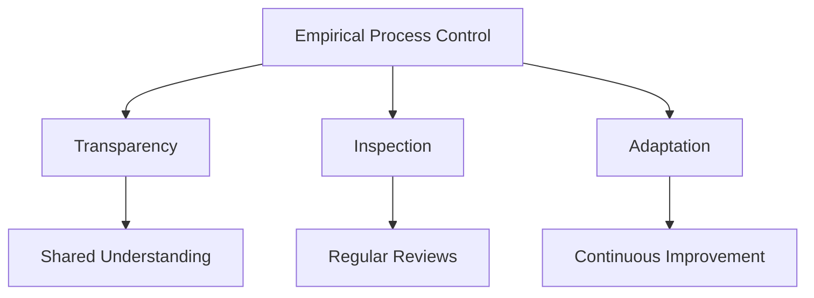
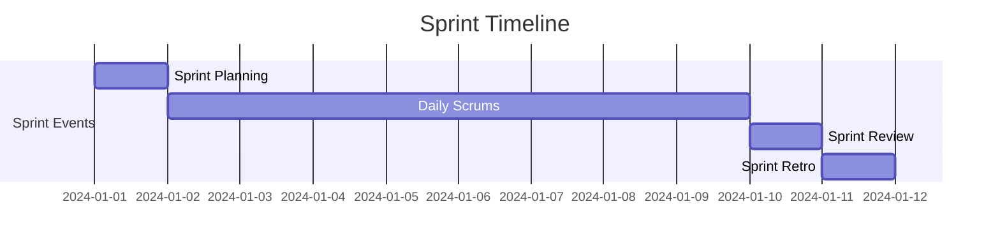

import Tabs from "@theme/Tabs";
import TabItem from "@theme/TabItem";

A comprehensive overview of Scrum's foundational elements, principles, and practices that form the basis of this agile framework.

<!-- truncate -->

:::tip Key Concepts
Understanding Scrum fundamentals is essential for:

- 🎯 Empirical Process Control
- 🔄 Iterative Development
- 👥 Self-organizing Teams
- 📈 Continuous Improvement
  :::

## The Three Pillars of Scrum

<Tabs>
  <TabItem value="transparency" label="Transparency" default>
    **Definition**: Making significant aspects of the process visible to those responsible for the outcome.

    **Key Aspects**:
    - Common language
    - Shared definition of "Done"
    - Open access to artifacts
    - Visible progress tracking

    **Implementation**:
    - Information radiators
    - Daily stand-ups
    - Sprint reviews
    - Burndown charts
  </TabItem>
  <TabItem value="inspection" label="Inspection">
    **Definition**: Regular examination of artifacts and progress toward goals.

    **Key Aspects**:
    - Timely reviews
    - Skilled inspectors
    - Objective criteria
    - Actionable feedback

    **Implementation**:
    - Sprint reviews
    - Daily Scrums
    - Sprint retrospectives
    - Backlog refinement
  </TabItem>
  <TabItem value="adaptation" label="Adaptation">
    **Definition**: Adjusting processes and artifacts when inspection reveals deviation.

    **Key Aspects**:
    - Quick responses
    - Minimal disruption
    - Team empowerment
    - Continuous learning

    **Implementation**:
    - Sprint planning adjustments
    - Process improvements
    - Team reorganization
    - Tool optimization
  </TabItem>
</Tabs>

## The Five Values of Scrum

:::info Core Values
These values provide the foundation for Scrum team culture and effectiveness.
:::

### 1. Commitment

<Tabs>
  <TabItem value="what" label="What It Means" default>
    Team members commit to:
    - Sprint goals
    - Quality standards
    - Continuous improvement
    - Team success
  </TabItem>
  <TabItem value="practice" label="In Practice">
    Demonstrated through:
    - Sprint planning participation
    - Daily stand-up attendance
    - Meeting deadlines
    - Supporting teammates
  </TabItem>
</Tabs>

### 2. Courage

<Tabs>
  <TabItem value="what" label="What It Means" default>
    Teams demonstrate courage by:
      - Tackling tough problems
      - Admitting mistakes
      - Asking for help
      - Giving honest feedback
  </TabItem>
  <TabItem value="practice" label="In Practice">
    Manifested in:
      - Speaking up about impediments
      - Challenging status quo
      - Taking calculated risks
      - Being transparent
  </TabItem>
</Tabs>

### 3. Focus

<Tabs>
  <TabItem value="what" label="What It Means" default>
    Teams maintain focus on:
      - Sprint goals
      - Essential work
      - Quality delivery
      - Value creation
  </TabItem>
  <TabItem value="practice" label="In Practice">
    Achieved through:
      - Sprint backlog management
      - Minimizing distractions
      - Time-boxing
      - Clear prioritization
  </TabItem>
</Tabs>

### 4. Openness

<Tabs>
  <TabItem value="what" label="What It Means" default>
    Teams practice openness about:
      - Work progress
      - Challenges faced
      - Needed support
      - Process improvements
  </TabItem>
  <TabItem value="practice" label="In Practice">
    Demonstrated in:
      - Daily stand-ups
      - Sprint reviews
      - Retrospectives
      - Backlog refinement
  </TabItem>
</Tabs>

### 5. Respect

<Tabs>
  <TabItem value="what" label="What It Means" default>
    Team members show respect for:
      - Different perspectives
      - Diverse skills
      - Individual autonomy
      - Team decisions
  </TabItem>
  <TabItem value="practice" label="In Practice">
    Manifested through:
      - Active listening
      - Inclusive behavior
      - Supporting growth
      - Acknowledging contributions
  </TabItem>
</Tabs>

## Timeboxing in Scrum

:::caution Important
Timeboxing is crucial for maintaining focus and ensuring efficient use of time. Events have maximum durations that should not be exceeded.
:::

## Empirical Process Control

### Evidence-Based Decision Making

<Tabs>
  <TabItem value="data" label="Data Collection" default>
    **Key Metrics**:
    - Velocity
    - Burndown
    - Cycle time
    - Quality metrics

    **Tools**:
    - Tracking software
    - Dashboards
    - Reports
    - Analytics
  </TabItem>
  <TabItem value="analysis" label="Analysis">
    **Techniques**:
    - Trend analysis
    - Variance tracking
    - Predictability assessment
    - Performance evaluation

    **Outcomes**:
    - Process adjustments
    - Team improvements
    - Better estimates
    - Increased efficiency
  </TabItem>
</Tabs>

## Best Practices

1. **Clear Communication**

   - Use information radiators
   - Maintain documentation
   - Regular updates
   - Transparent decisions

2. **Continuous Learning**

   - Regular retrospectives
   - Knowledge sharing
   - Skill development
   - Process improvement

3. **Team Empowerment**
   - Self-organization
   - Decision authority
   - Resource access
   - Growth opportunities

## Common Challenges

:::warning Watch Out
Understanding common challenges helps teams prepare and respond effectively.
:::

<Tabs>
  <TabItem value="process" label="Process Challenges" default>
    - Inconsistent ceremonies
    - Poor timeboxing
    - Unclear definitions
    - Scope creep
  </TabItem>
  <TabItem value="people" label="People Challenges">
    - Resistance to change
    - Lack of engagement
    - Role confusion
    - Communication issues
  </TabItem>
  <TabItem value="technical" label="Technical Challenges">
    - Technical debt
    - Quality issues
    - Tool problems
    - Integration challenges
  </TabItem>
</Tabs>

## Getting Started

### Essential Steps

1. Understand core concepts
2. Form cross-functional team
3. Establish ceremonies
4. Create initial backlog
5. Begin first sprint

### Success Factors

- Management support
- Team commitment
- Adequate training
- Proper tooling
- Regular feedback

## Additional Resources

- [Scrum Guide](https://scrumguides.org/)
- [Agile Manifesto](https://agilemanifesto.org/)
- [Scrum Patterns](https://www.scrumplop.org/)
- [Scrum Alliance](https://www.scrumalliance.org/)
