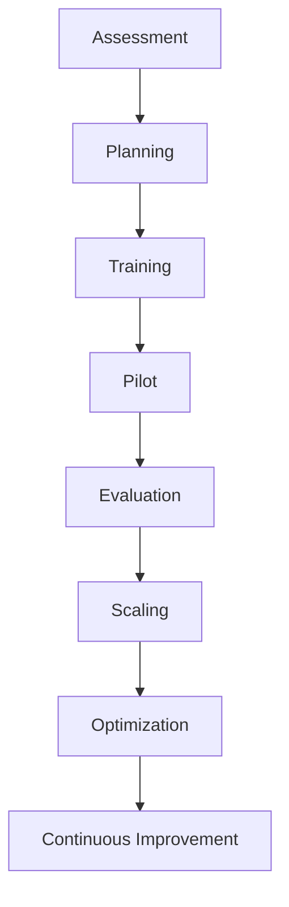
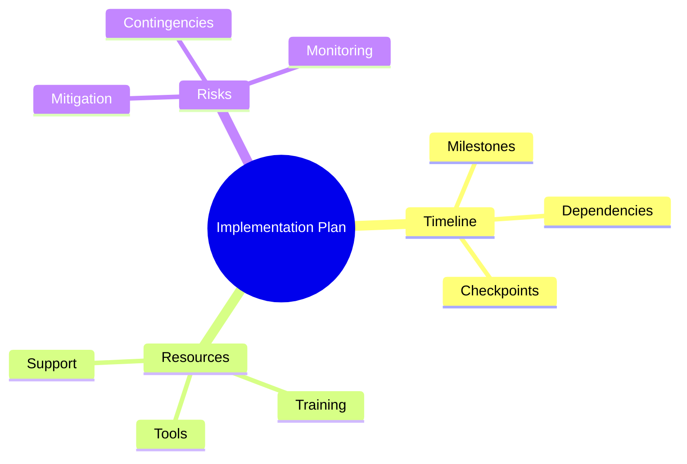
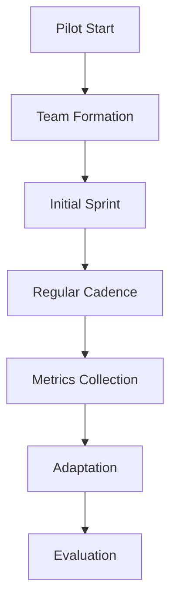
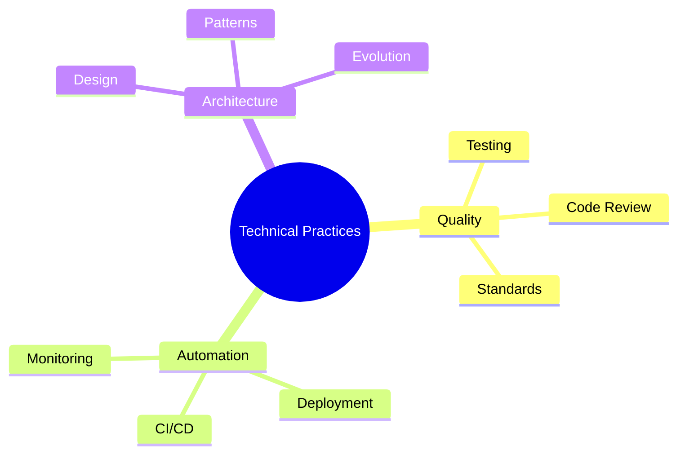

import Tabs from "@theme/Tabs";
import TabItem from "@theme/TabItem";

A comprehensive guide to implementing Scrum in your organization, from initial assessment through full adoption and continuous improvement.

<!-- truncate -->

:::tip Implementation Phases
Key phases of Scrum implementation:

- 📋 Assessment & Planning
- 🎓 Training & Education
- 🚀 Pilot Implementation
- 📈 Scaling & Growth
- 🔄 Continuous Improvement
  :::

## Implementation Roadmap

## Phase 1: Assessment & Planning

### Organizational Assessment

<Tabs>
  <TabItem value="culture" label="Cultural Assessment" default>
    **Key Areas**: - Leadership support - Change readiness - Current practices -
    Team dynamics **Evaluation Methods**: - Surveys - Interviews - Workshops -
    Observations
  </TabItem>
  <TabItem value="technical" label="Technical Assessment">
    **Focus Points**: - Development practices - Tool ecosystem - Quality
    processes - Integration practices **Analysis Areas**: - CI/CD capabilities -
    Testing practices - Code management - Release processes
  </TabItem>
</Tabs>

### Implementation Planning

## Phase 2: Training & Education

### Training Program

<Tabs>
  <TabItem value="basics" label="Scrum Basics" default>
    **Core Topics**: - Agile principles - Scrum framework - Roles &
    responsibilities - Events & artifacts **Delivery Methods**: - Workshops -
    Online courses - Hands-on exercises - Case studies
  </TabItem>
  <TabItem value="advanced" label="Advanced Topics">
    **Specialized Areas**: - Product ownership - Scrum mastery - Technical
    practices - Scaling patterns **Learning Paths**: - Role-based training -
    Certification prep - Practical applications - Mentoring programs
  </TabItem>
</Tabs>

## Phase 3: Pilot Implementation

### Pilot Team Selection

:::info Selection Criteria
Choose a pilot team that represents a good balance of challenges and opportunities.
:::

1. **Team Characteristics**

   - Cross-functional skills
   - Change receptivity
   - Collaborative culture
   - Manageable scope

2. **Project Selection**

   - Clear boundaries
   - Reasonable complexity
   - Business value
   - Stakeholder support

3. **Success Metrics**
   - Velocity trends
   - Quality metrics
   - Team satisfaction
   - Stakeholder feedback

### Pilot Execution

## Phase 4: Scaling & Growth

### Expansion Strategy

<Tabs>
  <TabItem value="approach" label="Scaling Approach" default>
    **Methods**: - Team-by-team rollout - Department-wide adoption -
    Project-based expansion - Organic growth **Considerations**: - Resource
    availability - Dependencies - Support capacity - Change impact
  </TabItem>
  <TabItem value="support" label="Support Structure">
    **Elements**: - Coaching network - Communities of practice - Knowledge
    sharing - Tool standardization **Resources**: - Internal coaches - External
    consultants - Training materials - Support tools
  </TabItem>
</Tabs>

## Phase 5: Optimization

### Process Refinement

1. **Ceremony Optimization**

   - Time management
   - Participation
   - Effectiveness
   - Value delivery

2. **Artifact Evolution**

   - Template refinement
   - Tool integration
   - Automation
   - Accessibility

3. **Role Development**
   - Skill enhancement
   - Collaboration patterns
   - Leadership growth
   - Team dynamics

### Technical Excellence

## Common Challenges

:::warning Implementation Pitfalls
Be prepared to address these common challenges during implementation.
:::

<Tabs>
  <TabItem value="resistance" label="Change Resistance" default>
    **Challenges**: - Cultural inertia - Process attachment - Fear of change -
    Role uncertainty **Solutions**: - Clear communication - Incremental change -
    Early wins - Support system
  </TabItem>
  <TabItem value="execution" label="Execution Issues">
    **Challenges**: - Ceremony effectiveness - Role confusion - Tool adoption -
    Quality maintenance **Solutions**: - Regular training - Coaching support -
    Tool optimization - Practice refinement
  </TabItem>
</Tabs>

## Success Factors

### Critical Elements

1. **Leadership Support**

   - Active engagement
   - Resource provision
   - Barrier removal
   - Cultural alignment

2. **Team Empowerment**

   - Decision authority
   - Skill development
   - Tool access
   - Clear boundaries

3. **Continuous Learning**
   - Regular feedback
   - Adaptation cycles
   - Knowledge sharing
   - Innovation support

## Measuring Implementation Success

### Key Metrics

<Tabs>
  <TabItem value="process" label="Process Metrics" default>
    **Measurements**: - Cycle time - Lead time - Velocity trends - Quality
    metrics **Analysis**: - Trend tracking - Baseline comparison - Goal
    achievement - Improvement rate
  </TabItem>
  <TabItem value="outcome" label="Outcome Metrics">
    **Business Impact**: - Value delivery - Customer satisfaction - Market
    response - Innovation rate **Team Health**: - Engagement levels -
    Collaboration - Satisfaction - Growth
  </TabItem>
</Tabs>

## Tools and Resources

### Implementation Toolkit

1. **Assessment Tools**

   - Readiness checklists
   - Culture surveys
   - Capability matrices
   - Risk assessments

2. **Training Materials**

   - Learning paths
   - Workshop templates
   - Exercise guides
   - Reference materials

3. **Tracking Tools**
   - Metrics dashboards
   - Progress trackers
   - Health indicators
   - Success measures

## Additional Resources

- [Scrum Implementation Guide](https://www.scrum.org/resources/implementation-guide)
- [Agile Transformation Patterns](https://www.atlassian.com/agile/agile-at-scale/agile-transformation)
- [Scrum Adoption Best Practices](https://www.scrumalliance.org/learn-about-scrum/scrum-adoption)
- [Change Management in Agile](https://www.agilebusiness.org/page/ProjectFramework_10_ImplementationGuidance)
