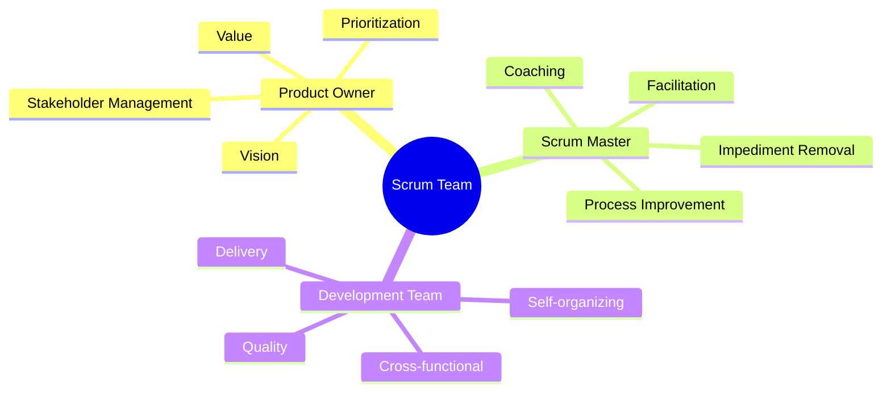
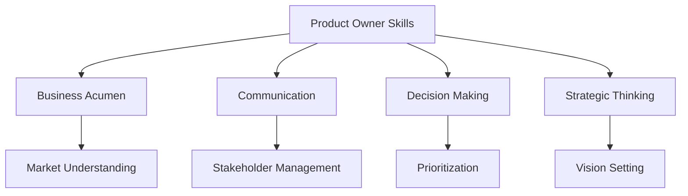
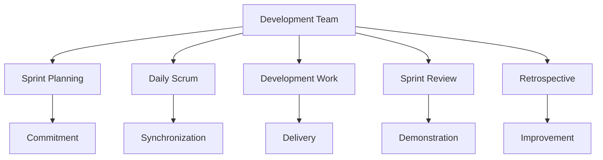

import Tabs from "@theme/Tabs";
import TabItem from "@theme/TabItem";

A detailed exploration of the three essential Scrum roles: Product Owner, Scrum Master, and Development Team. Understanding these roles is crucial for effective Scrum implementation.

<!-- truncate -->

:::tip Key Roles
The Scrum framework defines three distinct roles:

- 👑 Product Owner
- 🛡️ Scrum Master
- 👥 Development Team
  :::

## Role Overview

## Product Owner

:::info Single Point of Authority
The Product Owner is the sole person responsible for managing the Product Backlog and maximizing product value.
:::

### Core Responsibilities

<Tabs>
  <TabItem value="backlog" label="Product Backlog Management" default>
    **Primary Duties**:
    - Clearly expressing Product Backlog items
    - Ordering items for maximum value
    - Ensuring transparency and visibility
    - Making sure the team understands items

    **Key Activities**:
    - Backlog refinement
    - Story writing
    - Acceptance criteria definition
    - Value assessment
  </TabItem>
  <TabItem value="stakeholder" label="Stakeholder Management">
    **Primary Duties**:
    - Representing stakeholder interests
    - Communicating vision and goals
    - Managing expectations
    - Building relationships

    **Key Activities**:
    - Regular stakeholder meetings
    - Progress reporting
    - Feedback collection
    - Priority alignment
  </TabItem>
  <TabItem value="value" label="Value Optimization">
    **Primary Duties**:
    - Defining product vision
    - Maximizing ROI
    - Making value-based decisions
    - Measuring outcomes

    **Key Activities**:
    - Market analysis
    - Feature prioritization
    - ROI calculations
    - Success metrics tracking
  </TabItem>
</Tabs>

### Essential Skills

## Scrum Master

:::info Servant Leader
The Scrum Master serves the organization, Product Owner, and Development Team through servant leadership and process facilitation.
:::

### Service to the Organization

<Tabs>
  <TabItem value="planning" label="Implementation" default>
    **Activities**:
    - Leading Scrum adoption
    - Planning implementations
    - Training staff
    - Measuring effectiveness

    **Outcomes**:
    - Increased agility
    - Better collaboration
    - Improved delivery
    - Cultural transformation
  </TabItem>
  <TabItem value="coaching" label="Coaching">
    **Focus Areas**:
    - Empirical process control
    - Value optimization
    - Process improvement
    - Agile mindset

    **Methods**:
    - Workshops
    - Mentoring
    - Training sessions
    - Change management
  </TabItem>
</Tabs>

### Service to the Product Owner

<Tabs>
  <TabItem value="techniques" label="Facilitation" default>
    **Support Areas**:
    - Backlog management techniques
    - Goal-setting practices
    - Effective planning methods
    - Value optimization strategies

    **Tools**:
    - Prioritization frameworks
    - Visualization tools
    - Planning techniques
    - Metrics dashboards
  </TabItem>
  <TabItem value="effectiveness" label="Effectiveness">
    **Improvement Areas**:
    - Communication methods
    - Stakeholder engagement
    - Decision-making processes
    - Value measurement

    **Outcomes**:
    - Better backlog management
    - Clearer communication
    - Improved stakeholder relations
    - Enhanced value delivery
  </TabItem>
</Tabs>

### Service to the Development Team

<Tabs>
  <TabItem value="coaching" label="Team Coaching" default>
    **Focus Areas**:
    - Self-organization
    - Cross-functionality
    - Technical
    - Team dynamics

    **Methods**:
    - Daily facilitation
    - Impediment removal
    - Process guidance
    - Conflict resolution
  </TabItem>
  <TabItem value="improvement" label="Continuous Improvement">
    **Activities**:
    - Retrospective facilitation
    - Process optimization
    - Tool enhancement
    - Skill development

    **Outcomes**:
    - Higher productivity
    - Better quality
    - Improved morale
    - Enhanced collaboration
  </TabItem>
</Tabs>

## Development Team

:::info Self-Organizing
The Development Team is self-organizing and cross-functional, with all the skills needed to deliver product increments.
:::

### Characteristics

<Tabs>
  <TabItem value="structure" label="Team Structure" default>
    **Optimal Size**: 3-9 members

    **Key Attributes**:
    - Self-organizing
    - Cross-functional
    - No sub-teams
    - Collective ownership

    **Benefits**:
    - Efficient communication
    - Quick decision making
    - Flexible resource allocation
    - Shared responsibility
  </TabItem>
  <TabItem value="skills" label="Required Skills">
    **Technical Skills**:
    - Development
    - Testing
    - Design
    - Architecture

    **Soft Skills**:
    - Communication
    - Collaboration
    - Problem-solving
    - Adaptability
  </TabItem>
</Tabs>

### Responsibilities

## Role Interactions

### Communication Patterns

<Tabs>
  <TabItem value="daily" label="Daily Interactions" default>
    **Ceremonies**:
    - Daily Scrum
    - Backlog refinement
    - Ad-hoc discussions
    - Pair programming

    **Tools**:
    - Information radiators
    - Digital boards
    - Chat platforms
    - Collaboration tools
  </TabItem>
  <TabItem value="periodic" label="Periodic Interactions">
    **Events**:
    - Sprint planning
    - Sprint review
    - Retrospective
    - Stakeholder meetings

    **Outcomes**:
    - Aligned goals
    - Clear priorities
    - Shared understanding
    - Continuous improvement
  </TabItem>
</Tabs>

## Common Anti-patterns

:::warning Watch Out
Avoid these common role-related anti-patterns that can harm team effectiveness.
:::

<Tabs>
  <TabItem value="po" label="Product Owner" default>
    - Proxy Product Owner
    - Multiple Product Owners
    - Unavailable Product Owner
    - Micromanaging backlog
  </TabItem>
  <TabItem value="sm" label="Scrum Master">
    - Project manager mindset
    - Command and control
    - Solving team problems
    - Neglecting organization
  </TabItem>
  <TabItem value="team" label="Development Team">
    - Specialized sub-teams
    - Individual assignments
    - External dependencies
    - Lack of cross-training
  </TabItem>
</Tabs>

## Success Patterns

### Role Excellence

1. **Product Owner Excellence**

   - Clear vision communication
   - Effective prioritization
   - Stakeholder engagement
   - Value-driven decisions

2. **Scrum Master Excellence**

   - Servant leadership
   - Process facilitation
   - Continuous improvement
   - Organizational change

3. **Development Team Excellence**
   - Technical excellence
   - Self-organization
   - Continuous learning
   - Collaborative culture

## Additional Resources

- [Scrum Guide - Roles](https://scrumguides.org/scrum-guide.html#scrum-team)
- [Product Owner Learning Path](https://www.scrum.org/pathway/product-owner-learning-path)
- [Scrum Master Learning Path](https://www.scrum.org/pathway/scrum-master-learning-path)
- [Development Team Best Practices](https://www.scrum.org/resources/blog/done-understanding-definition-done)
