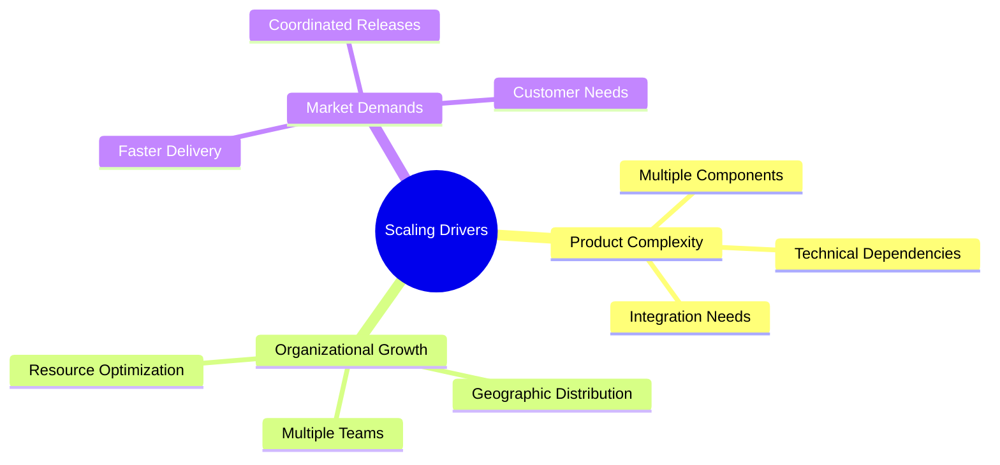
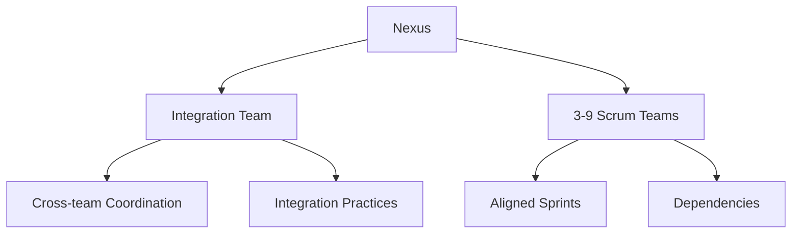
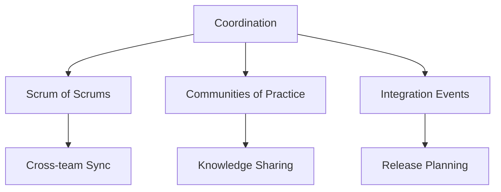

import Tabs from "@theme/Tabs";
import TabItem from "@theme/TabItem";

A comprehensive guide to scaling Scrum beyond a single team, exploring various frameworks and practical approaches for larger organizations.

<!-- truncate -->

:::tip Key Scaling Approaches
Popular frameworks for scaling Scrum:

- 🏢 LeSS (Large-Scale Scrum)
- 🔄 SAFe (Scaled Agile Framework)
- 🔗 Nexus Framework
- 🌐 Scrum@Scale
  :::

## Why Scale Scrum?

## Common Scaling Frameworks

### LeSS (Large-Scale Scrum)

<Tabs>
  <TabItem value="basics" label="Basic LeSS" default>
    **For 2-8 Teams**: - Single Product Owner - One Product Backlog -
    Synchronized Sprints - Overall Retrospective **Key Principles**: - More with
    LeSS - Whole product focus - Customer-centric - Systems thinking
  </TabItem>
  <TabItem value="huge" label="LeSS Huge">
    **For 8+ Teams**: - Area Product Owners - Requirement Areas - Area Backlogs
    - Extended Roles **Additional Elements**: - Product Owner Team - Area
    Specialization - Coordinated Backlogs - Multi-team Coordination
  </TabItem>
</Tabs>

### SAFe (Scaled Agile Framework)

:::info Framework Levels
SAFe provides multiple configurations to match organizational needs.
:::

<Tabs>
  <TabItem value="essential" label="Essential SAFe" default>
    **Core Elements**: - Agile Release Trains - Program Increment - DevOps
    Culture - Built-in Quality **Key Roles**: - Release Train Engineer - Product
    Management - System Architect - Scrum Teams
  </TabItem>
  <TabItem value="portfolio" label="Portfolio SAFe">
    **Additional Features**: - Strategic Themes - Portfolio Backlog - Lean
    Portfolio Management - Value Streams **Enterprise Focus**: - Investment
    Funding - Governance - Portfolio Vision - Enterprise Architecture
  </TabItem>
</Tabs>

### Nexus Framework

### Scrum@Scale

<Tabs>
  <TabItem value="structure" label="Framework Structure" default>
    **Scale-Free Architecture**: - Scaling cycles - Minimum viable bureaucracy -
    Team-centric approach **Components**: - Team-level Scrum - Scrum of Scrums -
    Executive Action Team
  </TabItem>
  <TabItem value="implementation" label="Implementation">
    **Key Aspects**: - Modular scaling - Reference model - Linear scaling -
    Organizational transformation **Focus Areas**: - Team coordination - Product
    delivery - Organizational design - Continuous improvement
  </TabItem>
</Tabs>

## Scaling Patterns

### Team Organization

1. **Feature Teams**

   - Cross-functional capabilities
   - End-to-end responsibility
   - Customer-centric focus
   - Reduced dependencies

2. **Component Teams**

   - Specialized expertise
   - Technical focus
   - Shared services
   - Platform development

3. **Hybrid Approach**
   - Mixed team types
   - Flexible organization
   - Context-based structure
   - Evolutionary design

### Coordination Mechanisms

## Common Challenges

:::warning Watch Out
Be prepared for these common scaling challenges.
:::

<Tabs>
  <TabItem value="coordination" label="Coordination Issues" default>
    **Challenges**: - Dependencies management - Communication overhead -
    Integration complexity - Release coordination **Solutions**: - Clear
    interfaces - Regular sync events - Automation - Shared practices
  </TabItem>
  <TabItem value="alignment" label="Organizational Alignment">
    **Challenges**: - Strategic alignment - Cultural differences - Process
    consistency - Goal conflicts **Solutions**: - Shared vision - Clear
    objectives - Standard practices - Regular alignment
  </TabItem>
</Tabs>

## Implementation Strategy

### Assessment and Planning

1. **Current State Analysis**

   - Team structure
   - Product architecture
   - Development practices
   - Organizational culture

2. **Framework Selection**

   - Organization size
   - Product complexity
   - Team distribution
   - Cultural fit

3. **Roadmap Development**
   - Phased implementation
   - Success metrics
   - Risk mitigation
   - Change management

### Success Factors

<Tabs>
  <TabItem value="technical" label="Technical Practices" default>
    **Essential Elements**: - Continuous Integration - Automated Testing -
    DevOps Culture - Architecture Standards **Implementation**: - Tool
    standardization - Practice alignment - Technical excellence - Quality focus
  </TabItem>
  <TabItem value="organizational" label="Organizational Practices">
    **Key Areas**: - Leadership support - Change management - Training programs
    - Communication plans **Focus Points**: - Culture development - Skill
    building - Continuous learning - Feedback loops
  </TabItem>
</Tabs>

## Measuring Success

### Key Metrics

1. **Delivery Metrics**

   - Lead Time
   - Cycle Time
   - Release Frequency
   - Quality Metrics

2. **Team Metrics**

   - Team Velocity
   - Sprint Success Rate
   - Cross-team Dependencies
   - Team Satisfaction

3. **Business Metrics**
   - Time to Market
   - Customer Satisfaction
   - Business Value Delivery
   - Innovation Rate

## Best Practices

:::tip Success Patterns
Focus on these areas for successful scaling.
:::

1. **Start Small**

   - Pilot programs
   - Incremental scaling
   - Learn and adapt
   - Build momentum

2. **Focus on Basics**

   - Solid Scrum foundation
   - Technical excellence
   - Clear communication
   - Strong leadership

3. **Continuous Improvement**
   - Regular retrospectives
   - Framework adaptation
   - Practice evolution
   - Knowledge sharing

## Additional Resources

- [Scrum@Scale Guide](https://www.scrumatscale.com/scrum-at-scale-guide/)
- [LeSS Framework](https://less.works/)
- [SAFe Framework](https://www.scaledagileframework.com/)
- [Nexus Guide](https://www.scrum.org/resources/nexus-guide)
