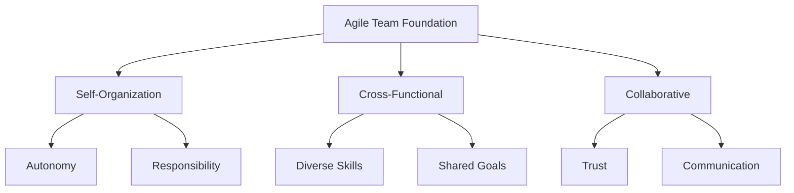

import Tabs from "@theme/Tabs";
import TabItem from "@theme/TabItem";

Effective team dynamics are at the heart of successful agile implementations. This guide explores how to build and nurture high-performing agile teams, focusing on key aspects of team interaction, collaboration, and continuous improvement.

<!-- truncate -->

:::tip Key Takeaway
Strong team dynamics are built on trust, effective communication, and continuous improvement. Success comes from creating an environment where self-organizing teams can thrive.
:::

## The Foundation of Agile Teams

### Self-Organizing Teams

<Tabs>
  <TabItem value="characteristics" label="Characteristics" default>
    Self-organizing teams: - Choose how to execute their work - Decide who does
    what tasks - Divide work into manageable increments - Make decisions without
    management oversight - Share collective responsibility for outcomes
  </TabItem>
  <TabItem value="benefits" label="Benefits">
    Benefits include: - Increased ownership - Better decision making - Faster
    response times - Higher motivation - Improved innovation
  </TabItem>
  <TabItem value="challenges" label="Challenges">
    Common challenges: - Initial uncertainty - Role adaptation - Decision-making
    process - Accountability balance - Skill gaps
  </TabItem>
</Tabs>

:::info Quote
"Self-organizing teams choose how they will execute the work, and who will do what. Management does not assign tasks or look over their shoulders. The team is entrusted with making the right decisions."
:::

### Cross-Functional Collaboration

<Tabs>
  <TabItem value="skills" label="Required Skills" default>
    Teams need: - Multiple disciplines represented - Complementary skill sets -
    Shared language across specialties - Collective ownership of outcomes -
    Ability to complete work end-to-end
  </TabItem>
  <TabItem value="practices" label="Best Practices">
    Effective practices: - Regular skill sharing - Cross-training - Pair
    programming - Knowledge rotation - Documentation
  </TabItem>
</Tabs>

## Building Trust and Psychological Safety

:::caution Important
Psychological safety is the foundation of high-performing teams. Without it, innovation and continuous improvement are impossible.
:::

### Creating a Safe Environment

<Tabs>
  <TabItem value="behaviors" label="Key Behaviors" default>
    Teams need to: - Take calculated risks - Express concerns openly - Share
    ideas without fear - Admit mistakes and learn from them - Challenge existing
    practices
  </TabItem>
  <TabItem value="leadership" label="Leadership Role">
    Leaders should: - Model vulnerability - Encourage feedback - Protect the
    team - Celebrate learning - Address conflicts
  </TabItem>
</Tabs>

### Establishing Trust

Trust is built through:

- Consistent delivery on commitments
- Open and honest communication
- Mutual respect for expertise
- Supporting team members in difficulty
- Celebrating collective successes

## Communication Patterns

### Face-to-Face Communication

The Agile Manifesto emphasizes that "the most efficient and effective method of conveying information to and within a development team is face-to-face conversation." This includes:

- Daily stand-up meetings
- Real-time problem solving
- Impromptu discussions
- Team planning sessions
- Retrospective meetings

### Remote Communication

For distributed teams, effective communication requires:

- Regular video conferences
- Digital collaboration tools
- Clear communication protocols
- Scheduled overlap times
- Documentation of decisions

## Team Motivation and Engagement

### Building Motivated Teams

As highlighted in agile principles, projects should "build projects around motivated individuals." This involves:

- Providing autonomy
- Setting clear purpose and goals
- Offering growth opportunities
- Recognizing achievements
- Supporting professional development

### Maintaining Engagement

Keep teams engaged through:

- Meaningful work assignments
- Regular feedback loops
- Clear career progression
- Team building activities
- Continuous learning opportunities

## Servant Leadership

### Role of Servant Leaders

Servant leaders in agile teams:

- Remove obstacles
- Facilitate team success
- Coach and mentor
- Protect team focus
- Enable self-organization

### Leadership Practices

Effective servant leaders:

- Listen actively
- Build consensus
- Foster empowerment
- Support growth
- Shield from disruptions

## Team Development Stages

### Tuckman's Model in Agile Context

Teams typically progress through:

1. **Forming**

   - Team assembly
   - Initial orientation
   - Establishing basic rules

2. **Storming**

   - Conflict emergence
   - Role clarification
   - Process negotiation

3. **Norming**

   - Establishing workflows
   - Building relationships
   - Creating team identity

4. **Performing**
   - High productivity
   - Effective collaboration
   - Continuous improvement

## Continuous Improvement

### Team Reflection

Regular reflection helps teams evolve:

- Sprint retrospectives
- Feedback sessions
- Process reviews
- Skill assessments
- Improvement planning

### Adaptation and Growth

Teams should continuously:

- Adjust processes
- Learn new skills
- Share knowledge
- Experiment with approaches
- Measure improvements

## Common Challenges and Solutions

### Team Challenges

Address common issues like:

- Conflicting priorities
- Skill gaps
- Communication barriers
- Process inefficiencies
- External dependencies

### Solution Strategies

Implement solutions through:

- Clear prioritization
- Training programs
- Communication frameworks
- Process optimization
- Stakeholder management

## Measuring Team Effectiveness

### Key Metrics

Track team performance using:

- Velocity trends
- Quality metrics
- Team happiness
- Customer satisfaction
- Delivery predictability

### Health Indicators

Monitor team health through:

- Collaboration levels
- Innovation metrics
- Learning indicators
- Retention rates
- Engagement scores

## Best Practices for Team Success

### Team Structure

- Keep teams small (3-10 members)
- Maintain stable team composition
- Ensure skill coverage
- Define clear roles
- Enable pair working

### Working Environment

- Create collaborative spaces
- Provide necessary tools
- Enable quick communication
- Support focus time
- Foster innovation

## Conclusion

Building effective agile teams requires careful attention to team dynamics, communication patterns, and continuous improvement practices. Success comes from creating an environment where self-organizing teams can thrive, supported by servant leadership and strong trust relationships.

Remember that team development is an ongoing journey, not a destination. Regular assessment and adjustment of team practices ensure continued growth and effectiveness in delivering value to customers.

## Further Reading

- The Agile Manifesto Principles
- Team Topologies
- Psychological Safety in Teams
- Servant Leadership in Practice
- Measuring Team Performance
