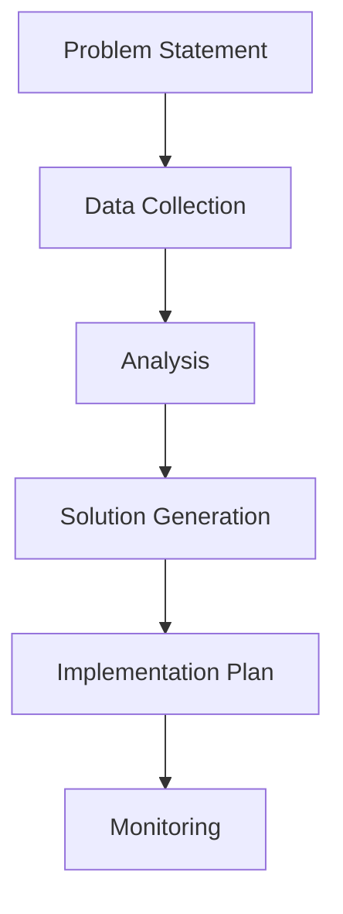

import Tabs from "@theme/Tabs";
import TabItem from "@theme/TabItem";

A collection of research-backed exercises and activities designed to strengthen agile team dynamics, improve collaboration, and foster continuous improvement. These exercises are based on industry best practices and proven methodologies.

<!-- truncate -->

## Quick Reference

:::tip Activity Categories
Choose activities based on your team's development needs:

- 🤝 Team Cohesion & Collaboration
- 🎯 Strategic Alignment & Goal Setting
- 🔄 Process Improvement & Optimization
- 🧠 Problem Solving & Decision Making
- 📈 Skill Development & Knowledge Sharing
  :::

## Team Formation Activities

### Professional Ice Breakers

<Tabs>
  <TabItem value="skills" label="Skills Matrix Workshop" default>
    **Duration**: 45 minutes **Objective**: Map team capabilities and identify
    growth opportunities **Process**: 1. Create comprehensive skills inventory
    2. Self-assess proficiency levels 3. Identify knowledge gaps 4. Develop
    learning partnerships **Materials**: Digital skills matrix template [Learn
    more about Skills
    Matrix](https://www.planview.com/resources/guide/agile-methodologies-a-beginners-guide/agile-best-practices-effective-teams/)
  </TabItem>
  <TabItem value="goals" label="Team Charter Creation">
    **Duration**: 90 minutes **Objective**: Establish team identity and working
    agreements **Process**: 1. Define team mission and values 2. Establish
    working principles 3. Set collaboration guidelines 4. Create success metrics
    **Materials**: Digital whiteboard, template [Team Charter
    Guide](https://www.atlassian.com/team-playbook/plays/team-charter)
  </TabItem>
</Tabs>

## Psychological Safety Exercises

:::info Research Background
Based on Google's Project Aristotle research, psychological safety is the most important factor in high-performing teams.
:::

<Tabs>
  <TabItem value="casestudy" label="Case Study Analysis" default>
    **Duration**: 60 minutes **Objective**: Build psychological safety through
    shared learning **Process**: 1. Present real project challenges 2. Analyze
    decisions and outcomes 3. Share personal experiences 4. Extract learning
    points **Materials**: Prepared case studies, facilitation guide [Google's
    Project Aristotle
    Findings](https://rework.withgoogle.com/print/guides/5721312655835136/)
  </TabItem>
  <TabItem value="feedback" label="Feedback Workshop">
    **Duration**: 45 minutes **Objective**: Develop constructive feedback skills
    **Process**: 1. Learn feedback frameworks 2. Practice in small groups 3.
    Provide peer feedback 4. Reflect on learnings **Materials**: Feedback
    templates, scenarios [Effective Feedback
    Techniques](https://www.scrum.org/resources/blog/giving-and-receiving-effective-feedback)
  </TabItem>
</Tabs>

## Problem-Solving Activities

### Root Cause Analysis

<Tabs>
  <TabItem value="fishbone" label="Ishikawa Analysis" default>
    **Duration**: 60 minutes **Objective**: Systematic problem analysis
    **Process**: 1. Define problem statement 2. Identify major categories 3.
    Analyze contributing factors 4. Prioritize root causes **Materials**:
    Digital collaboration tool [Ishikawa Diagram
    Guide](https://asq.org/quality-resources/fishbone)
  </TabItem>
  <TabItem value="impact" label="Impact Mapping">
    **Duration**: 90 minutes **Objective**: Connect goals to deliverables
    **Process**: 1. Define business goals 2. Identify stakeholders 3. Map
    behavior changes 4. List deliverables **Materials**: Impact mapping template
    [Impact Mapping Tutorial](https://www.impactmapping.org/tutorial.html)
  </TabItem>
</Tabs>

## Retrospective Techniques

:::info Retrospective Prime Directive
"Regardless of what we discover, we understand and truly believe that everyone did the best job they could, given what they knew at the time, their skills and abilities, the resources available, and the situation at hand."

- Norm Kerth, Project Retrospectives
  :::

<Tabs>
  <TabItem value="data" label="Data-Driven Retro" default>
    **Duration**: 60 minutes **Objective**: Evidence-based improvement
    **Process**: 1. Review metrics and KPIs 2. Analyze trends 3. Identify
    improvement areas 4. Create action plan **Materials**: Sprint metrics,
    dashboards [Metrics-Based
    Retrospectives](https://www.scrum.org/resources/blog/metrics-scrum-teams-focus-what-matters)
  </TabItem>
  <TabItem value="start" label="Start-Stop-Continue">
    **Duration**: 45 minutes **Objective**: Action-oriented reflection
    **Process**: 1. Collect team input 2. Group similar items 3. Vote on
    priorities 4. Plan implementation **Materials**: Digital collaboration board
    [Effective Retrospectives
    Guide](https://www.atlassian.com/team-playbook/plays/retrospective)
  </TabItem>
</Tabs>

## Strategic Alignment Exercises

### Vision Alignment

<Tabs>
  <TabItem value="story" label="Story Mapping" default>
    **Duration**: 120 minutes **Objective**: Align team on product vision
    **Process**: 1. Map user journey 2. Identify activities 3. Break down tasks
    4. Prioritize releases **Materials**: Story mapping tool [User Story Mapping
    Guide](https://www.jpattonassociates.com/user-story-mapping/)
  </TabItem>
  <TabItem value="okr" label="OKR Workshop">
    **Duration**: 90 minutes **Objective**: Set measurable objectives
    **Process**: 1. Define objectives 2. Create key results 3. Align team goals
    4. Plan tracking **Materials**: OKR templates [OKR Framework
    Guide](https://rework.withgoogle.com/guides/set-goals-with-okrs/steps/introduction/)
  </TabItem>
</Tabs>

## Remote Collaboration Techniques

:::tip Remote-First Mindset
Design all activities with remote participation in mind, even for hybrid teams.
:::

<Tabs>
  <TabItem value="async" label="Asynchronous Planning" default>
    **Duration**: Distributed over 2-3 days **Objective**: Inclusive remote
    planning **Process**: 1. Share context asynchronously 2. Collect individual
    input 3. Synthesize feedback 4. Live discussion of key points **Materials**:
    Collaboration platform [Async Planning
    Guide](https://www.atlassian.com/agile/project-management/remote-teams)
  </TabItem>
  <TabItem value="virtual" label="Virtual Workshops">
    **Duration**: 60-90 minutes **Objective**: Engaging remote sessions
    **Process**: 1. Pre-workshop preparation 2. Interactive exercises 3. Small
    group breakouts 4. Digital documentation **Materials**: Virtual facilitation
    tools [Remote Workshop
    Techniques](https://www.mural.co/blog/online-warm-ups-energizers)
  </TabItem>
</Tabs>

## Measuring Success

### Evidence-Based Assessment

Track exercise effectiveness using:

- Quantitative metrics

  - Team velocity trends
  - Cycle time improvements
  - Quality metrics
  - Team stability index

- Qualitative indicators
  - Team engagement scores
  - Psychological safety measures
  - Collaboration effectiveness
  - Knowledge sharing metrics

[Learn more about Agile Metrics](https://www.scrum.org/resources/blog/agile-metrics-scrum-team-needs-track)

## Best Practices

1. **Strategic Implementation**

   - Align with team maturity
   - Consider organizational context
   - Build progressive complexity
   - Maintain consistent cadence

2. **Inclusive Design**

   - Account for diverse work styles
   - Provide multiple participation channels
   - Consider cultural factors
   - Ensure accessibility

3. **Continuous Evolution**
   - Gather participant feedback
   - Iterate on formats
   - Document learnings
   - Share success patterns

## Conclusion

Effective team exercises should be purposeful, measurable, and aligned with your organization's agile journey. Focus on activities that deliver concrete value and support your team's specific development needs.

:::note Scientific Approach
Base your selection of team activities on empirical evidence and measured outcomes rather than popular trends.
:::

## Additional Resources

- [Agile Alliance's Experience Reports](https://www.agilealliance.org/resources/experience-reports/)
- [Scrum.org's Professional Development](https://www.scrum.org/professional-development)
- [Modern Agile Principles](http://modernagile.org/)
- [Liberating Structures](http://www.liberatingstructures.com/)
