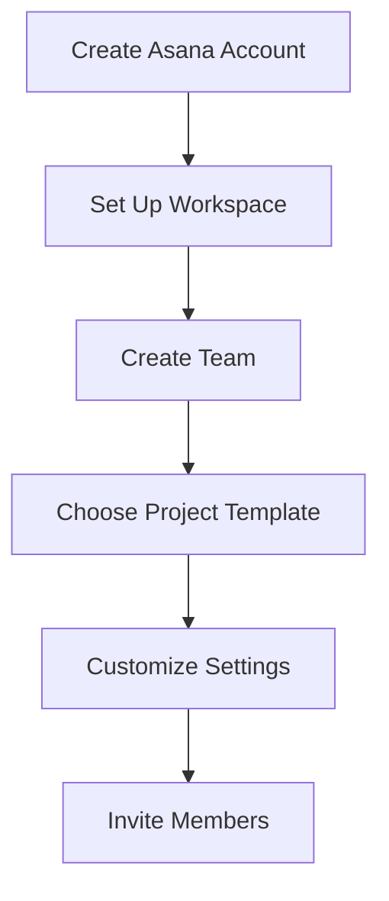
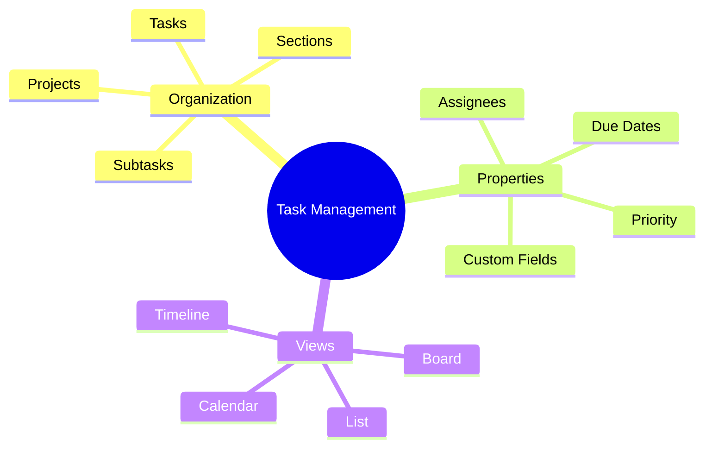
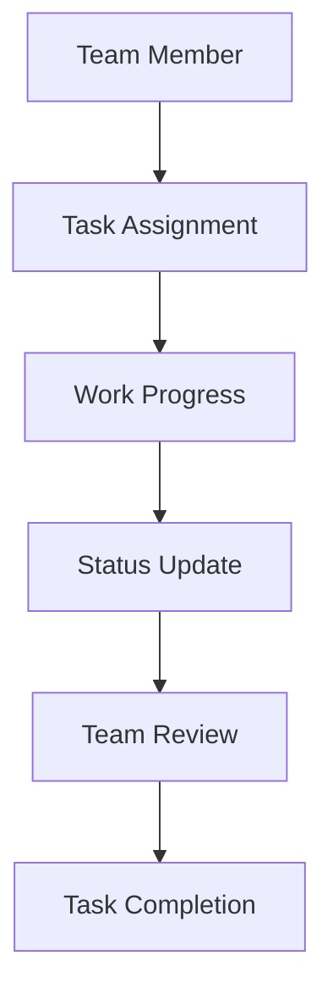
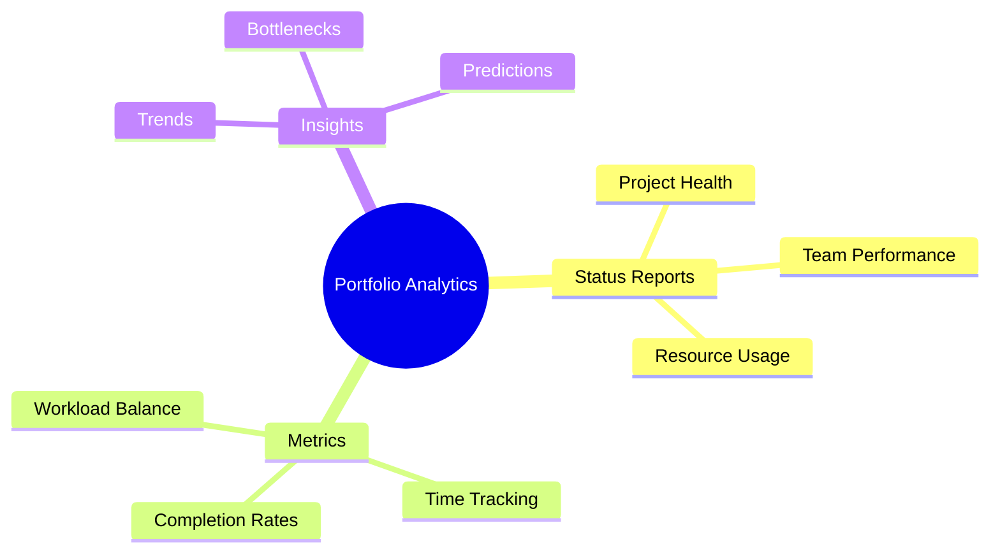

import Tabs from "@theme/Tabs";
import TabItem from "@theme/TabItem";

A comprehensive guide to using Asana for agile development and project management, focusing on setup, workflows, and best practices.

<!-- truncate -->

:::tip Key Features
Essential elements covered in this guide:

- 🚀 Getting Started with Asana
- 📋 Project Templates & Setup
- ✅ Task Management
- 👥 Team Collaboration
- 📅 Timeline & Dependencies
- 📊 Portfolio Management
  :::

## Getting Started with Asana

### Initial Setup

<Tabs>
  <TabItem value="workspace" label="Workspace Setup" default>
    **Key Steps**: - Create organization workspace - Configure workspace
    settings - Set up teams and departments - Define access levels **Initial
    Decisions**: - Organization structure - Team hierarchies - Permission levels
    - Communication preferences
  </TabItem>
  <TabItem value="teams" label="Team Configuration">
    **Team Setup**: - Define team purpose - Set team privacy - Add team members
    - Configure team settings **Team Features**: - Shared calendars - Team
    conversations - Resource planning - Team goals
  </TabItem>
</Tabs>

## Project Templates & Setup

### Agile Templates

:::info Template Selection
Choose the right template to kickstart your agile project management.
:::

<Tabs>
  <TabItem value="scrum" label="Scrum Template" default>
    **Key Components**: - Product backlog - Sprint planning board - Sprint
    backlog - Daily standup tracking **Features**: - Story point fields - Sprint
    velocity tracking - Burndown charts - Release planning
  </TabItem>
  <TabItem value="kanban" label="Kanban Template">
    **Board Structure**: - Customizable columns - WIP limits - Swimlanes - Flow
    metrics **Features**: - Visual workflow - Status automation - Lead time
    tracking - Bottleneck identification
  </TabItem>
</Tabs>

## Task Management

### Task Structure

### Task Configuration

<Tabs>
  <TabItem value="creation" label="Task Creation" default>
    **Essential Elements**: - Task name and description - Assignee and followers
    - Due dates and duration - Priority levels **Advanced Features**: - Custom
    fields - Dependencies - Attachments - Recurring tasks
  </TabItem>
  <TabItem value="workflow" label="Task Workflow">
    **Status Management**: - Status updates - Progress tracking - Approval
    processes - Automation rules **Collaboration**: - Comments and discussions -
    @mentions - File sharing - Task following
  </TabItem>
</Tabs>

## Team Collaboration

### Communication Tools

1. **Comments and Discussions**

   - Task-level comments
   - Project conversations
   - Team updates
   - @mentions and notifications

2. **File Sharing**
   - Document attachments
   - Version control
   - Preview capabilities
   - Storage integration

### Team Coordination

## Timeline & Dependencies

### Timeline Management

<Tabs>
  <TabItem value="planning" label="Project Planning" default>
    **Timeline Features**: - Gantt chart view - Dependency mapping - Critical
    path - Milestone tracking **Planning Tools**: - Resource allocation -
    Workload management - Schedule optimization - Progress tracking
  </TabItem>
  <TabItem value="dependencies" label="Dependency Management">
    **Types of Dependencies**: - Task dependencies - Project dependencies - Team
    dependencies - External dependencies **Management Features**: - Visual
    dependency mapping - Conflict detection - Impact analysis - Resolution
    tracking
  </TabItem>
</Tabs>

## Portfolio Management

### Portfolio Features

:::note Portfolio Overview
Manage multiple projects and track high-level progress effectively.
:::

1. **Portfolio Structure**

   - Project grouping
   - Status overview
   - Resource allocation
   - Progress tracking

2. **Portfolio Analysis**
   - Project health metrics
   - Resource utilization
   - Timeline alignment
   - Budget tracking

### Reporting & Analytics

## Advanced Features

### Automation

<Tabs>
  <TabItem value="rules" label="Automation Rules" default>
    **Rule Types**: - Status updates - Task assignments - Due date management -
    Notifications **Triggers**: - Task creation - Status changes - Due date
    approach - Custom field updates
  </TabItem>
  <TabItem value="integrations" label="Integrations">
    **Popular Integrations**: - Slack - Microsoft Teams - Google Workspace -
    Development tools **Integration Features**: - Two-way sync - Automated
    updates - Cross-platform notifications - Data consistency
  </TabItem>
</Tabs>

## Best Practices

### Implementation Success

1. **Project Organization**

   - Clear hierarchy
   - Consistent naming
   - Logical grouping
   - Efficient tagging

2. **Team Onboarding**

   - Training plan
   - Documentation
   - Support system
   - Best practices guide

3. **Process Optimization**
   - Regular reviews
   - Workflow refinement
   - Template updates
   - Automation enhancement

## Additional Resources

- [Asana Guide](https://asana.com/guide)
- [Asana Academy](https://academy.asana.com/)
- [Asana Community](https://community.asana.com/)
- [Asana Developer Documentation](https://developers.asana.com/docs)
