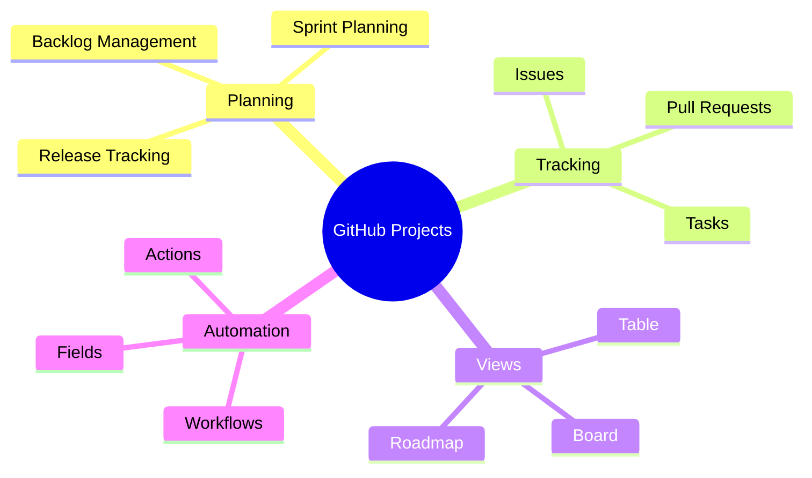
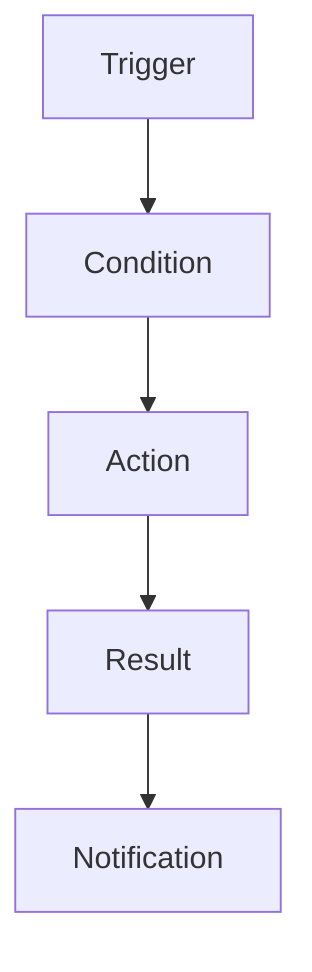
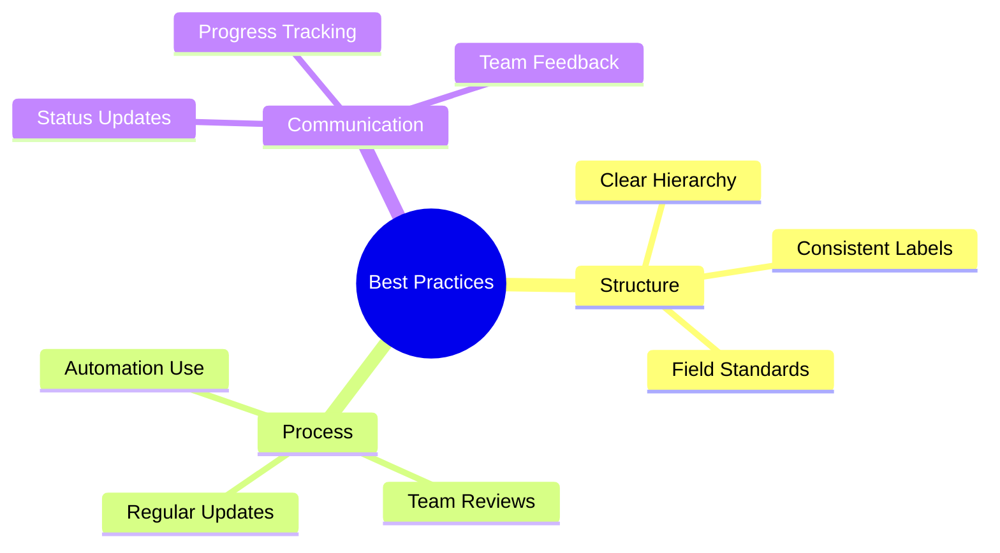
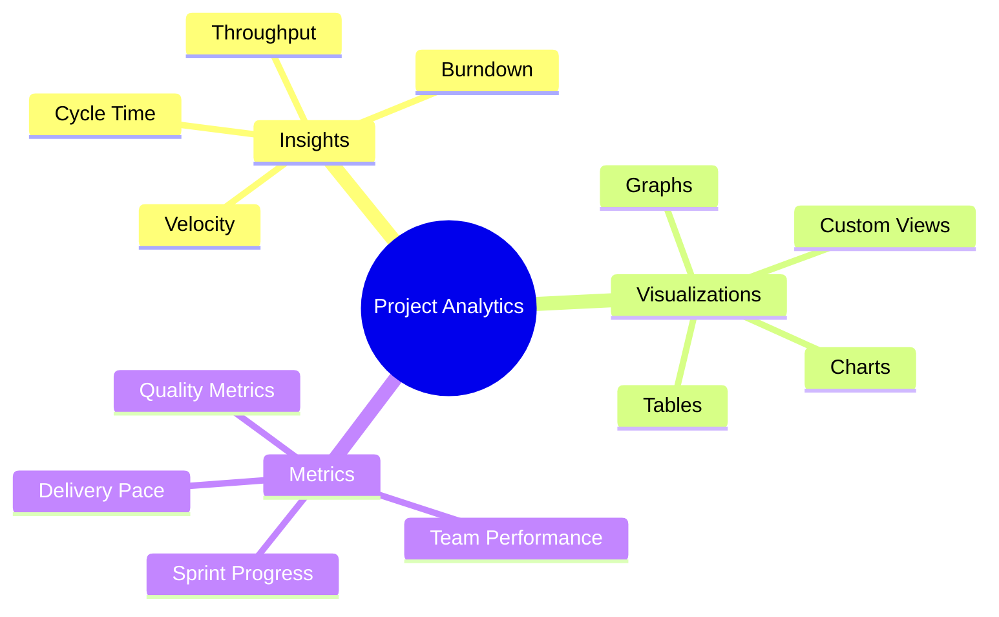

import Tabs from "@theme/Tabs";
import TabItem from "@theme/TabItem";

A comprehensive guide to using GitHub Projects for agile development, covering setup, customization, automation, and best practices.

<!-- truncate -->

:::tip Key Features
Essential GitHub Projects capabilities:

- 📋 Flexible Project Views
- 🎯 Issue Management
- 🔄 Built-in Automation
- 📊 Custom Fields
- 📈 Progress Tracking
- 🤖 GitHub Actions Integration
  :::

## Overview and Setup

### Understanding GitHub Projects



<Tabs>
  <TabItem value="basics" label="Core Concepts" default>
    **Key Components**:
    - Project tables
    - Custom fields
    - Views and layouts
    - Automation rules

    **Benefits**:
    - Integrated with GitHub
    - Flexible workflows
    - Real-time updates
    - Team collaboration

  </TabItem>
  <TabItem value="setup" label="Initial Setup">
    **Steps**:
    - Create organization/user project
    - Configure basic fields
    - Set up initial views
    - Define workflows

    **Best Practices**:
    - Start with templates
    - Define clear structure
    - Set up key fields
    - Enable automations

  </TabItem>
</Tabs>

## Project Views and Layouts

### Available Views

:::info View Types
GitHub Projects offers three main view types: Table, Board, and Roadmap, each serving different needs in your agile workflow.
:::

1. **Table View**

   - Spreadsheet-like layout
   - Custom field columns
   - Grouping and sorting
   - Bulk updates

2. **Board View**

   ```mermaid
   graph LR
       A[Backlog] --> B[To Do]
       B --> C[In Progress]
       C --> D[Review]
       D --> E[Done]
   ```

3. **Roadmap View**
   - Timeline visualization
   - Milestone tracking
   - Release planning
   - Dependencies

### Customizing Views

<Tabs>
  <TabItem value="fields" label="Field Configuration" default>
    **Available Fields**:
    - Status fields
    - Priority levels
    - Custom labels
    - Iteration tracking
    - Date fields
    - Number fields

    **Usage**:
    - Sprint planning
    - Story points
    - Release dates
    - Team assignments

  </TabItem>
  <TabItem value="layouts" label="Layout Options">
    **Customization**:
    - Column configuration
    - Grouping rules
    - Sorting options
    - Filtering criteria

    **Applications**:
    - Sprint boards
    - Backlog management
    - Release tracking
    - Team workload

  </TabItem>
</Tabs>

## Issue Management

### Agile Workflow Integration

1. **Backlog Management**

   - Issue organization
   - Priority setting
   - Sprint planning
   - Story point estimation

2. **Sprint Planning**
   ```mermaid
   graph TD
       A[Backlog Refinement] --> B[Sprint Planning]
       B --> C[Sprint Backlog]
       C --> D[Active Sprint]
       D --> E[Sprint Review]
   ```

### Issue Organization

<Tabs>
  <TabItem value="structure" label="Issue Structure" default>
    **Components**:
    - Title and description
    - Labels and milestones
    - Assignees
    - Custom fields
    - Sub-tasks

    **Organization**:
    - Epic linking
    - Sprint assignment
    - Priority levels
    - Status tracking

  </TabItem>
  <TabItem value="workflow" label="Workflow States">
    **Standard States**:
    - Backlog
    - To Do
    - In Progress
    - Review
    - Done

    **Custom States**:
    - Blocked
    - On Hold
    - Testing
    - Deployed

  </TabItem>
</Tabs>

## Automation Features

### Built-in Workflows

:::warning Automation Power
Leverage GitHub's built-in automation to reduce manual work and maintain consistency.
:::

1. **Status Automation**

   - Auto-status updates
   - Pull request linking
   - Issue transitions
   - Done criteria

2. **Field Updates**
   - Automatic assignments
   - Date calculations
   - Status changes
   - Priority updates

### Custom Automation



## GitHub Actions Integration

### Workflow Automation

<Tabs>
  <TabItem value="actions" label="Available Actions" default>
    **Common Actions**:
    - Issue creation
    - Status updates
    - Field population
    - Notifications

    **Integration Points**:
    - CI/CD pipelines
    - Code reviews
    - Deployments
    - Testing

  </TabItem>
  <TabItem value="examples" label="Example Workflows">
    **Automation Examples**:
    - Auto-labeling
    - Sprint updates
    - Release tracking
    - Metrics collection

    **Custom Scripts**:
    - Field updates
    - Status changes
    - Report generation
    - Team notifications

  </TabItem>
</Tabs>

## Best Practices and Tips

### Agile Implementation

1. **Sprint Management**

   - Regular planning
   - Daily updates
   - Review processes
   - Retrospectives

2. **Team Collaboration**
   - Clear ownership
   - Visible progress
   - Easy updates
   - Quick feedback

### Optimization Tips



## Migration Guide

### Moving to GitHub Projects

<Tabs>
  <TabItem value="planning" label="Migration Planning" default>
    **Steps**:
    - Data assessment
    - Field mapping
    - Timeline planning
    - Team training

    **Considerations**:
    - Data preservation
    - Workflow mapping
    - Team impact
    - Timeline

  </TabItem>
  <TabItem value="execution" label="Implementation">
    **Process**:
    - Data export
    - Import preparation
    - Validation
    - Team onboarding

    **Follow-up**:
    - Process verification
    - Team feedback
    - Adjustments
    - Documentation

  </TabItem>
</Tabs>

## Additional Resources

- [GitHub Projects Documentation](https://docs.github.com/en/issues/planning-and-tracking-with-projects)
- [Automating Projects](https://docs.github.com/en/issues/planning-and-tracking-with-projects/automating-your-project)
- [Project Views Guide](https://docs.github.com/en/issues/planning-and-tracking-with-projects/customizing-views-in-your-project)
- [Best Practices](https://docs.github.com/en/issues/planning-and-tracking-with-projects/learning-about-projects/best-practices-for-projects)

## Analytics & Reporting

### Project Insights

:::info Analytics Power
GitHub Projects provides built-in analytics tools to help teams track progress, measure performance, and make data-driven decisions.
:::



### Built-in Analytics

<Tabs>
  <TabItem value="charts" label="Chart Types" default>
    **Available Charts**: - Status distribution - Assignee workload - Label
    breakdown - Timeline progress **Applications**: - Sprint tracking - Resource
    allocation - Bottleneck identification - Trend analysis
  </TabItem>
  <TabItem value="metrics" label="Key Metrics">
    **Core Metrics**: - Completion rate - Time to resolution - Open vs. closed
    items - Sprint velocity **Performance Indicators**: - Team productivity -
    Quality metrics - Delivery predictability - Process efficiency
  </TabItem>
</Tabs>

### Custom Reporting

1. **Report Types**

   - Sprint reports
   - Velocity tracking
   - Burndown charts
   - Custom field analytics

2. **Data Visualization**
   ```mermaid
   graph TD
       A[Data Collection] --> B[Processing]
       B --> C[Visualization]
       C --> D[Analysis]
       D --> E[Insights]
       E --> F[Action Items]
   ```

### Performance Tracking

<Tabs>
  <TabItem value="velocity" label="Velocity Tracking" default>
    **Measurement Areas**: - Story points completed - Issues resolved - Pull
    requests merged - Sprint achievements **Analysis Tools**: - Trend tracking -
    Prediction modeling - Capacity planning - Team benchmarking
  </TabItem>
  <TabItem value="quality" label="Quality Metrics">
    **Key Indicators**: - Code review coverage - Bug resolution time - Test
    coverage - Technical debt **Quality Gates**: - Review requirements -
    Acceptance criteria - Testing standards - Documentation needs
  </TabItem>
</Tabs>

### Dashboard Creation

:::tip Dashboard Best Practices
Create focused dashboards that provide actionable insights and support decision-making.
:::

1. **Dashboard Types**

   - Sprint overview
   - Team performance
   - Quality metrics
   - Release tracking

2. **Visualization Options**
   ```mermaid
   mindmap
     root((Dashboard Elements))
       Charts
         Burndown
         Velocity
         Distribution
         Timeline
       Tables
         Issue Lists
         PR Status
         Assignments
         Milestones
       Metrics
         Completion
         Velocity
         Quality
         Efficiency
   ```

### Reporting Automation

<Tabs>
  <TabItem value="scheduled" label="Scheduled Reports" default>
    **Report Types**: - Daily status updates - Sprint summaries - Monthly
    metrics - Custom reports **Distribution**: - Email delivery - Slack
    notifications - Team dashboards - Stakeholder views
  </TabItem>
  <TabItem value="custom" label="Custom Analytics">
    **Customization Options**: - Field selection - Filter criteria - Grouping
    rules - Calculation methods **Export Capabilities**: - CSV export - JSON
    data - API access - Integration feeds
  </TabItem>
</Tabs>

### Analytics Best Practices

1. **Implementation Guidelines**

   - Define key metrics
   - Set up tracking
   - Configure dashboards
   - Establish baselines

2. **Usage Optimization**
   - Regular review cycles
   - Data-driven decisions
   - Continuous refinement
   - Team feedback loops

### Performance Optimization

<Tabs>
  <TabItem value="process" label="Process Improvement" default>
    **Focus Areas**: - Workflow efficiency - Bottleneck removal - Resource
    optimization - Quality enhancement **Methods**: - Data analysis - Team
    feedback - Process adjustments - Continuous monitoring
  </TabItem>
  <TabItem value="team" label="Team Performance">
    **Tracking Areas**: - Individual productivity - Team velocity -
    Collaboration metrics - Learning curve **Support Tools**: - Performance
    dashboards - Progress tracking - Skill development - Recognition systems
  </TabItem>
</Tabs>
