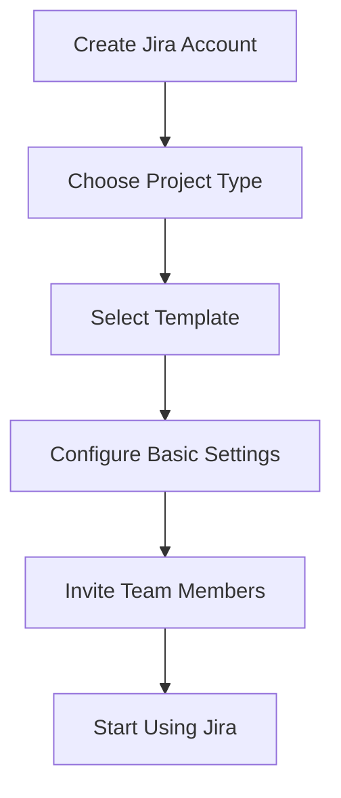
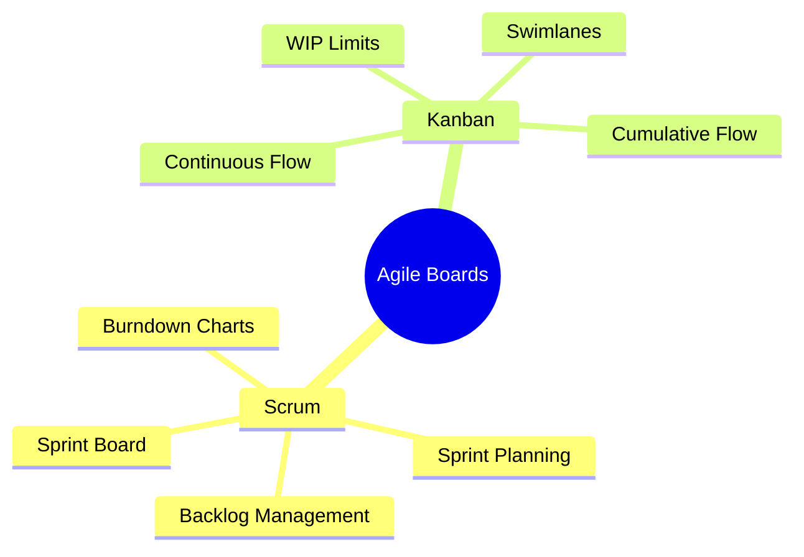
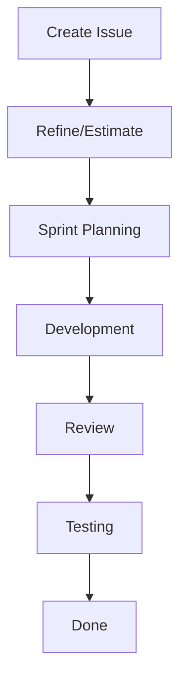
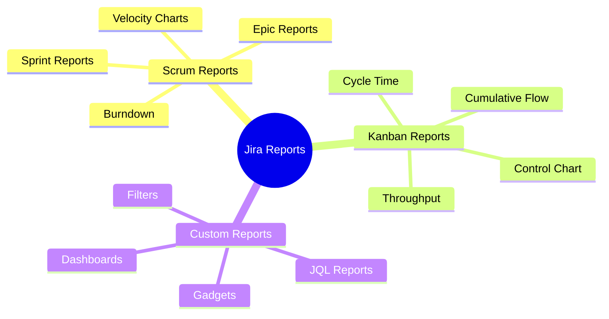

import Tabs from "@theme/Tabs";
import TabItem from "@theme/TabItem";

A comprehensive guide to using Jira for agile development, covering setup, configuration, best practices, and advanced features.

<!-- truncate -->

:::tip Key Features
Essential elements covered in this guide:

- 🚀 Getting Started with Jira
- ⚙️ Project Configuration
- 📊 Agile Boards
- 🎯 Issue Management
- 📈 Reporting & Analytics
- 🔄 Advanced Features
  :::

## Getting Started with Jira

### Initial Setup



<Tabs>
  <TabItem value="setup" label="Basic Setup" default>
    **Key Steps**: - Create Jira account/instance - Choose between Cloud/Server
    - Select project template - Configure basic settings **Initial Decisions**:
    - Project methodology (Scrum/Kanban) - Team structure - Permission schemes -
    Notification settings
  </TabItem>
  <TabItem value="templates" label="Project Templates">
    **Available Options**: - Scrum software development - Kanban software
    development - Agile project management - Bug tracking **Template Features**:
    - Pre-configured workflows - Issue types - Screen schemes - Field
    configurations
  </TabItem>
</Tabs>

## Project Configuration

### Project Settings

:::info Configuration Importance
Proper project configuration sets the foundation for successful agile development.
:::

<Tabs>
  <TabItem value="basics" label="Basic Settings" default>
    **Essential Configuration**: - Project name and key - Project lead and roles
    - Access and permissions - Email notifications **Team Setup**: - Member
    invitations - Role assignments - Component leads - Security levels
  </TabItem>
  <TabItem value="advanced" label="Advanced Settings">
    **Additional Options**: - Custom fields - Screen schemes - Workflow schemes
    - Permission schemes **Integration Settings**: - Development tools - CI/CD
    pipelines - External systems - Automation rules
  </TabItem>
</Tabs>

## Agile Boards

### Board Types and Configuration



### Scrum Board Setup

<Tabs>
  <TabItem value="sprints" label="Sprint Management" default>
    **Sprint Features**: - Sprint creation - Backlog grooming - Sprint planning
    - Sprint reviews **Key Activities**: - Story point estimation - Sprint scope
    management - Daily updates - Sprint closure
  </TabItem>
  <TabItem value="workflow" label="Board Workflow">
    **Column Configuration**: - To Do - In Progress - Review - Done **Workflow
    Rules**: - Status transitions - Column constraints - Definition of Done -
    Automation rules
  </TabItem>
</Tabs>

## Issue Management

### Issue Types and Structure

:::note Issue Hierarchy
Understanding the issue hierarchy helps organize work effectively.
:::

1. **Epic**

   - Large initiatives
   - Feature sets
   - Major deliverables
   - Long-term goals

2. **Story**

   - User requirements
   - Feature components
   - Deliverable units
   - Sprint-sized work

3. **Task**

   - Technical work
   - Sub-components
   - Implementation details
   - Support activities

4. **Bug**
   - Defect tracking
   - Quality issues
   - Production problems
   - Technical debt

### Issue Workflow



## Reporting & Analytics

### Agile Reports

<Tabs>
  <TabItem value="scrum" label="Scrum Reports" default>
    **Core Reports**:
    - Sprint burndown
    - Velocity chart
    - Epic burndown
    - Version report
    
    **Applications**:
    - Sprint planning
    - Capacity forecasting
    - Release tracking
    - Team performance
  </TabItem>
  <TabItem value="kanban" label="Kanban Reports">
    **Key Reports**:
    - Cumulative flow diagram
    - Control chart
    - Cycle time report
    - Throughput report
    
    **Use Cases**:
    - Flow efficiency
    - Process stability
    - Delivery predictability
    - Bottleneck identification
  </TabItem>
</Tabs>

## Analytics & Reporting

### Agile Reporting Suite

:::info Jira Analytics
Jira provides powerful built-in reporting tools designed specifically for agile teams, offering insights into project progress, team performance, and delivery metrics.
:::



### Built-in Reports

<Tabs>
  <TabItem value="scrum" label="Scrum Reports" default>
    **Core Reports**: - Sprint burndown - Velocity chart - Epic burndown -
    Version report **Applications**: - Sprint planning - Capacity forecasting -
    Release tracking - Team performance
  </TabItem>
  <TabItem value="kanban" label="Kanban Reports">
    **Key Reports**: - Cumulative flow diagram - Control chart - Cycle time
    report - Throughput report **Use Cases**: - Flow efficiency - Process
    stability - Delivery predictability - Bottleneck identification
  </TabItem>
</Tabs>

### Dashboard Creation

:::tip Dashboard Design
Create focused dashboards that provide relevant insights for different stakeholder groups.
:::

1. **Dashboard Types**

   - Team performance
   - Project progress
   - Release tracking
   - Quality metrics

2. **Gadget Configuration**
   ```mermaid
   graph TD
       A[Dashboard] --> B[Agile Gadgets]
       A --> C[Issue Gadgets]
       A --> D[Custom Gadgets]
       B --> E[Sprint Health]
       B --> F[Velocity]
       C --> G[Issue Statistics]
       C --> H[Created vs Resolved]
       D --> I[External Data]
   ```

### Advanced Analytics

<Tabs>
  <TabItem value="metrics" label="Key Metrics" default>
    **Performance Metrics**:
    - Lead time
    - Cycle time
    - Sprint velocity
    - Issue resolution
    
    **Quality Metrics**:
    - Defect density
    - Technical debt
    - Code coverage
    - Review efficiency
  </TabItem>
  <TabItem value="customization" label="Custom Analytics">
    **JQL Capabilities**:
    - Advanced queries
    - Custom filters
    - Complex calculations
    - Data aggregation
    
    **Integration Options**:
    - eazyBI
    - Power BI
    - Custom scripts
    - External tools
  </TabItem>
</Tabs>

### Performance Tracking

1. **Team Metrics**

   - Velocity trends
   - Capacity utilization
   - Delivery predictability
   - Quality indicators

2. **Process Metrics**
   ```mermaid
   mindmap
     root((Process Analytics))
       Flow Metrics
         Lead Time
         Cycle Time
         Throughput
         WIP
       Quality Metrics
         Bugs
         Technical Debt
         Test Coverage
         Review Time
       Team Metrics
         Velocity
         Capacity
         Availability
         Efficiency
   ```

### Report Automation

<Tabs>
  <TabItem value="scheduled" label="Automated Reports" default>
    **Schedule Types**:
    - Daily summaries
    - Sprint reports
    - Monthly metrics
    - Custom periods
    
    **Distribution**:
    - Email subscriptions
    - Slack integration
    - MS Teams notifications
    - PDF exports
  </TabItem>
  <TabItem value="custom" label="Custom Reports">
    **Creation Tools**:
    - JQL queries
    - Custom fields
    - Calculated fields
    - Report templates
    
    **Export Options**:
    - Excel/CSV
    - PDF format
    - JSON data
    - API access
  </TabItem>
</Tabs>

### Analytics Best Practices

1. **Implementation Strategy**

   - Define key metrics
   - Configure dashboards
   - Set up automation
   - Establish baselines

2. **Data Quality**
   - Regular cleanup
   - Consistent tracking
   - Field validation
   - Data integrity

### Performance Optimization

<Tabs>
  <TabItem value="analysis" label="Data Analysis" default>
    **Focus Areas**:
    - Trend analysis
    - Bottleneck detection
    - Resource optimization
    - Process efficiency
    
    **Tools**:
    - Built-in reports
    - Custom dashboards
    - External analytics
    - Integration data
  </TabItem>
  <TabItem value="improvement" label="Process Improvement">
    **Key Activities**:
    - Workflow optimization
    - Automation enhancement
    - Team feedback
    - Continuous refinement
    
    **Outcomes**:
    - Faster delivery
    - Better quality
    - Team efficiency
    - Predictable results
  </TabItem>
</Tabs>

### Integration with External Tools

1. **Analytics Platforms**

   - Power BI connection
   - Tableau integration
   - Custom analytics
   - Data warehousing

2. **Data Export Options**
   ```mermaid
   graph TD
       A[Jira Data] --> B[Export Methods]
       B --> C[Direct Export]
       B --> D[API Access]
       B --> E[Integration Tools]
       C --> F[CSV/Excel]
       D --> G[Custom Analytics]
       E --> H[Third-party Tools]
   ```

## Additional Resources

- [Jira Reporting Guide](https://support.atlassian.com/jira-software-cloud/docs/analyze-and-report-on-your-teams-work/)
- [Advanced JQL Guide](https://www.atlassian.com/blog/jira-software/jql-the-most-flexible-way-to-search-jira-14)
- [Dashboard Best Practices](https://www.atlassian.com/software/jira/guides/dashboards/overview)
- [Metrics & Analytics](https://www.atlassian.com/agile/tutorials/metrics)
