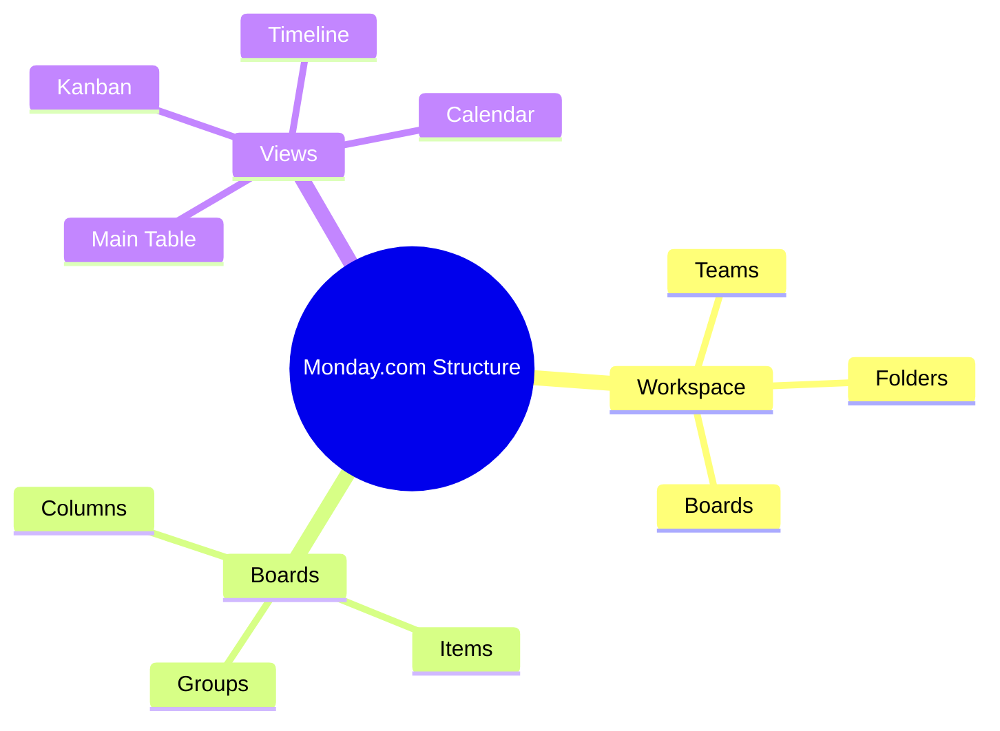
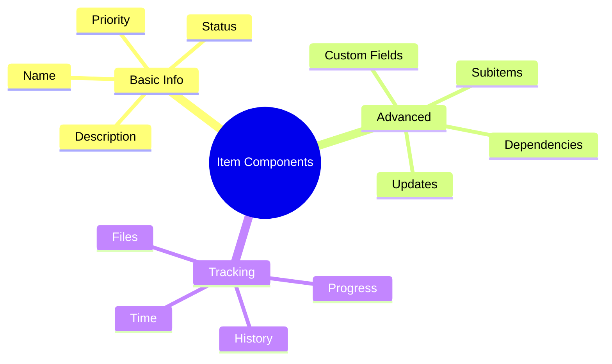

import Tabs from "@theme/Tabs";
import TabItem from "@theme/TabItem";

A comprehensive guide to using Monday.com for agile development, focusing on its flexible workflow system, automation capabilities, and team collaboration features.

<!-- truncate -->

:::tip Key Features
Essential elements covered in this guide:

- 🎯 Workspace Setup & Configuration
- 📊 Board Management & Views
- ✨ Item & Column Customization
- 🤖 Automation & Integrations
- 👥 Team Collaboration
- 📈 Dashboards & Analytics
  :::

## Getting Started with Monday.com

### Core Components



### Workspace Setup

<Tabs>
  <TabItem value="structure" label="Initial Setup" default>
    **Core Elements**: - Workspace creation - Team organization - Permission
    settings - Board templates **Setup Process**: - Define workspace structure -
    Configure team access - Set security preferences - Import existing data
  </TabItem>
  <TabItem value="templates" label="Agile Templates">
    **Available Templates**: - Sprint planning - Product roadmap - Scrum
    framework - Kanban board **Template Features**: - Pre-built columns -
    Automation recipes - Dashboard widgets - Common integrations
  </TabItem>
</Tabs>

## Board Management

### Board Structure

:::info Board Components
Boards are the foundation of project management in Monday.com, offering flexible ways to organize and track work.
:::

1. **Groups Organization**

   - Sprint backlog
   - Current sprint
   - In progress
   - Done
   - Archived items

2. **Column Types**
   ```mermaid
   graph TD
       A[Column Types] --> B[Status]
       A --> C[People]
       A --> D[Date]
       A --> E[Numbers]
       B --> F[Custom Statuses]
       C --> G[Team Assignment]
       D --> H[Timeline]
       E --> I[Story Points]
   ```

### View Configuration

<Tabs>
  <TabItem value="views" label="Available Views" default>
    **Core Views**: - Main table view - Kanban board - Timeline/Gantt - Calendar
    **Benefits**: - Multiple perspectives - Flexible organization - Real-time
    updates - Team alignment
  </TabItem>
  <TabItem value="customization" label="View Customization">
    **Options**: - Column arrangement - Color coding - Grouping rules - Filter
    conditions **Features**: - Saved views - Team sharing - Custom fields - View
    permissions
  </TabItem>
</Tabs>

## Item & Column Management

### Item Structure



### Column Types & Usage

<Tabs>
  <TabItem value="basic" label="Basic Columns" default>
    **Essential Types**: - Status columns - People assignments - Date tracking -
    Number fields **Applications**: - Task status - Team allocation - Deadline
    management - Effort estimation
  </TabItem>
  <TabItem value="advanced" label="Advanced Columns">
    **Specialized Types**: - Formula columns - Dependency columns - Integration
    columns - Lookup columns **Use Cases**: - Automated calculations -
    Relationship mapping - External data - Cross-board references
  </TabItem>
</Tabs>

## Automation & Integrations

### Automation Capabilities

:::note Automation Power
Monday.com's automation features help teams eliminate repetitive tasks and maintain consistent workflows.
:::

1. **Automation Types**

   - Status-based
   - Date-based
   - Item-based
   - Cross-board

2. **Common Recipes**
   ```mermaid
   graph TD
       A[Trigger] --> B[Status Change]
       B --> C[Notify Team]
       C --> D[Create Item]
       D --> E[Update Dashboard]
   ```

### Integration Options

<Tabs>
  <TabItem value="development" label="Development Tools" default>
    **Key Integrations**: - GitHub - Jira - GitLab - Bitbucket **Features**: -
    Code sync - Issue tracking - Commit linking - Branch management
  </TabItem>
  <TabItem value="productivity" label="Productivity Tools">
    **Popular Tools**: - Slack - Microsoft Teams - Google Workspace - Zoom
    **Capabilities**: - Message sync - File sharing - Meeting scheduling -
    Notification management
  </TabItem>
</Tabs>

## Team Collaboration

### Collaboration Features

1. **Communication Tools**

   - Updates section
   - @mentions
   - File sharing
   - Team inbox

2. **Workspace Collaboration**
   ```mermaid
   mindmap
     root((Collaboration))
       Communication
         Updates
         Mentions
         Notifications
       Sharing
         Files
         Views
         Dashboards
       Permissions
         Team Access
         Guest Access
         View Rights
   ```

### Team Management

<Tabs>
  <TabItem value="organization" label="Team Structure" default>
    **Management Features**: - Team creation - Role assignment - Permission
    levels - Guest access **Benefits**: - Clear ownership - Secure access - Team
    alignment - Efficient collaboration
  </TabItem>
  <TabItem value="workflow" label="Work Management">
    **Workflow Features**: - Task assignment - Progress tracking - Workload
    management - Time tracking **Advantages**: - Balanced workload - Clear
    priorities - Deadline tracking - Resource optimization
  </TabItem>
</Tabs>

## Dashboards & Analytics

### Dashboard Creation

:::info Visual Analytics
Dashboards provide real-time insights into project progress and team performance.
:::

1. **Widget Types**

   - Chart widgets
   - Number widgets
   - Battery widgets
   - Custom widgets

2. **Data Visualization**
   ```mermaid
   graph TD
       A[Data Sources] --> B[Widgets]
       B --> C[Dashboard]
       C --> D[Team View]
       D --> E[Decision Making]
   ```

### Reporting & Metrics

<Tabs>
  <TabItem value="metrics" label="Key Metrics" default>
    **Project Metrics**: - Velocity tracking - Burndown charts - Sprint progress
    - Team capacity **Analysis Tools**: - Custom formulas - Data export - Trend
    analysis - Performance tracking
  </TabItem>
  <TabItem value="reports" label="Report Types">
    **Available Reports**: - Sprint reports - Team performance - Resource
    allocation - Time tracking **Features**: - Custom views - Export options -
    Scheduled reports - Sharing capabilities
  </TabItem>
</Tabs>

## Best Practices

### Implementation Success

1. **Setup Guidelines**

   - Start with templates
   - Customize gradually
   - Train team members
   - Document processes

2. **Maintenance Tips**
   - Regular cleanup
   - View optimization
   - Automation review
   - Performance monitoring

### Optimization Strategies

<Tabs>
  <TabItem value="workflow" label="Workflow Optimization" default>
    **Key Areas**: - Process streamlining - Automation enhancement - View
    customization - Integration efficiency **Approach**: - Regular reviews -
    Team feedback - Performance metrics - Continuous improvement
  </TabItem>
  <TabItem value="adoption" label="Team Adoption">
    **Success Factors**: - Clear guidelines - Training program - Support system
    - Feedback loops **Implementation**: - Phased rollout - Champion program -
    Regular check-ins - Success tracking
  </TabItem>
</Tabs>

## Additional Resources

- [Monday.com Knowledge Base](https://support.monday.com/)
- [Monday.com Blog](https://monday.com/blog/)
- [Developer Documentation](https://developer.monday.com/)
- [Monday.com Community](https://community.monday.com/)
- [Integration Center](https://monday.com/integrations/)
