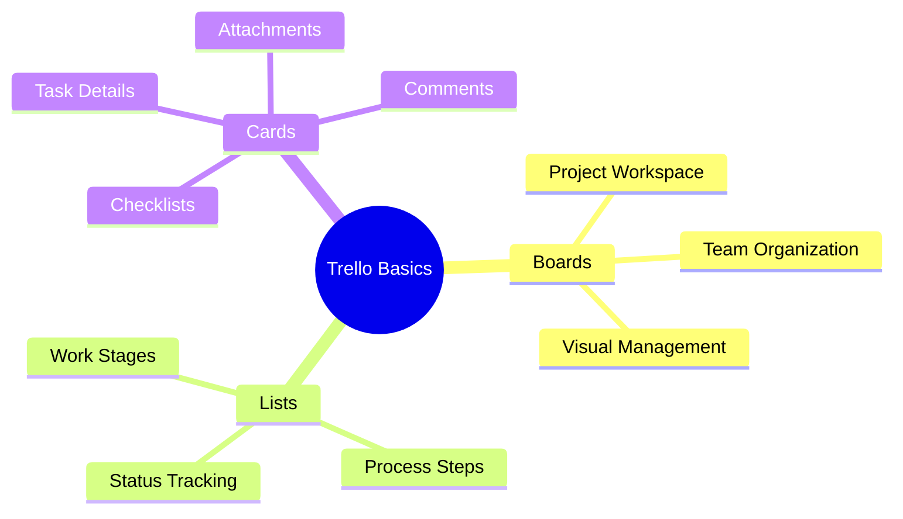
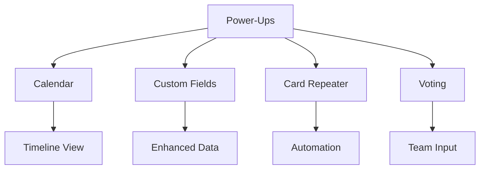
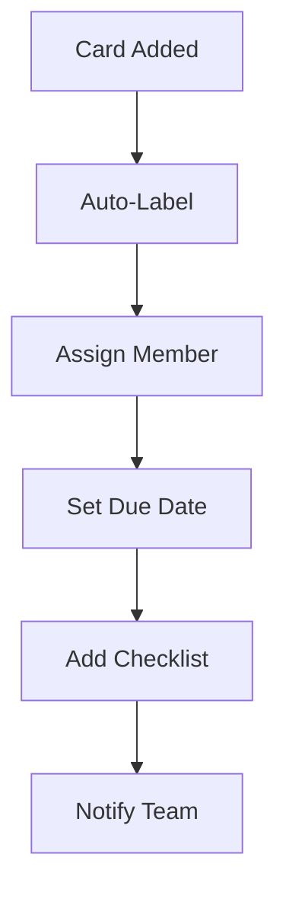
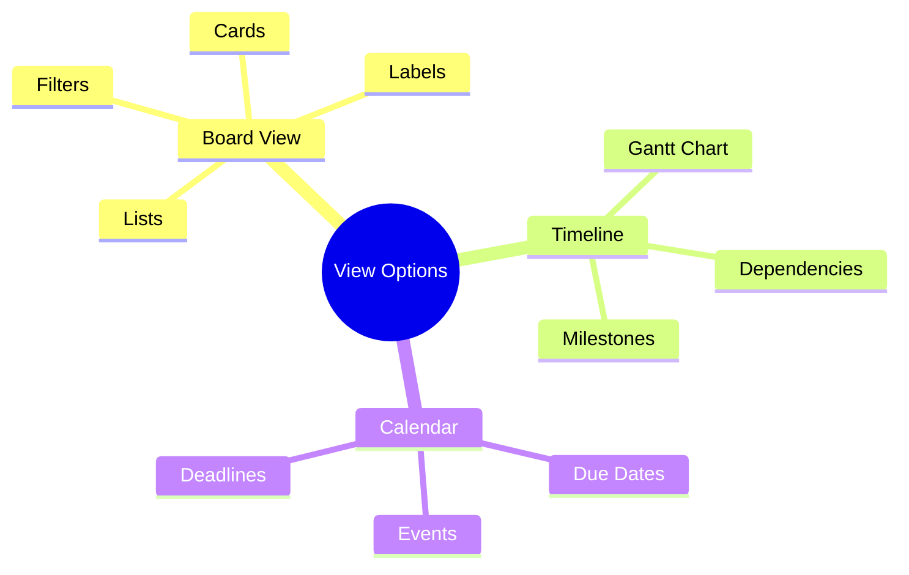

import Tabs from "@theme/Tabs";
import TabItem from "@theme/TabItem";

A comprehensive guide to using Trello for agile development, focusing on its visual board system, automation capabilities, and team collaboration features.

<!-- truncate -->

:::tip Key Features
Essential elements covered in this guide:

- 📋 Board Setup & Management
- 🎴 Card Organization
- 🔌 Power-Ups & Integrations
- 🤖 Butler Automation
- 👥 Team Collaboration
- 📊 Views & Visualization
  :::

## Getting Started with Trello

### Core Components

### Board Setup

<Tabs>
  <TabItem value="structure" label="Board Structure" default>
    **Basic Elements**: - Board creation - List organization - Card management -
    Team access **Setup Steps**: - Choose board visibility - Define list
    structure - Set up labels - Configure preferences
  </TabItem>
  <TabItem value="templates" label="Board Templates">
    **Agile Templates**: - Scrum board - Kanban board - Sprint planning -
    Backlog management **Features**: - Pre-configured lists - Label systems -
    Workflow automation - Common Power-Ups
  </TabItem>
</Tabs>

## Card Management

### Card Structure

:::info Card Components
Cards are the fundamental unit of work in Trello, representing tasks, stories, or items that need to be tracked.
:::

<Tabs>
  <TabItem value="basics" label="Basic Elements" default>
    **Core Features**: - Title and description - Labels and due dates -
    Checklists - Attachments **Organization**: - Priority markers - Custom
    fields - Cover images - Quick actions
  </TabItem>
  <TabItem value="advanced" label="Advanced Features">
    **Enhanced Options**: - Custom fields - Power-Up integrations - Automation
    triggers - Advanced checklists **Management**: - Card relationships -
    Dependencies - Time tracking - Progress indicators
  </TabItem>
</Tabs>

## Power-Ups

### Essential Power-Ups

### Integration Categories

<Tabs>
  <TabItem value="productivity" label="Productivity Tools" default>
    **Popular Integrations**: - Calendar view - Time tracking - Custom fields -
    Card aging **Benefits**: - Enhanced visibility - Better organization -
    Improved tracking - Automated updates
  </TabItem>
  <TabItem value="development" label="Development Tools">
    **Key Integrations**: - GitHub - Bitbucket - GitLab - Stack Overflow
    **Features**: - Code tracking - PR management - Issue linking - Deployment
    status
  </TabItem>
</Tabs>

## Butler Automation

### Automation Capabilities

:::note Butler Power
Butler is Trello's built-in automation tool that helps teams work more efficiently by automating repetitive tasks.
:::

1. **Rule Types**

   - Card actions
   - Board actions
   - Due date management
   - List operations

2. **Trigger Events**
   - Card moves
   - Due dates
   - Label changes
   - Member actions

### Automation Examples

## Team Collaboration

### Collaboration Features

<Tabs>
  <TabItem value="communication" label="Communication Tools" default>
    **Features**: - Card comments - @mentions - Board sharing - Team visibility
    **Benefits**: - Real-time updates - Clear ownership - Team awareness - Quick
    feedback
  </TabItem>
  <TabItem value="organization" label="Team Organization">
    **Workspace Features**: - Team management - Permission levels - Board
    collections - Shared resources **Capabilities**: - Role assignment - Access
    control - Resource sharing - Team coordination
  </TabItem>
</Tabs>

## Views & Visualization

### Board Views

1. **Standard Views**

   - Board view (Kanban)
   - Calendar view
   - Timeline view
   - Table view

2. **Custom Views**
   - Dashboard
   - Map view
   - Team table
   - Custom fields

### Visualization Options

## Best Practices

### Implementation Success

<Tabs>
  <TabItem value="setup" label="Initial Setup" default>
    **Key Steps**: - Board structure - List organization - Label system -
    Automation rules **Guidelines**: - Keep it simple - Use templates - Define
    workflows - Document processes
  </TabItem>
  <TabItem value="maintenance" label="Ongoing Maintenance">
    **Regular Tasks**: - Archive completed cards - Review automation rules -
    Update templates - Clean up boards **Best Practices**: - Regular reviews -
    Team feedback - Process updates - Performance monitoring
  </TabItem>
</Tabs>

## Additional Resources

- [Trello Guide](https://trello.com/guide)
- [Trello Blog](https://blog.trello.com/)
- [Automation with Butler](https://trello.com/butler-automation)
- [Power-Ups Directory](https://trello.com/power-ups)
- [Developer Documentation](https://developer.atlassian.com/cloud/trello/)
