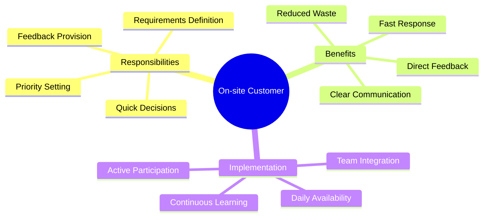
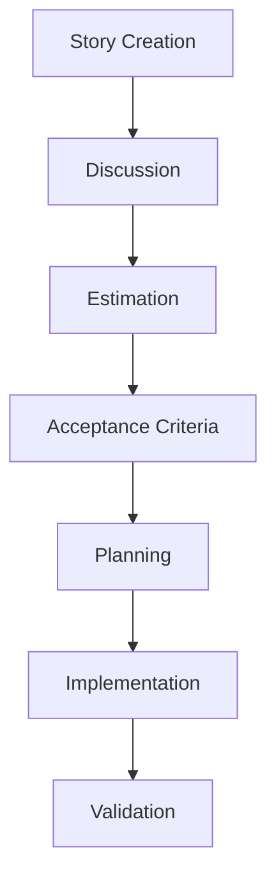
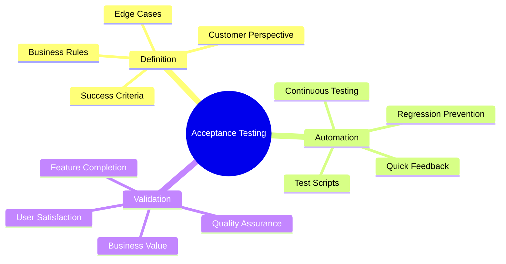
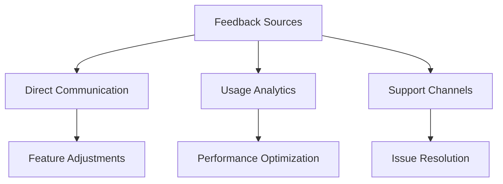
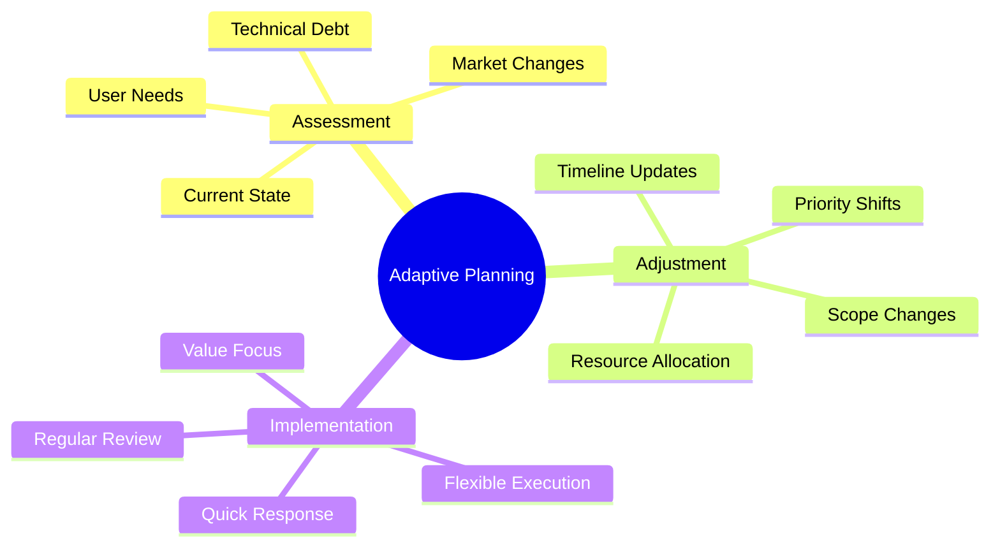

import Tabs from "@theme/Tabs";
import TabItem from "@theme/TabItem";

A comprehensive guide to customer collaboration in Extreme Programming (XP), focusing on building strong partnerships, effective communication, and continuous feedback loops.

<!-- truncate -->

:::tip Key Collaboration Elements
Essential aspects of customer collaboration in XP:

- 👥 On-site Customer
- 📝 User Stories
- ✅ Acceptance Tests
- 🚀 Regular Deployment
- 🔄 Customer Feedback
- 📊 Adaptive Planning
  :::

## On-site Customer

### Core Concept

### Implementation Strategy

<Tabs>
  <TabItem value="setup" label="Setup & Integration" default>
    **Key Elements**:
    - Physical presence
    - Regular availability
    - Decision authority
    - Team integration

    **Benefits**:
    - Immediate clarification
    - Faster decisions
    - Better understanding
    - Reduced delays

  </TabItem>
  <TabItem value="challenges" label="Common Challenges">
    **Challenges**:
    - Customer availability
    - Remote collaboration
    - Decision bottlenecks
    - Knowledge transfer

    **Solutions**:
    - Proxy customers
    - Virtual presence
    - Clear escalation paths
    - Documentation practices

  </TabItem>
</Tabs>

## User Stories

### Story Development

:::info Effective Stories
User stories in XP should be valuable, estimable, small, and testable (VEST).
:::

### Story Management

<Tabs>
  <TabItem value="writing" label="Story Writing" default>
    **Components**:
    - User role
    - Desired feature
    - Business value
    - Acceptance criteria

    **Guidelines**:
    - Clear language
    - Focused scope
    - Measurable outcomes
    - Testable criteria

  </TabItem>
  <TabItem value="refinement" label="Story Refinement">
    **Activities**:
    - Regular reviews
    - Size adjustment
    - Priority updates
    - Value assessment

    **Tools**:
    - Story cards
    - Planning boards
    - Tracking systems
    - Estimation tools

  </TabItem>
</Tabs>

## Acceptance Tests

### Test Development

### Implementation Framework

<Tabs>
  <TabItem value="process" label="Test Process" default>
    **Steps**:
    - Define criteria
    - Create tests
    - Automate validation
    - Execute regularly

    **Outcomes**:
    - Verified functionality
    - Documented behavior
    - Quality assurance
    - Customer confidence

  </TabItem>
  <TabItem value="practices" label="Best Practices">
    **Guidelines**:
    - Customer involvement
    - Early definition
    - Continuous execution
    - Regular updates

    **Tools**:
    - Testing frameworks
    - Automation tools
    - Documentation systems
    - Reporting platforms

  </TabItem>
</Tabs>

## Regular Deployment

### Deployment Strategy

:::warning Continuous Value Delivery
Regular deployments ensure customers receive value frequently and can provide timely feedback.
:::

<Tabs>
  <TabItem value="planning" label="Deployment Planning" default>
    **Elements**:
    - Release schedule
    - Feature grouping
    - Risk assessment
    - Customer readiness

    **Considerations**:
    - Business impact
    - User training
    - Support requirements
    - Rollback plans

  </TabItem>
  <TabItem value="execution" label="Deployment Execution">
    **Process**:
    - Automated deployment
    - Smoke testing
    - User validation
    - Feedback collection

    **Tools**:
    - CI/CD pipelines
    - Monitoring systems
    - Feedback channels
    - Support systems

  </TabItem>
</Tabs>

## Customer Feedback

### Feedback Mechanisms

### Feedback Implementation

<Tabs>
  <TabItem value="collection" label="Feedback Collection" default>
    **Methods**:
    - Regular meetings
    - Usage monitoring
    - Support tickets
    - User surveys

    **Focus Areas**:
    - Feature usage
    - User satisfaction
    - Performance issues
    - Enhancement requests

  </TabItem>
  <TabItem value="action" label="Taking Action">
    **Process**:
    - Analysis
    - Prioritization
    - Implementation
    - Validation

    **Outcomes**:
    - Product improvements
    - Better user experience
    - Higher satisfaction
    - Continuous evolution

  </TabItem>
</Tabs>

## Adaptive Planning

### Planning Approach

### Planning Framework

<Tabs>
  <TabItem value="strategy" label="Planning Strategy" default>
    **Components**:
    - Regular reviews
    - Flexible roadmap
    - Value assessment
    - Risk management

    **Benefits**:
    - Quick adaptation
    - Market alignment
    - Customer satisfaction
    - Efficient delivery

  </TabItem>
  <TabItem value="execution" label="Execution">
    **Activities**:
    - Priority updates
    - Resource adjustment
    - Timeline revision
    - Stakeholder communication

    **Tools**:
    - Planning boards
    - Tracking systems
    - Communication platforms
    - Reporting tools

  </TabItem>
</Tabs>

## Best Practices

### Success Factors

1. **Strong Relationships**

   - Trust building
   - Regular communication
   - Shared understanding
   - Mutual respect

2. **Effective Communication**

   - Clear channels
   - Regular updates
   - Transparent decisions
   - Quick responses

3. **Value Focus**
   - Business alignment
   - Quick delivery
   - Measurable outcomes
   - Continuous improvement

## Additional Resources

- [XP Customer Collaboration Guide](https://www.agilealliance.org/glossary/customer-collaboration/)
- [User Story Best Practices](https://www.mountaingoatsoftware.com/agile/user-stories)
- [Acceptance Test-Driven Development](https://www.agilealliance.org/glossary/atdd/)
- [Continuous Delivery](https://martinfowler.com/bliki/ContinuousDelivery.html)
