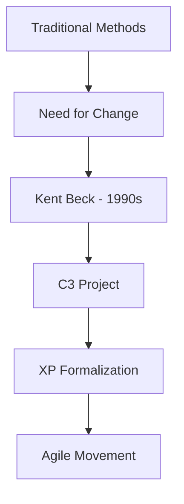
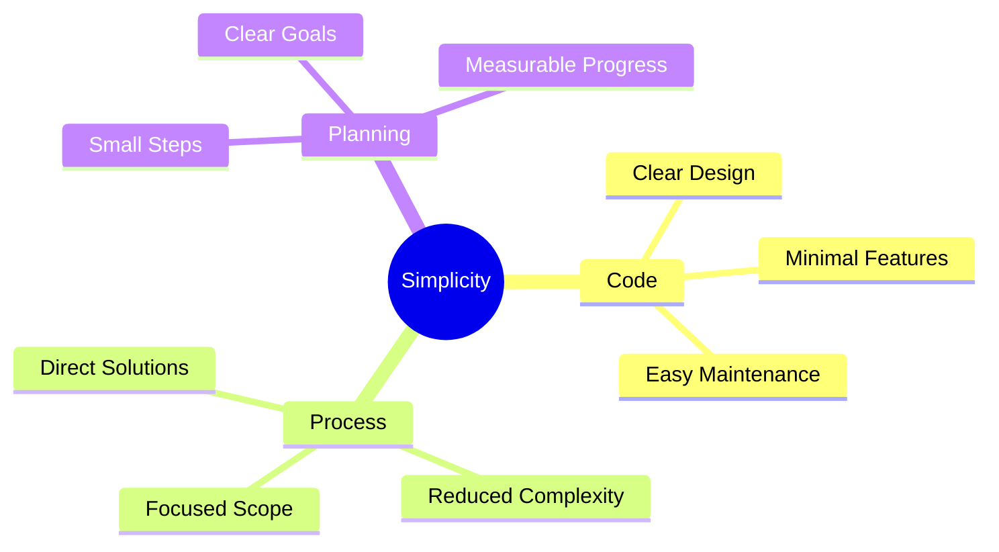
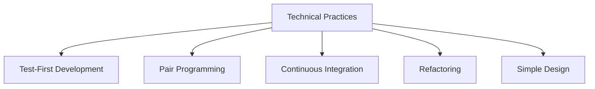

import Tabs from "@theme/Tabs";
import TabItem from "@theme/TabItem";

A comprehensive guide to Extreme Programming (XP), exploring its origins, core values, principles, and modern applications in software development.

<!-- truncate -->

:::tip Key Concepts
Essential elements covered in this guide:

- 📚 Origins and History
- 🎯 Core Values
- 💡 Key Principles
- ⚡ Characteristics
- 📈 Benefits and Challenges
  :::

## Origins and History

### The Birth of XP

<Tabs>
  <TabItem value="background" label="Historical Context" default>
    **Development**: - Created by Kent Beck in the 1990s - Refined during
    Chrysler C3 project - Formalized in "Extreme Programming Explained" (1999)
    **Evolution**: - Response to traditional waterfall limitations - Focus on
    technical excellence - Integration with Agile movement
  </TabItem>
  <TabItem value="motivation" label="Key Motivations">
    **Drivers**: - Need for faster delivery - Adapting to changing requirements
    - Improving software quality - Enhancing team collaboration **Goals**: -
    Reduce development cycles - Increase customer satisfaction - Improve code
    quality - Enable continuous feedback
  </TabItem>
</Tabs>

## Core Values

:::info Foundation
XP is built on five fundamental values that guide all practices and decisions.
:::

### 1. Communication

<Tabs>
  <TabItem value="principles" label="Key Principles" default>
    **Focus Areas**: - Face-to-face interaction - Continuous dialogue - Team
    collaboration - Knowledge sharing **Implementation**: - Daily stand-ups -
    Pair programming - Team workspace - Customer involvement
  </TabItem>
  <TabItem value="benefits" label="Benefits">
    **Outcomes**: - Faster problem solving - Reduced documentation needs -
    Better team alignment - Improved decision making
  </TabItem>
</Tabs>

### 2. Simplicity

### 3. Feedback

<Tabs>
  <TabItem value="types" label="Feedback Types" default>
    **Sources**: - Unit testing - Customer reviews - Team retrospectives -
    System metrics **Timing**: - Immediate technical feedback - Short iteration
    cycles - Regular customer demos - Continuous integration
  </TabItem>
  <TabItem value="application" label="Application">
    **Usage**: - Guide development - Adjust direction - Improve quality -
    Enhance practices
  </TabItem>
</Tabs>

### 4. Courage

:::note Courage in Practice
Courage means taking bold actions while being aware of their consequences.
:::

- Telling the truth about progress
- Adapting to changes
- Throwing away code when needed
- Trying new approaches
- Maintaining high standards

### 5. Respect

- Valuing team members' contributions
- Supporting each other's efforts
- Accepting responsibility
- Giving and receiving feedback
- Maintaining work-life balance

## Key Characteristics

### Technical Excellence

### Customer Focus

<Tabs>
  <TabItem value="involvement" label="Customer Involvement" default>
    **Practices**: - On-site customer - Regular feedback - Story writing -
    Acceptance testing **Benefits**: - Clear requirements - Fast decisions -
    Value alignment - Quick feedback
  </TabItem>
  <TabItem value="delivery" label="Delivery Focus">
    **Approach**: - Small releases - Continuous delivery - Iterative development
    - Value-driven prioritization
  </TabItem>
</Tabs>

## Benefits and Challenges

### Advantages

1. **Quality Improvement**

   - Reduced defects
   - Better design
   - Maintainable code
   - Technical excellence

2. **Team Effectiveness**

   - Enhanced collaboration
   - Shared knowledge
   - Continuous learning
   - High motivation

3. **Business Value**
   - Fast delivery
   - Flexible adaptation
   - Customer satisfaction
   - Reduced risk

### Challenges

:::warning Common Difficulties
Understanding these challenges helps teams prepare and respond effectively.
:::

<Tabs>
  <TabItem value="organizational" label="Organizational" default>
    **Challenges**: - Cultural resistance - Resource commitment - Customer
    availability - Management support **Solutions**: - Gradual adoption - Clear
    communication - Demonstrated value - Leadership engagement
  </TabItem>
  <TabItem value="technical" label="Technical">
    **Challenges**: - Learning curve - Tool adoption - Practice discipline -
    Legacy systems **Solutions**: - Training programs - Mentoring - Incremental
    adoption - Technical spikes
  </TabItem>
</Tabs>

## Additional Resources

- [Extreme Programming Explained](https://www.amazon.com/Extreme-Programming-Explained-Embrace-Change/dp/0321278658) by Kent Beck
- [XP Values and Principles](https://www.altexsoft.com/blog/extreme-programming-values-principles-and-practices/)
- [Ron Jeffries on XP](https://ronjeffries.com/xprog/articles/expdocumentationinxp/)
- [Agile Alliance XP Guide](https://www.agilealliance.org/glossary/xp/)
