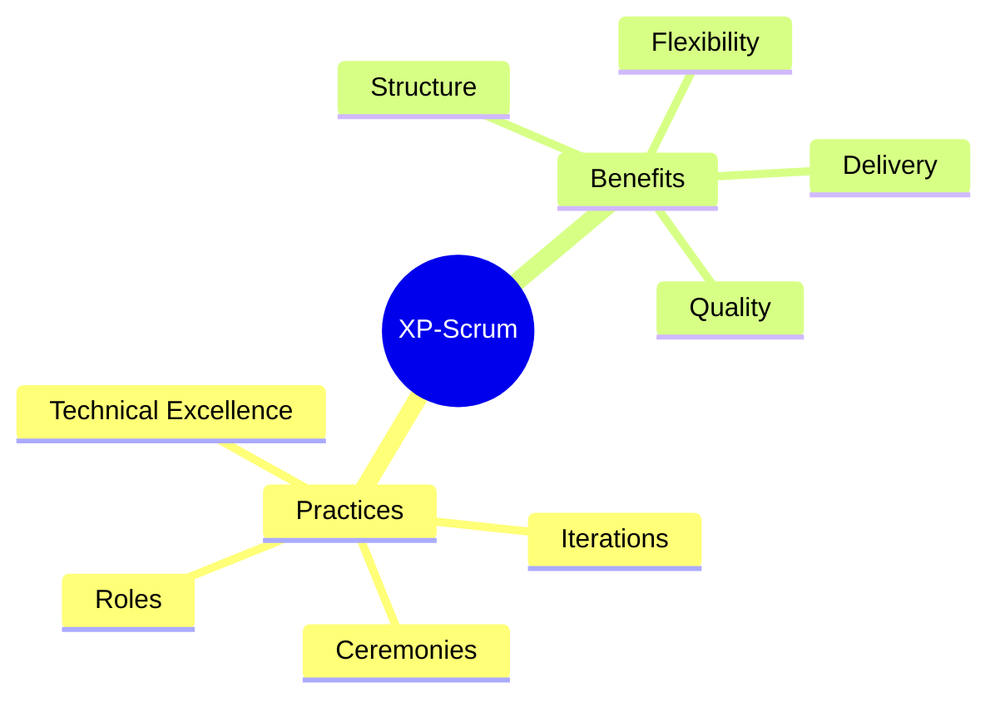
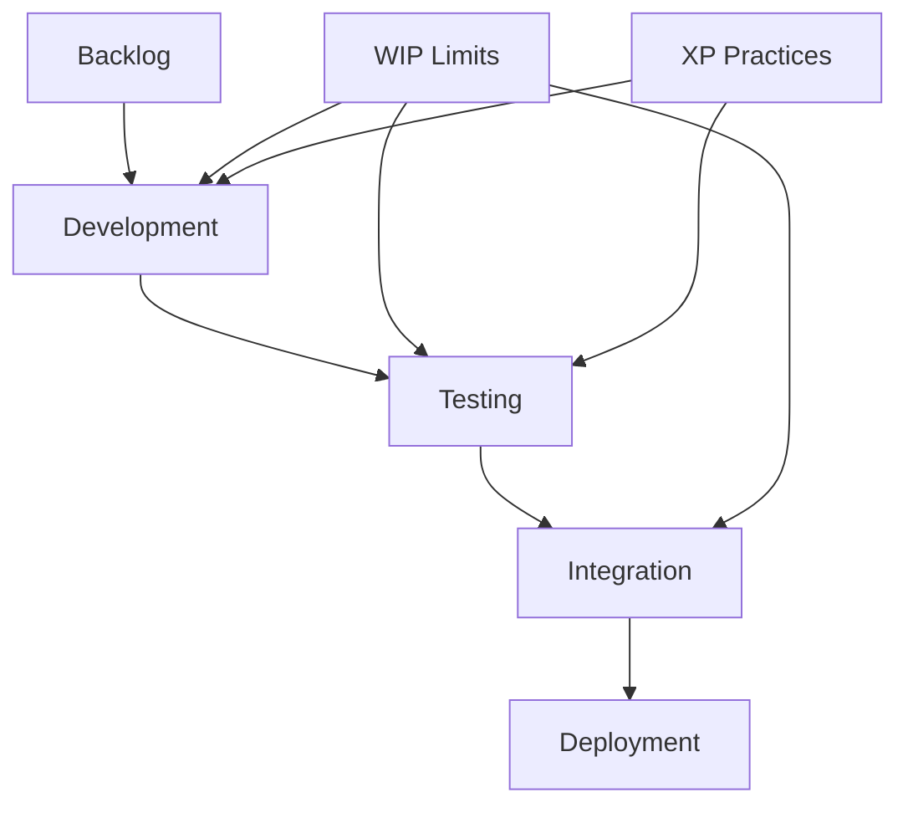
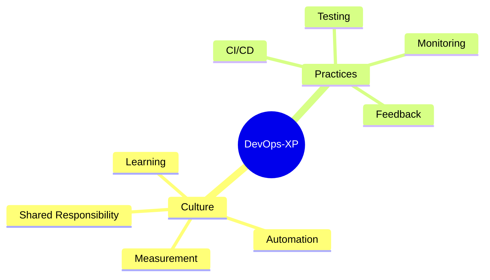
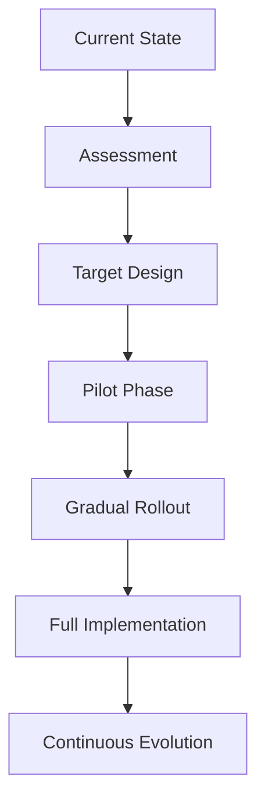
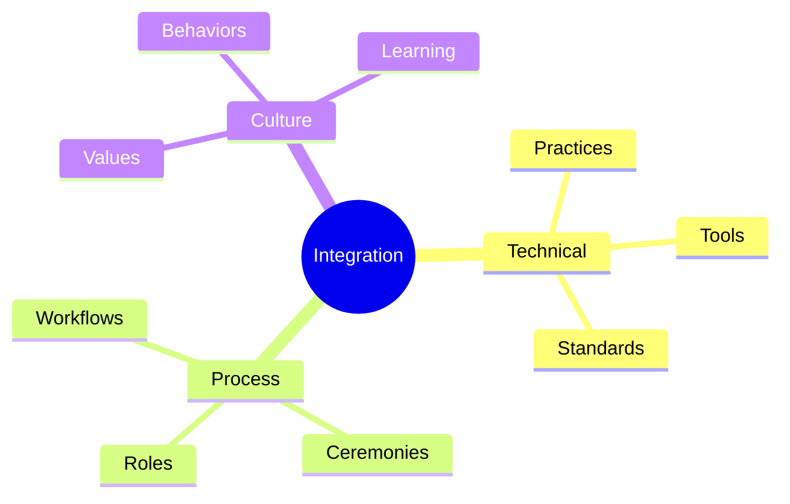

import Tabs from "@theme/Tabs";
import TabItem from "@theme/TabItem";

A comprehensive guide to combining Extreme Programming (XP) with other methodologies, creating effective hybrid approaches that leverage the strengths of multiple frameworks.

<!-- truncate -->

:::tip Key Integration Areas
Essential elements for hybrid approaches:

- 🔄 XP with Scrum
- 📊 XP with Kanban
- 🚀 XP with DevOps
- 🛠️ Custom Combinations
- 📈 Migration Strategies
- 🔗 Integration Patterns
  :::

## XP with Scrum

### Integration Points

<Tabs>
  <TabItem value="practices" label="Combined Practices" default>
    **XP Practices**:
    - Pair programming
    - TDD
    - Continuous integration
    - Simple design

    **Scrum Framework**:
    - Sprint structure
    - Daily standups
    - Sprint reviews
    - Retrospectives

  </TabItem>
  <TabItem value="roles" label="Role Integration">
    **Team Structure**:
    - Product Owner
    - Scrum Master
    - Development Team
    - Technical Coach

    **Responsibilities**:
    - Backlog management
    - Process facilitation
    - Technical practices
    - Quality focus

  </TabItem>
</Tabs>

## XP with Kanban

### Flow-Based Development

:::info Continuous Flow
Combining XP's technical practices with Kanban's flow management creates a powerful delivery system.
:::

### Practice Integration

<Tabs>
  <TabItem value="flow" label="Flow Management" default>
    **Kanban Elements**:
    - Visualization
    - WIP limits
    - Flow metrics
    - Pull system

    **XP Integration**:
    - Continuous flow
    - Quality practices
    - Technical excellence
    - Feedback loops

  </TabItem>
  <TabItem value="metrics" label="Combined Metrics">
    **Flow Metrics**:
    - Lead time
    - Cycle time
    - WIP tracking
    - Throughput

    **Quality Metrics**:
    - Test coverage
    - Defect rates
    - Technical debt
    - Release frequency

  </TabItem>
</Tabs>

## XP with DevOps

### Technical Integration

1. **Continuous Practices**

   - Integration pipeline
   - Deployment automation
   - Infrastructure as code
   - Monitoring and feedback

2. **Quality Assurance**
   - Automated testing
   - Security scanning
   - Performance testing
   - Compliance checks

### Culture and Collaboration

## Custom Combinations

### Framework Selection

<Tabs>
  <TabItem value="analysis" label="Selection Criteria" default>
    **Considerations**:
    - Team size
    - Project type
    - Organization culture
    - Technical needs

    **Evaluation**:
    - Practice compatibility
    - Value alignment
    - Implementation effort
    - Expected benefits

  </TabItem>
  <TabItem value="implementation" label="Implementation">
    **Steps**:
    - Practice assessment
    - Integration planning
    - Pilot implementation
    - Feedback collection

    **Adjustments**:
    - Practice refinement
    - Tool integration
    - Process optimization
    - Team adaptation

  </TabItem>
</Tabs>

### Custom Patterns

:::warning Careful Design
Custom combinations require thoughtful design to maintain effectiveness and avoid conflicts.
:::

1. **Pattern Development**

   - Context analysis
   - Practice selection
   - Integration design
   - Validation approach

2. **Pattern Implementation**
   - Pilot testing
   - Feedback loops
   - Refinement cycles
   - Documentation

## Migration Strategies

### Transition Planning

### Implementation Approach

<Tabs>
  <TabItem value="planning" label="Transition Plan" default>
    **Phases**:
    - Current state analysis
    - Gap identification
    - Practice mapping
    - Implementation roadmap

    **Support**:
    - Training programs
    - Coaching support
    - Tool adoption
    - Documentation

  </TabItem>
  <TabItem value="execution" label="Execution">
    **Activities**:
    - Practice introduction
    - Team training
    - Tool setup
    - Progress tracking

    **Monitoring**:
    - Success metrics
    - Team feedback
    - Process effectiveness
    - Value delivery

  </TabItem>
</Tabs>

## Integration Patterns

### Common Patterns

1. **Technical Excellence Focus**

   - Quality practices
   - Automation emphasis
   - Technical standards
   - Continuous improvement

2. **Process Integration**
   - Workflow alignment
   - Ceremony combination
   - Role definition
   - Communication patterns

### Pattern Application

## Best Practices

### Success Factors

<Tabs>
  <TabItem value="critical" label="Critical Elements" default>
    **Key Factors**:
    - Clear objectives
    - Strong leadership
    - Team buy-in
    - Technical excellence

    **Support**:
    - Training
    - Coaching
    - Tools
    - Documentation

  </TabItem>
  <TabItem value="challenges" label="Common Challenges">
    **Issues**:
    - Practice conflicts
    - Tool integration
    - Team resistance
    - Process complexity

    **Solutions**:
    - Clear guidance
    - Pilot testing
    - Regular feedback
    - Continuous adaptation

  </TabItem>
</Tabs>

## Additional Resources

- [XP and Scrum Integration](https://www.agilealliance.org/resources/experience-reports/integrating-xp-and-scrum/)
- [Kanban and XP](https://www.digite.com/blog/kanban-xp-integration/)
- [DevOps and XP Practices](https://martinfowler.com/articles/devops-and-xp.html)
- [Hybrid Methodologies](https://www.thoughtworks.com/insights/blog/hybrid-methodologies)
