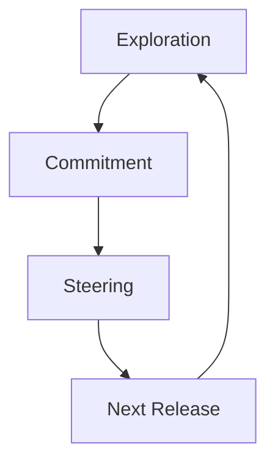
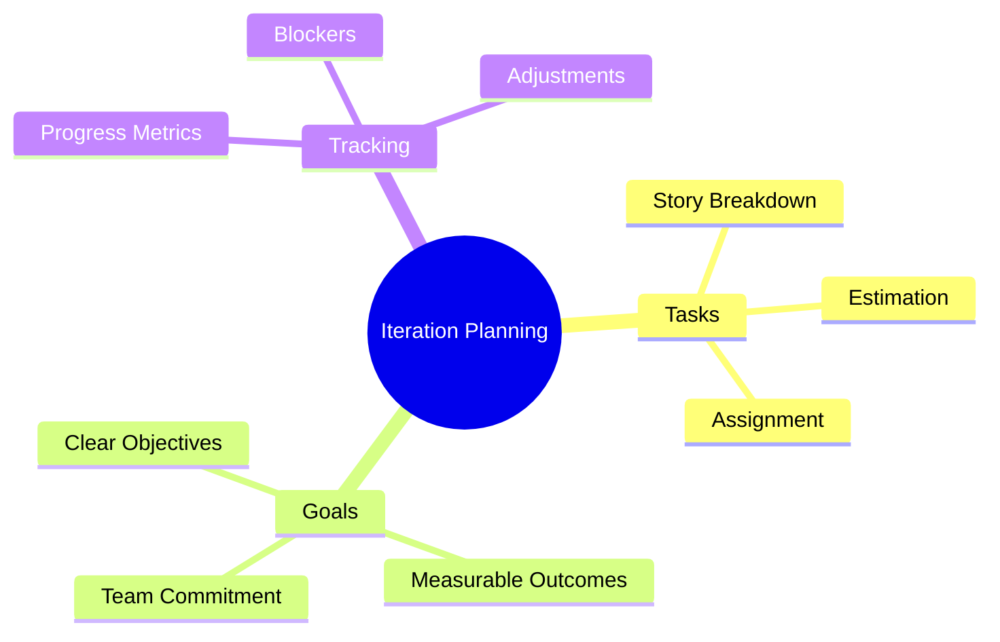
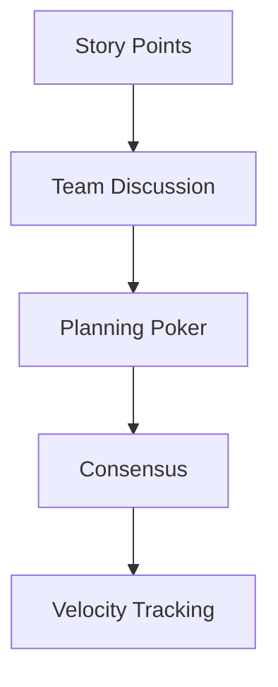
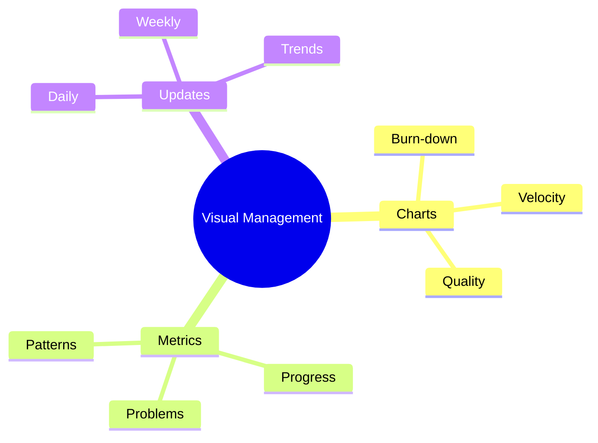

import Tabs from "@theme/Tabs";
import TabItem from "@theme/TabItem";

A comprehensive guide to planning and feedback practices in Extreme Programming (XP), focusing on iterative development and continuous feedback loops.

<!-- truncate -->

:::tip Key Planning Elements
Essential components of XP planning:

- 📅 Release Planning
- 🔄 Iteration Planning
- 📝 Story Writing
- 📊 Estimation
- 👥 Stand-up Meetings
- 📈 Big Visible Charts
  :::

## Release Planning

### The Planning Game

<Tabs>
  <TabItem value="exploration" label="Exploration Phase" default>
    **Activities**:
    - Write user stories
    - Estimate stories
    - Build prototypes
    - Technical spikes

    **Outputs**:
    - Story cards
    - Initial estimates
    - Technical insights
    - Risk assessment

  </TabItem>
  <TabItem value="commitment" label="Commitment Phase">
    **Activities**:
    - Sort by value
    - Sort by risk
    - Set velocity
    - Choose scope

    **Outputs**:
    - Release plan
    - Delivery date
    - Resource needs
    - Risk mitigation

  </TabItem>
</Tabs>

### Release Strategy

1. **Value Prioritization**

   - Business value ranking
   - Risk assessment
   - Dependency analysis
   - Resource allocation

2. **Scope Definition**
   - Essential features
   - MVP components
   - Technical requirements
   - Quality standards

## Iteration Planning

### Planning Process

<Tabs>
  <TabItem value="preparation" label="Planning Preparation" default>
    **Key Steps**:
    - Review stories
    - Break down tasks
    - Estimate effort
    - Identify risks

    **Tools**:
    - Planning board
    - Story cards
    - Task cards
    - Velocity charts

  </TabItem>
  <TabItem value="execution" label="Planning Execution">
    **Activities**:
    - Task assignment
    - Pair allocation
    - Resource planning
    - Risk mitigation

    **Outcomes**:
    - Iteration backlog
    - Team commitments
    - Clear goals
    - Success criteria

  </TabItem>
</Tabs>

## Story Writing

### User Story Creation

:::info Effective Stories
Good user stories follow the INVEST criteria: Independent, Negotiable, Valuable, Estimable, Small, and Testable.
:::

<Tabs>
  <TabItem value="structure" label="Story Structure" default>
    **Components**:
    - User role
    - Desired action
    - Business value
    - Acceptance criteria

    **Format**:
    - As a [role]
    - I want to [action]
    - So that [value]

  </TabItem>
  <TabItem value="guidelines" label="Writing Guidelines">
    **Best Practices**:
    - Customer perspective
    - Clear value proposition
    - Testable outcomes
    - Right size

    **Anti-patterns**:
    - Technical details
    - Multiple dependencies
    - Unclear value
    - Too large/small

  </TabItem>
</Tabs>

## Estimation

### Estimation Techniques

### Estimation Process

<Tabs>
  <TabItem value="methods" label="Estimation Methods" default>
    **Techniques**:
    - Planning poker
    - T-shirt sizing
    - Dot voting
    - Relative sizing

    **Factors**:
    - Complexity
    - Uncertainty
    - Volume
    - Risk

  </TabItem>
  <TabItem value="tracking" label="Progress Tracking">
    **Metrics**:
    - Velocity
    - Burn-down
    - Completion rate
    - Accuracy trends

    **Adjustments**:
    - Re-estimation
    - Scope changes
    - Team capacity
    - Risk factors

  </TabItem>
</Tabs>

## Stand-up Meetings

### Daily Communication

:::warning Effective Stand-ups
Keep stand-ups short, focused, and at the same time each day.
:::

1. **Core Questions**

   - What did you complete?
   - What will you do next?
   - What obstacles exist?
   - What help is needed?

2. **Meeting Format**
   - 15-minute timeframe
   - Standing participants
   - Team-focused updates
   - Action items noted

### Meeting Effectiveness

<Tabs>
  <TabItem value="practices" label="Best Practices" default>
    **Guidelines**:
    - Start on time
    - Stay focused
    - Be prepared
    - Follow up offline

    **Outcomes**:
    - Clear status
    - Quick decisions
    - Team alignment
    - Blocked removed

  </TabItem>
  <TabItem value="challenges" label="Common Challenges">
    **Issues**:
    - Going too long
    - Side discussions
    - Missing team members
    - Lack of focus

    **Solutions**:
    - Time boxing
    - Parking lot
    - Team commitment
    - Clear format

  </TabItem>
</Tabs>

## Big Visible Charts

### Information Radiators

### Implementation Strategy

<Tabs>
  <TabItem value="setup" label="Chart Setup" default>
    **Elements**:
    - Key metrics
    - Progress indicators
    - Risk highlights
    - Team goals

    **Location**:
    - Team space
    - High visibility
    - Easy access
    - Regular updates

  </TabItem>
  <TabItem value="usage" label="Effective Usage">
    **Practices**:
    - Regular updates
    - Team reviews
    - Action tracking
    - Trend analysis

    **Benefits**:
    - Transparency
    - Quick feedback
    - Team alignment
    - Early warnings

  </TabItem>
</Tabs>

## Best Practices

### Success Factors

1. **Clear Communication**

   - Regular updates
   - Visible progress
   - Open discussion
   - Quick feedback

2. **Team Engagement**

   - Active participation
   - Shared ownership
   - Collective decisions
   - Continuous learning

3. **Adaptive Planning**
   - Flexible approach
   - Regular reviews
   - Quick adjustments
   - Value focus

## Additional Resources

- [XP Planning Game](https://www.agilealliance.org/glossary/planning-game/)
- [User Story Guidelines](https://www.mountaingoatsoftware.com/agile/user-stories)
- [Estimation Techniques](https://www.agilealliance.org/glossary/estimation/)
- [Stand-up Meeting Patterns](https://martinfowler.com/articles/itsNotJustStandingUp.html)
