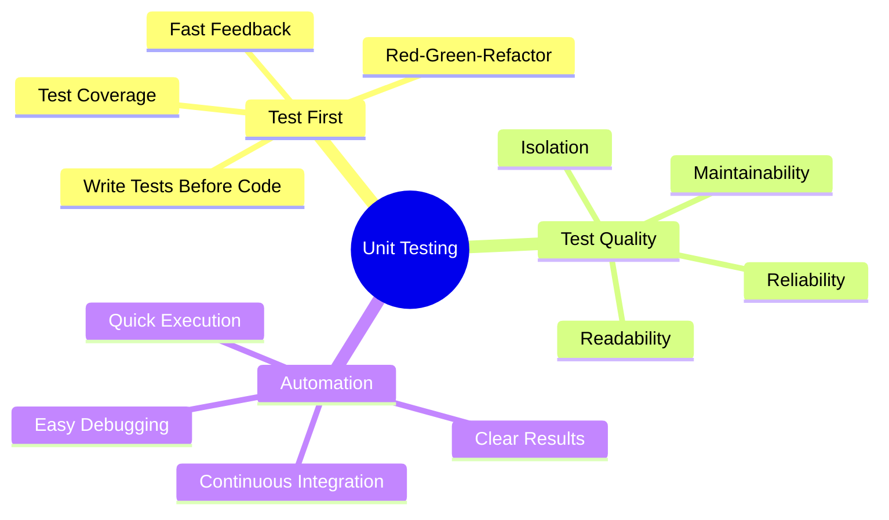
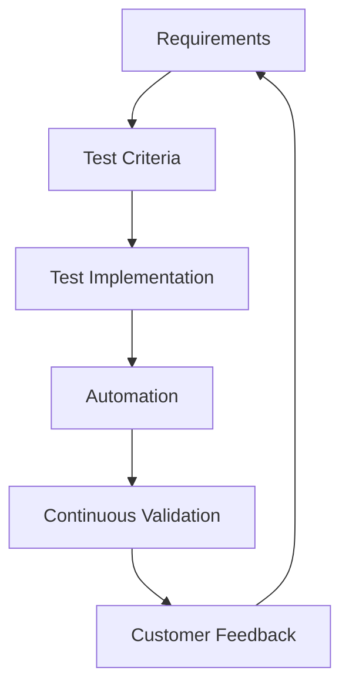
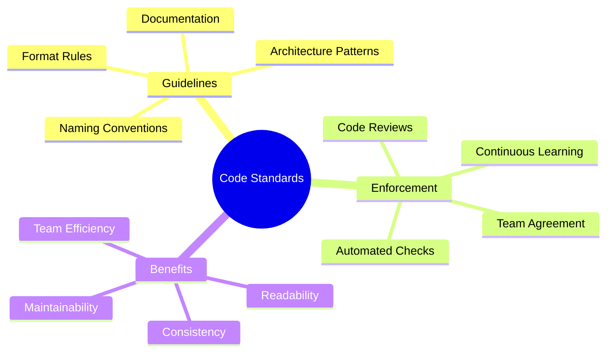
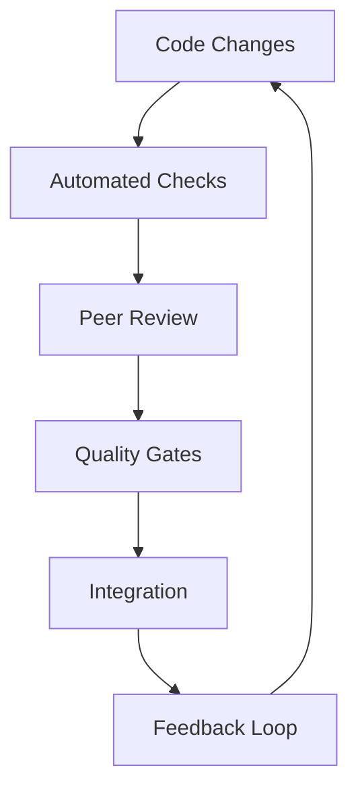
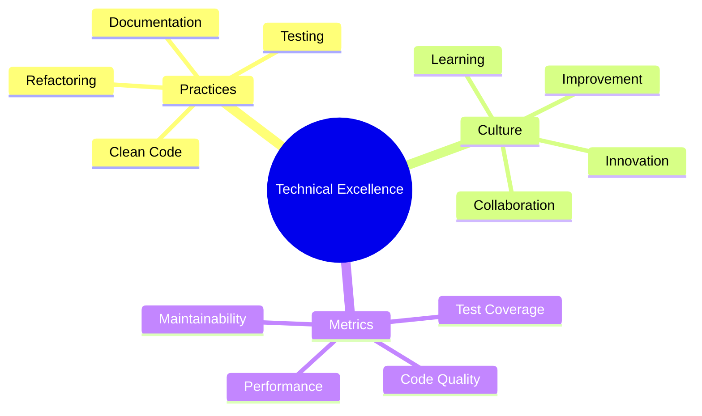

import Tabs from "@theme/Tabs";
import TabItem from "@theme/TabItem";

A comprehensive guide to quality practices in Extreme Programming (XP), focusing on building and maintaining technical excellence through disciplined practices and continuous improvement.

<!-- truncate -->

:::tip Key Quality Elements
Essential aspects of XP quality practices:

- 🧪 Unit Testing
- ✅ Acceptance Testing
- 📝 Code Standards
- 🚀 Small Releases
- 🔄 Continuous Review
- ⭐ Technical Excellence
  :::

## Unit Testing

### Core Principles

### Implementation Strategy

<Tabs>
  <TabItem value="practices" label="Testing Practices" default>
    **Key Elements**:
    - Test-Driven Development
    - Automated test suites
    - Continuous execution
    - Coverage metrics

    **Benefits**:
    - Early bug detection
    - Design guidance
    - Refactoring safety
    - Documentation

  </TabItem>
  <TabItem value="patterns" label="Test Patterns">
    **Common Patterns**:
    - Arrange-Act-Assert
    - Given-When-Then
    - Test doubles
    - Boundary testing

    **Anti-patterns**:
    - Brittle tests
    - Test duplication
    - Complex setup
    - Slow execution

  </TabItem>
</Tabs>

## Acceptance Testing

### Testing Framework

:::info Customer Focus
Acceptance tests verify that the system meets customer requirements and business value is delivered.
:::

### Implementation Approach

<Tabs>
  <TabItem value="process" label="Testing Process" default>
    **Steps**:
    - Define acceptance criteria
    - Create test scenarios
    - Implement tests
    - Automate execution

    **Outcomes**:
    - Verified functionality
    - Customer satisfaction
    - Quality assurance
    - Clear requirements

  </TabItem>
  <TabItem value="tools" label="Testing Tools">
    **Components**:
    - Testing frameworks
    - BDD tools
    - CI/CD integration
    - Reporting systems

    **Features**:
    - Readable scenarios
    - Quick feedback
    - Clear results
    - Trend analysis

  </TabItem>
</Tabs>

## Code Standards

### Standards Framework

### Implementation Strategy

<Tabs>
  <TabItem value="setup" label="Standards Setup" default>
    **Elements**:
    - Style guides
    - Linting rules
    - Review checklists
    - Documentation templates

    **Tools**:
    - Code formatters
    - Static analyzers
    - Documentation generators
    - Review platforms

  </TabItem>
  <TabItem value="adoption" label="Team Adoption">
    **Process**:
    - Team agreement
    - Training sessions
    - Regular reviews
    - Continuous feedback

    **Success Factors**:
    - Clear guidelines
    - Automated enforcement
    - Team buy-in
    - Regular updates

  </TabItem>
</Tabs>

## Small Releases

### Release Strategy

:::warning Continuous Value
Small, frequent releases reduce risk and enable quick feedback loops.
:::

<Tabs>
  <TabItem value="planning" label="Release Planning" default>
    **Components**:
    - Feature selection
    - Release scope
    - Risk assessment
    - Deployment plan

    **Considerations**:
    - Business value
    - Technical debt
    - User impact
    - Team capacity

  </TabItem>
  <TabItem value="execution" label="Release Execution">
    **Process**:
    - Automated deployment
    - Smoke testing
    - Monitoring
    - Feedback collection

    **Tools**:
    - CI/CD pipelines
    - Feature flags
    - Monitoring systems
    - Rollback procedures

  </TabItem>
</Tabs>

## Continuous Review

### Review Framework

### Review Process

<Tabs>
  <TabItem value="methods" label="Review Methods" default>
    **Techniques**:
    - Pair programming
    - Code reviews
    - Architecture reviews
    - Quality metrics

    **Focus Areas**:
    - Code quality
    - Design patterns
    - Performance
    - Security

  </TabItem>
  <TabItem value="feedback" label="Review Feedback">
    **Channels**:
    - Review comments
    - Team discussions
    - Metrics analysis
    - Improvement plans

    **Actions**:
    - Knowledge sharing
    - Standard updates
    - Process improvements
    - Team learning

  </TabItem>
</Tabs>

## Technical Excellence

### Excellence Framework

### Implementation Strategy

<Tabs>
  <TabItem value="practices" label="Core Practices" default>
    **Focus Areas**:
    - Code craftsmanship
    - Design patterns
    - Architecture
    - Performance

    **Activities**:
    - Regular refactoring
    - Knowledge sharing
    - Technical spikes
    - Innovation time

  </TabItem>
  <TabItem value="culture" label="Excellence Culture">
    **Elements**:
    - Continuous learning
    - Experimentation
    - Best practices
    - Mentoring

    **Support**:
    - Training programs
    - Tech talks
    - Code dojos
    - Learning resources

  </TabItem>
</Tabs>

## Best Practices

### Success Factors

1. **Quality Focus**

   - Built-in quality
   - Automated checks
   - Regular reviews
   - Continuous improvement

2. **Team Engagement**

   - Shared responsibility
   - Active participation
   - Knowledge sharing
   - Continuous learning

3. **Process Excellence**
   - Clear standards
   - Automated processes
   - Regular feedback
   - Measurable outcomes

## Additional Resources

- [Test-Driven Development Guide](https://www.agilealliance.org/glossary/tdd/)
- [Code Review Best Practices](https://google.github.io/eng-practices/review/)
- [Clean Code Principles](https://www.oreilly.com/library/view/clean-code/9780136083238/)
- [Continuous Delivery](https://martinfowler.com/bliki/ContinuousDelivery.html)
