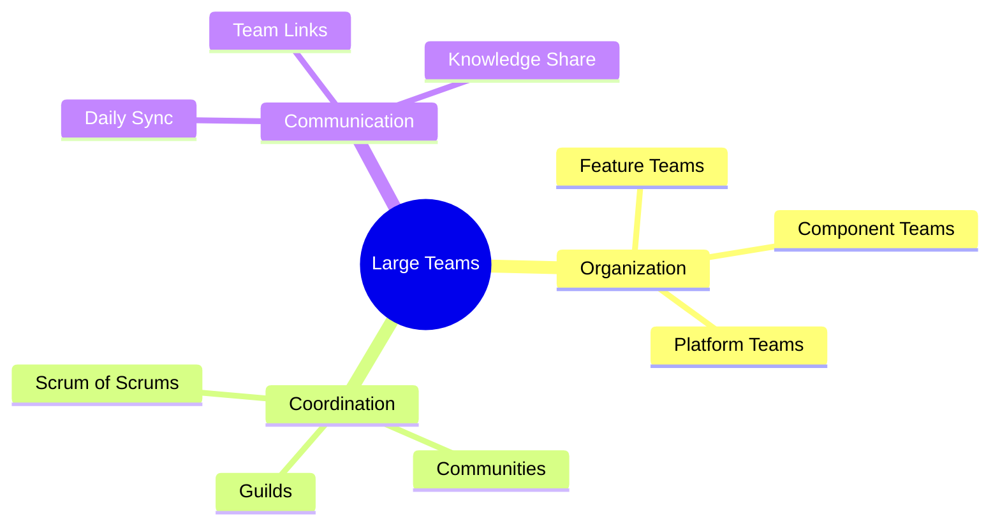
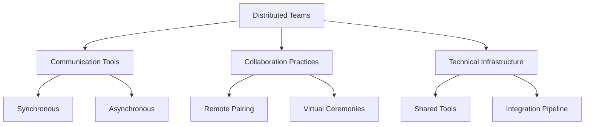
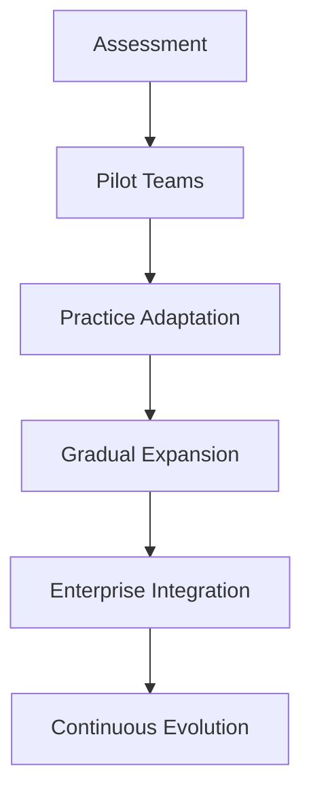
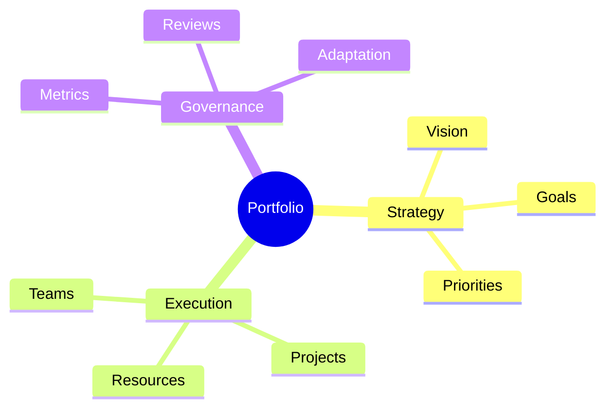

import Tabs from "@theme/Tabs";
import TabItem from "@theme/TabItem";

A comprehensive guide to scaling Extreme Programming (XP) practices from single teams to enterprise-level implementation, focusing on adaptations and success patterns.

<!-- truncate -->

:::tip Key Scaling Areas
Essential elements for scaling XP:

- 🏢 Large Team Adaptations
- 🌐 Distributed Teams
- 🚀 Enterprise Adoption
- 🔄 Multi-team Coordination
- 📊 Portfolio Management
- 📈 Success Stories
  :::

## Large Team Adaptations

### Team Structure Patterns

<Tabs>
  <TabItem value="structure" label="Team Organization" default>
    **Team Types**:
    - Feature-focused teams
    - Component specialists
    - Platform/infrastructure teams
    - Integration teams

    **Size Guidelines**:
    - 5-9 members per team
    - 3-5 teams per area
    - Clear interfaces
    - Shared practices

  </TabItem>
  <TabItem value="practices" label="Practice Adaptation">
    **Modified Practices**:
    - Multi-team planning
    - Cross-team pairing
    - Collective ownership
    - Integration strategy

    **Coordination**:
    - Regular sync meetings
    - Technical councils
    - Practice communities
    - Knowledge sharing

  </TabItem>
</Tabs>

### Technical Practices at Scale

1. **Continuous Integration**

   - Multi-team branching
   - Integration frequency
   - Build management
   - Release coordination

2. **Testing Strategy**
   - Test automation
   - Coverage requirements
   - Performance testing
   - Integration testing

## Distributed Teams

### Remote Collaboration

:::info Effective Distribution
Successful distributed XP requires additional attention to communication and coordination.
:::

### Virtual XP Practices

<Tabs>
  <TabItem value="pairing" label="Remote Pairing" default>
    **Tools & Setup**:
    - Screen sharing
    - Code collaboration
    - Voice/video quality
    - Shared environments

    **Best Practices**:
    - Regular rotation
    - Time zone management
    - Tool proficiency
    - Communication protocols

  </TabItem>
  <TabItem value="ceremonies" label="Virtual Ceremonies">
    **Meeting Types**:
    - Planning sessions
    - Daily standups
    - Reviews/demos
    - Retrospectives

    **Facilitation**:
    - Clear agendas
    - Visual collaboration
    - Active participation
    - Documentation

  </TabItem>
</Tabs>

## Enterprise Adoption

### Organizational Change

1. **Leadership Engagement**

   - Executive sponsorship
   - Middle management
   - Technical leadership
   - Change champions

2. **Cultural Transformation**
   - Values alignment
   - Mindset shift
   - Practice adoption
   - Continuous improvement

### Implementation Strategy

## Multi-team Coordination

### Coordination Mechanisms

<Tabs>
  <TabItem value="sync" label="Synchronization" default>
    **Methods**:
    - Scrum of Scrums
    - Technical councils
    - Integration meetings
    - Release planning

    **Tools**:
    - Shared backlogs
    - Dependency tracking
    - Progress visualization
    - Risk management

  </TabItem>
  <TabItem value="alignment" label="Practice Alignment">
    **Focus Areas**:
    - Coding standards
    - Testing practices
    - Integration approach
    - Release process

    **Enablers**:
    - Guidelines
    - Tools
    - Training
    - Support

  </TabItem>
</Tabs>

### Dependencies Management

:::warning Critical Focus
Managing dependencies effectively is crucial for scaled XP success.
:::

1. **Technical Dependencies**

   - API contracts
   - Shared services
   - Integration points
   - Release coordination

2. **Team Dependencies**
   - Work sequencing
   - Resource sharing
   - Knowledge transfer
   - Skill alignment

## Portfolio Management

### Strategic Alignment

### Portfolio Practices

<Tabs>
  <TabItem value="planning" label="Portfolio Planning" default>
    **Activities**:
    - Strategic alignment
    - Resource allocation
    - Priority setting
    - Risk management

    **Timeframes**:
    - Quarterly planning
    - Monthly reviews
    - Weekly sync
    - Daily coordination

  </TabItem>
  <TabItem value="execution" label="Portfolio Execution">
    **Focus Areas**:
    - Value delivery
    - Team performance
    - Risk mitigation
    - Quality assurance

    **Metrics**:
    - Delivery metrics
    - Quality indicators
    - Team health
    - Business value

  </TabItem>
</Tabs>

## Success Stories

### Enterprise Case Studies

1. **Large-Scale Transformation**

   - Initial state
   - Approach taken
   - Challenges overcome
   - Results achieved

2. **Distributed Implementation**
   - Team structure
   - Tools adopted
   - Practice modifications
   - Lessons learned

### Key Learnings

<Tabs>
  <TabItem value="success" label="Success Factors" default>
    **Critical Elements**:
    - Leadership commitment
    - Clear communication
    - Technical excellence
    - Gradual scaling

    **Enablers**:
    - Tool investment
    - Training programs
    - Support systems
    - Feedback loops

  </TabItem>
  <TabItem value="challenges" label="Common Challenges">
    **Issues**:
    - Communication overhead
    - Practice dilution
    - Tool complexity
    - Coordination costs

    **Solutions**:
    - Clear structures
    - Strong practices
    - Effective tools
    - Regular adaptation

  </TabItem>
</Tabs>

## Additional Resources

- [Scaling XP Patterns](https://www.scaledagileframework.com/extreme-programming/)
- [Distributed Teams Guide](https://martinfowler.com/articles/remote-or-co-located.html)
- [Enterprise Adoption](https://www.thoughtworks.com/insights/blog/scaling-agile-organization)
- [Portfolio Management](https://www.scaledagileframework.com/portfolio-management/)
