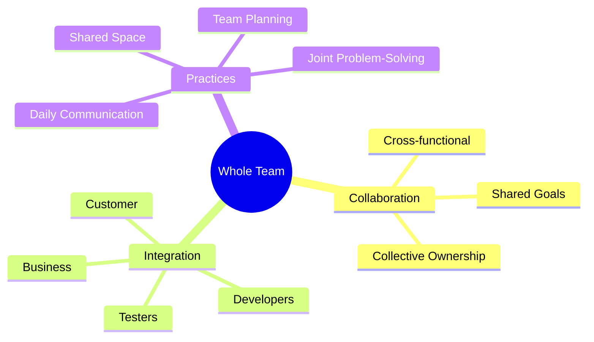
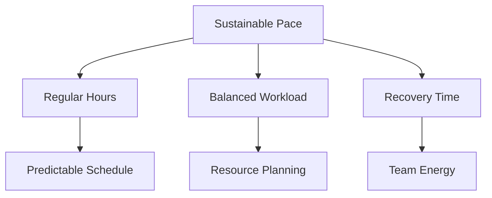
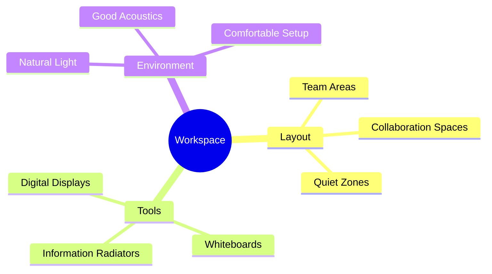
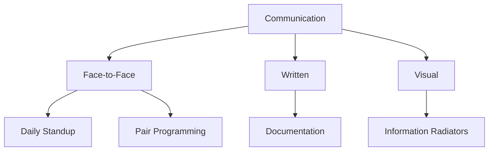
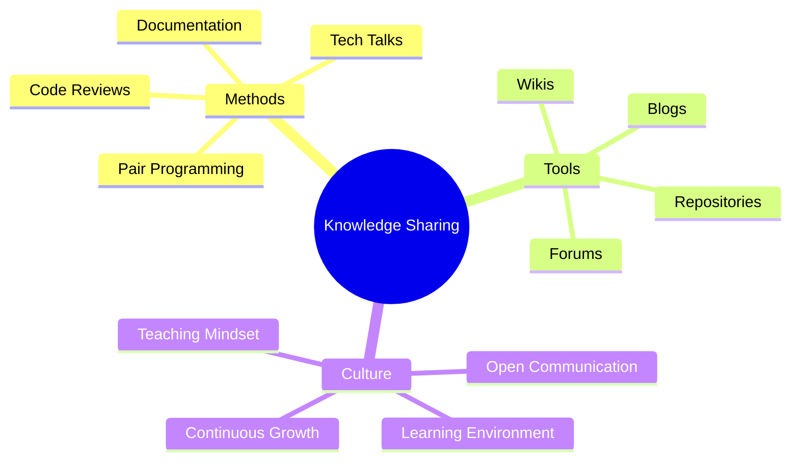

import Tabs from "@theme/Tabs";
import TabItem from "@theme/TabItem";

A comprehensive guide to XP team practices, focusing on building and maintaining high-performance software development teams through collaboration, communication, and continuous improvement.

<!-- truncate -->

:::tip Key Team Practices
Essential elements of XP team practices:

- 👥 Whole Team Approach
- ⚖️ Sustainable Pace
- 🏢 Open Workspace
- 👤 Team Roles
- 🗣️ Communication Patterns
- 📚 Knowledge Sharing
  :::

## Whole Team Approach

### Core Principles

### Implementation Strategy

<Tabs>
  <TabItem value="structure" label="Team Structure" default>
    **Key Elements**:
    - Cross-functional skills
    - Balanced expertise
    - Customer integration
    - Shared responsibility

    **Benefits**:
    - Faster decisions
    - Better solutions
    - Reduced handoffs
    - Improved quality

  </TabItem>
  <TabItem value="practices" label="Best Practices">
    **Activities**:
    - Daily stand-ups
    - Team planning
    - Collective reviews
    - Shared retrospectives

    **Focus Areas**:
    - Skill development
    - Role rotation
    - Knowledge sharing
    - Team building

  </TabItem>
</Tabs>

## Sustainable Pace

:::info Work-Life Balance
Sustainable pace ensures long-term team productivity and well-being through balanced workload and regular rhythms.
:::

### Key Components

### Implementation Framework

<Tabs>
  <tabItem value="principles" label="Core Principles" default>
    **Guidelines**:
    - 40-hour weeks
    - Regular schedules
    - Planned breaks
    - No heroics

    **Benefits**:
    - Better quality
    - Reduced burnout
    - Consistent delivery
    - Team retention

  </tabItem>
  <tabItem value="practices" label="Best Practices">
    **Strategies**:
    - Workload monitoring
    - Capacity planning
    - Regular feedback
    - Schedule respect

    **Metrics**:
    - Team velocity
    - Overtime tracking
    - Satisfaction levels
    - Quality metrics

  </tabItem>
</Tabs>

## Open Workspace

### Workspace Design

### Implementation Guidelines

<Tabs>
  <tabItem value="setup" label="Physical Setup" default>
    **Elements**:
    - Team co-location
    - Pair stations
    - Visual management
    - Meeting spaces

    **Configuration**:
    - Flexible seating
    - Shared resources
    - Communication tools
    - Team boards

  </tabItem>
  <tabItem value="remote" label="Remote Considerations">
    **Virtual Space**:
    - Digital tools
    - Video conferencing
    - Virtual whiteboards
    - Chat platforms

    **Practices**:
    - Regular check-ins
    - Virtual pairing
    - Online collaboration
    - Remote ceremonies

  </tabItem>
</Tabs>

## Team Roles

### Role Definitions

:::note Fluid Roles
XP emphasizes fluid roles with shared responsibilities rather than rigid specializations.
:::

<Tabs>
  <tabItem value="core" label="Core Roles" default>
    **Development Team**:
    - Programmers
    - Testers
    - Analysts
    - Designers

    **Support Roles**:
    - Coach
    - Tracker
    - Customer
    - Manager

  </tabItem>
  <tabItem value="responsibilities" label="Responsibilities">
    **Primary Duties**:
    - Code development
    - Testing
    - Design
    - Planning

    **Shared Tasks**:
    - Quality assurance
    - Documentation
    - Knowledge sharing
    - Process improvement

  </tabItem>
</Tabs>

## Communication Patterns

### Effective Communication

### Communication Practices

<Tabs>
  <tabItem value="patterns" label="Key Patterns" default>
    **Daily Activities**:
    - Stand-up meetings
    - Pair programming
    - Team discussions
    - Customer collaboration

    **Tools**:
    - Task boards
    - Progress charts
    - Team wikis
    - Chat platforms

  </tabItem>
  <tabItem value="improvement" label="Enhancement">
    **Focus Areas**:
    - Clear messaging
    - Active listening
    - Feedback loops
    - Information flow

    **Metrics**:
    - Response time
    - Understanding
    - Effectiveness
    - Satisfaction

  </tabItem>
</Tabs>

## Knowledge Sharing

### Sharing Practices

### Implementation Strategy

<Tabs>
  <tabItem value="activities" label="Core Activities" default>
    **Regular Events**:
    - Tech talks
    - Code reviews
    - Learning sessions
    - Team workshops

    **Documentation**:
    - Best practices
    - Lessons learned
    - Technical guides
    - Process documents

  </tabItem>
  <tabItem value="culture" label="Learning Culture">
    **Elements**:
    - Psychological safety
    - Growth mindset
    - Experimentation
    - Continuous learning

    **Support**:
    - Mentoring
    - Training
    - Resources
    - Time allocation

  </tabItem>
</Tabs>

## Best Practices

### Success Factors

1. **Team Cohesion**

   - Trust building
   - Shared goals
   - Clear communication
   - Collective ownership

2. **Continuous Improvement**

   - Regular retrospectives
   - Process adaptation
   - Skill development
   - Knowledge sharing

3. **Sustainable Development**
   - Balanced workload
   - Regular rhythm
   - Quality focus
   - Long-term thinking

## Additional Resources

- [XP Team Practices Guide](https://www.agilealliance.org/glossary/xp/)
- [Sustainable Pace](https://martinfowler.com/bliki/SustainablePace.html)
- [Effective Team Communication](https://www.industriallogic.com/blog/communication-in-agile/)
- [Knowledge Sharing Patterns](https://www.thoughtworks.com/insights/blog/agile-practices)
