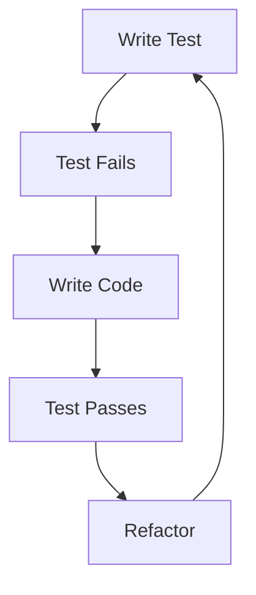
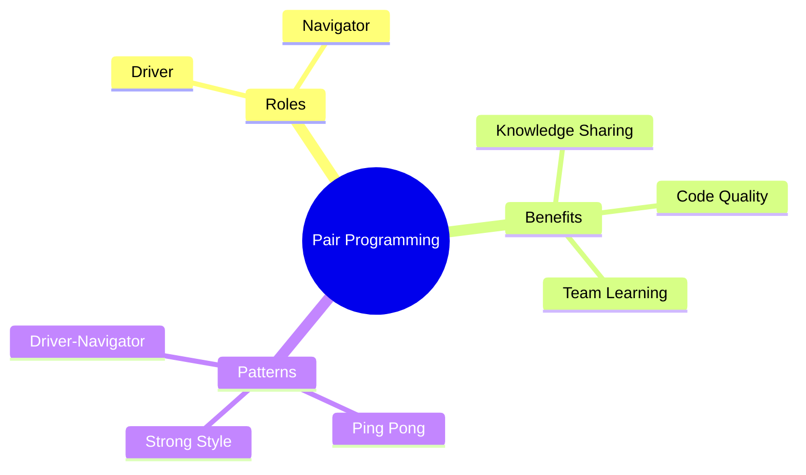
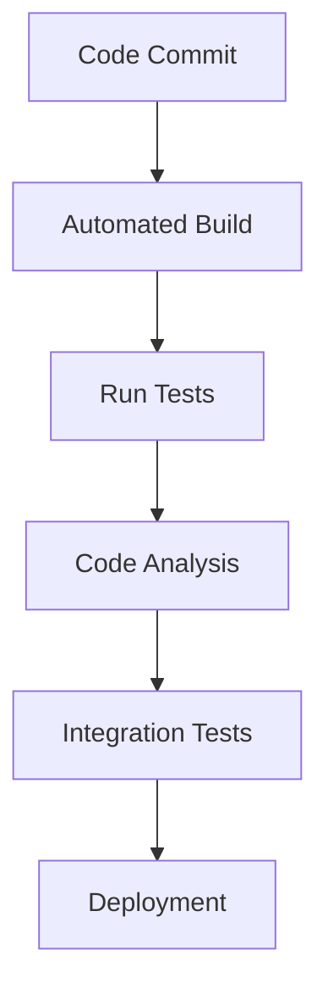
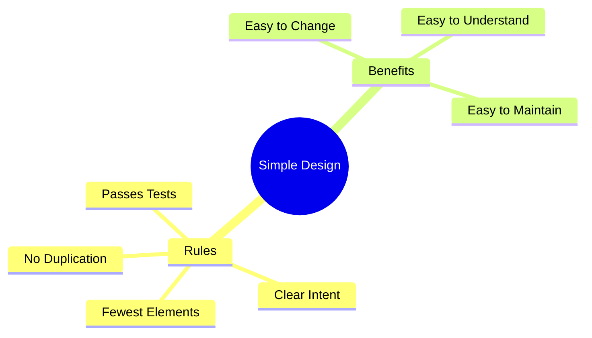

import Tabs from "@theme/Tabs";
import TabItem from "@theme/TabItem";

A comprehensive guide to the core technical practices of Extreme Programming (XP), focusing on engineering excellence and code quality.

<!-- truncate -->

:::tip Key Technical Practices
Essential engineering practices in XP:

- 🧪 Test-Driven Development (TDD)
- 👥 Pair Programming
- 🔄 Continuous Integration
- 🔧 Refactoring
- 📐 Simple Design
- 👥 Collective Code Ownership
  :::

## Test-Driven Development (TDD)

### The TDD Cycle

<Tabs>
  <TabItem value="process" label="TDD Process" default>
    **Core Steps**:
    - Write failing test first
    - Implement minimal code to pass
    - Refactor while keeping tests green
    - Repeat for next feature

    **Benefits**:
    - Design guidance
    - Regression safety
    - Documentation
    - Confidence in changes

  </TabItem>
  <TabItem value="practices" label="Best Practices">
    **Guidelines**:
    - Keep tests focused
    - Test one thing at a time
    - Maintain test suite
    - Regular test runs
    
    **Anti-patterns**:
    - Testing after coding
    - Brittle tests
    - Test complexity
    - Poor maintenance
  </TabItem>
</Tabs>

### Test Types

1. **Unit Tests**

   - Component level testing
   - Fast execution
   - Immediate feedback
   - Design guidance

2. **Acceptance Tests**
   - Customer requirements
   - Business scenarios
   - End-to-end validation
   - Feature verification

## Pair Programming

:::info Collaborative Development
Pair programming is a core XP practice where two developers work together at one workstation.
:::

### Pairing Dynamics

<Tabs>
  <TabItem value="roles" label="Role Definition" default>
    **Driver**:
    - Writes code
    - Focuses on details
    - Implements solutions
    - Handles mechanics

    **Navigator**:
    - Reviews code
    - Thinks strategically
    - Spots issues
    - Suggests improvements

  </TabItem>
  <TabItem value="patterns" label="Pairing Patterns">
    **Common Approaches**:
    - Ping-pong pairing
    - Strong-style pairing
    - Expert-novice pairing
    - Collaborative pairing
  </TabItem>
</Tabs>

## Continuous Integration

### CI Pipeline

<Tabs>
  <TabItem value="practices" label="Core Practices" default>
    **Essential Elements**: - Frequent integration - Automated builds -
    Comprehensive testing - Quick feedback **Implementation**: - Shared mainline
    - Build automation - Test automation - Quality gates
  </TabItem>
  <TabItem value="benefits" label="Key Benefits">
    **Advantages**: - Early problem detection - Reduced integration risk -
    Continuous feedback - Improved collaboration **Outcomes**: - Stable codebase
    - Faster delivery - Higher quality - Team confidence
  </TabItem>
</Tabs>

## Refactoring

### Refactoring Principles

:::warning Continuous Improvement
Refactoring is not a one-time activity but a continuous process of code improvement.
:::

<Tabs>
  <TabItem value="approach" label="Refactoring Approach" default>
    **Key Principles**: - Small changes - Test coverage - Regular practice -
    Clear motivation **Triggers**: - Code smells - Duplicate code - Complex
    methods - Poor names
  </TabItem>
  <TabItem value="patterns" label="Common Patterns">
    **Refactoring Types**: - Extract method - Rename elements - Move
    functionality - Simplify conditions **Goals**: - Improve readability -
    Enhance maintainability - Reduce complexity - Support changes
  </TabItem>
</Tabs>

## Simple Design

### Design Principles

### Four Rules

1. **Runs All Tests**

   - Verified behavior
   - Regression safety
   - Design validation
   - Confidence in changes

2. **Clear Intent**

   - Self-documenting code
   - Meaningful names
   - Clear structure
   - Obvious purpose

3. **No Duplication**

   - DRY principle
   - Single source of truth
   - Shared abstractions
   - Maintainable code

4. **Fewest Elements**
   - Minimal complexity
   - Essential components
   - YAGNI principle
   - Focused solutions

## Collective Code Ownership

### Shared Responsibility

<Tabs>
  <TabItem value="principles" label="Core Principles" default>
    **Key Elements**: - Team ownership - Shared responsibility - Open
    collaboration - Continuous learning **Practices**: - Code reviews -
    Knowledge sharing - Team standards - Pair rotation
  </TabItem>
  <TabItem value="implementation" label="Implementation">
    **Enablers**: - Coding standards - Documentation - Team communication -
    Shared understanding **Challenges**: - Skill differences - Team dynamics -
    Code complexity - Knowledge silos
  </TabItem>
</Tabs>

## Best Practices

### Success Factors

1. **Technical Excellence**

   - Strong testing culture
   - Regular refactoring
   - Clean code practices
   - Continuous learning

2. **Team Collaboration**

   - Effective pairing
   - Knowledge sharing
   - Clear communication
   - Shared ownership

3. **Process Discipline**
   - Consistent practices
   - Regular feedback
   - Continuous improvement
   - Quality focus

## Additional Resources

- [Test-Driven Development Guide](https://www.agilealliance.org/glossary/tdd/)
- [Pair Programming Patterns](https://martinfowler.com/articles/on-pair-programming.html)
- [Continuous Integration Practices](https://www.martinfowler.com/articles/continuousIntegration.html)
- [Refactoring Techniques](https://refactoring.com/)
